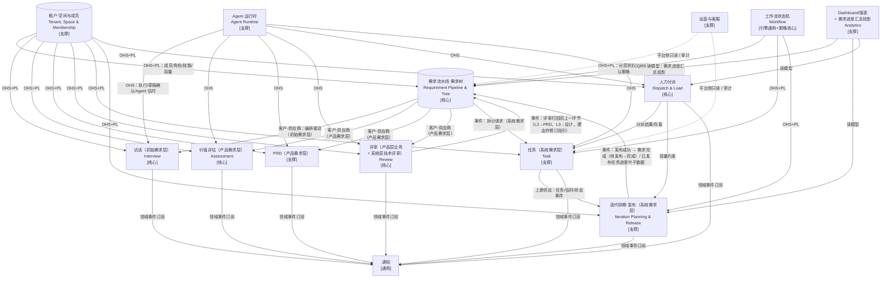

# 需求管理平台 —— DDD 领域划分与领域模型设计

> 版本：v0.4（技术设计阶段前序文档；**需求分层分解树 + 空间模型 + 发布，对齐 PRD v0.7**）
> v0.3 → v0.4 变更要点：对齐 PRD v0.7 五条定稿决策——① 空间模型（修正 RBAC）：租户=公司 → 空间（原「项目」= 特定需求集目的容器）→ 需求/迭代/成员；账号（公司级）→ 成员（空间级，绑空间内角色）→ 权限；角色在空间下定义、可自定义（迭代负责人/验收负责人）；空间负责人维护空间内角色/权限/账户关系；`Project`→`Space`、`TeamMember`→`Member`（TE-01/03/04/11/12/13）；② 任务验收打回：待验收被打回 → 回「进行中」+ 必填验收反馈，打回次数计入任务记录，验收裁决人工专属（验收人默认产品负责人、可配「验收负责人」角色）（TA-02）；③ 完成 = 发布上线：任务完成 = 代码合入 + 测试通过（可发布）≠ 需求完成；需求完成 = 全部直接子级「已发布上线」；三层状态机加「待发布」（READY_TO_RELEASE）；新增 `Release` 发布聚合（迭代内可多次、带一批任务/需求、留痕，发布成功 = 相关需求完成，失败/回滚回「待发布」可重试；M0 人工发布、M2 接 CI/CD）；进度口径 = 已发布任务数/总任务数（RE-05/16、IT-10）；④ 废弃扩展为任意阶段终止态（带原因、可留痕、可恢复），父级完成判定排除废弃子级，不做但留档用挂起（EV-04、RE-18）；⑤ 去归档：删除「归档」概念，RE-04 仅「删除（二次确认）」，副作用动作分类表「删除/归档」→「删除」。
> v0.2 → v0.3 变更要点：对齐 PRD v0.6 六条定稿决策——①「完成」统一口径（完成 = 全部直接子级「已完成/已交付」，中间态 L1/L3「实施中」、L2「开发中」，状态与进度永远一致）；② 三层划分判据（初始=业务目标 / 产品=方案 / 系统=技术实现 / 任务=最小交付）；③ 直接创建来源（PM 直建产品需求跳过澄清、架构师/研发直建系统需求·技术改进跳过评估/PRD/评审）与 L3 生命周期（新建→设计→评审→实施中→完成）；④ 评审打回 = 回上一环节（L2→PRD、L3→设计，理由作修订指引，取代回填访谈循环）；⑤ 挂起/阻塞标记不沿需求树自动传递（父级显示「下级 N 个阻塞/挂起」风险提醒）；⑥「可开发」判定（已拆分 = 全部任务确认创建，RE-17）与 AI 拆分质量信号（TA-08）。术语与 PRD v0.6 名词表一致。
> v0.1 → v0.2 变更要点：将「单条需求流水线」升级为「需求分层分解树」——需求分 初始/产品/系统 三层，任务为最底层；每层独立状态机；进度向上汇总（读模型投影，不写回父级）；挂起/阻塞升级为所有需求类型通用的全局正交标记。
> 范围：SaaS 需求管理平台，核心是「AI 辅助、人机可替换」的需求全生命周期流水线。
> 目标读者：架构师、后端与前端技术设计、AI 流水线状态机实现者。

---

## 1. 通用语言（Ubiquitous Language）摘录

| 术语 | 含义 |
|---|---|
| 处理人（Handler） | 流水线某一环节的执行者，**三选一**：人 / Agent / 人机协作 |
| 租户（Tenant） | 多租户隔离边界；**租户 = 一个实际公司**；租户下多账号、多空间 |
| 账号（Account） | 登录主体（**公司级身份**）；可加入多租户、多空间，登录后切换租户/空间上下文；加入某空间后成为该空间成员 |
| 空间（Space） | 租户（公司）下的目的容器（原「项目」）：**为同一目标服务的一堆需求被归拢到一起**；内含需求集、迭代、成员（人 + Agent）；一个公司可有多个空间；空间负责人维护空间内角色/权限/账户关系 |
| 成员（Member） | **账号在空间内的身份（空间级）**；人与 Agent 对象化为**同一实体**，带空间内角色、技能、容量；`kind: HUMAN | AGENT` |
| 团队（Team） | 空间下的可选协作建制分组；成员（人 + Agent）的归属单位；承载流水线处理人模板 |
| 空间角色（Space Role） | 在**空间下定义**、绑定权限集，可自定义（如「迭代负责人」「验收负责人」）；成员（账号在空间内的身份）绑定空间内角色，权限模型 = 账号→成员→空间角色→权限 |
| 需求分层分解树（Requirement Tree） | 初始需求→产品需求→系统需求→任务的 1:N 分层分解结构；规模自适应，中小需求可跳过初始层 |
| 初始需求（L1） | 需求树顶层 = **业务描述/目标**；承载澄清/访谈环节；完成 = 全部直接产品需求「已发布上线」 |
| 产品需求（L2） | 需求树中间层 = **解决方案**；承载评估/PRD/评审环节；可由 PM 直接创建（跳过澄清，评估+评审仍走）；完成 = 全部直接系统需求「已发布上线」 |
| 系统需求（L3） | 需求树底层需求 = **技术实现**；生命周期 新建→设计→评审→实施中→待发布→完成；可由架构师/研发直接创建（技术改进类，带标记）；子级为任务；完成 = 全部任务「已发布上线」 |
| 任务（Task） | **最小交付**颗粒度执行单元，归系统需求层；「已完成」= 代码合入 + 测试通过（**可发布**），≠ 需求完成；验收不通过可打回「进行中」 |
| 发布（Release） | 迭代内**可多次**执行的动作：带一批任务/需求发布上线；**发布成功 = 相关需求「完成」**；失败/回滚回「待发布」可重试；M0 人工点发布、M2 起可接 CI/CD 自动发布 |
| 完成统一口径（Completion Rule） | 任务「已完成」= 代码合入 + 测试通过（**可发布**）；某需求「完成」= 全部直接子级「**已发布上线**」；中间态不叫完成（L1/L3「实施中」、L2「开发中」、任务全完成未发布「待发布」）；**状态与进度永远一致** |
| 分解（Decompose） | 父级在满足状态前置时拆出子级（初始→产品→系统；系统→任务）；或由 PM/架构师/研发**直接创建**（跳过上游环节） |
| 可开发（Ready to Develop） | 系统需求「已拆分」= 全部计划任务均已确认创建（RE-17）；部分确认仍属待拆分 |
| 拆分质量信号（Split Quality Signal） | AI 拆分接受率低时预警并可重新拆分（TA-08），作为 AI 拆分质量的反馈指标 |
| 进度汇总（Progress Aggregation） | 任务→系统→产品→初始 逐层向上聚合的读模型投影；系统需求进度 = **已发布任务数/总任务数**（待发布/挂起/阻塞/进行中/待处理均计未完成）；父级完成 = 全部直接子级「已发布上线」；废弃子级排除；挂起/阻塞计未完成；状态与进度一致 |
| 全局正交标记（PauseMarker） | 挂起/阻塞；可挂在任意需求类型任意状态下；不改变底层状态；带原因；解除回原状态；**不沿需求树自动传递**（父级显示「下级存在 N 个阻塞/挂起」风险提醒）；**不做但需留档 → 用挂起**（v0.7 去归档后的语义） |
| 废弃（Abandoned） | **任意阶段终止态**（v0.7 扩展，取代「仅 L2 评估判档」）：评估判档 = 废弃，或开发到一半直接废弃；带原因、可留痕、可恢复；**父级完成判定排除废弃子级**（不计入进度、不拖累父级） |
| 草稿+确认（Draft & Confirm） | Agent 默认执行模式：产出草稿后暂停，等待人确认 |
| 全自动（Full Auto） | 可配置开启：Agent 产出后无需人确认即进入下一环节 |
| 副作用动作（Side-effect Action） | 状态流转/指派/删除等有后果的管理动作，默认「建议+人确认」 |
| 提醒类动作（Reminder Action） | 催办、到期提醒等无副作用动作，AI 可自动执行 |
| 白名单（Whitelist） | 团队可把某副作用动作放开为 AI 自动执行 |
| 估时双轨（Estimate Track） | 人认领→人工工时；Agent 认领→Agent 工时，随认领者切换 |

---

## 2. 子域划分：核心 / 支撑 / 通用

| 类型 | 子域 | 判断理由 |
|---|---|---|
| **核心域** | 需求分层分解树与流水线编排（Requirement Tree & Pipeline） | 全产品差异化的「大脑」：分层建模、分解不变量、每层状态机、环节编排，贯穿人机可替换 |
| **核心域** | 需求分解与进度汇总规则 | 分解前置校验与「完成统一口径（父级完成 = 全部直接子级**已发布上线**）、进度 = 已发布任务/总任务、废弃子级排除、挂起/阻塞计未完成且不沿树传递」的聚合语义是核心业务规则（进度投影本身属读侧） |
| **核心域** | 访谈（Grill 式，服务初始需求层） | 「AI 挖全貌」是核心 AI 能力与差异化卖点 |
| **核心域** | 价值评估（RICE 变体/可自定义框架，服务产品需求层） | 需求分档决策是产品核心业务规则 |
| **核心域** | 评审（AI 主持质询 + 人裁决 + 打回回上一环节，服务产品层业务评审 + 系统层技术评审） | 人机协作裁决闭环是差异化核心 |
| **核心域** | 人力分派（技能分派 + 超载保护） | 「按角色技能自动分派 + 超载保护 + 建议/白名单」是核心规则 |
| **核心域** | 工作流确认策略（提醒自动 / 副作用建议+确认 / 白名单） | 「人机可替换」的安全边界，贯穿全流水线 |
| 支撑域 | 任务、迭代排期与发布、PRD 文档 | 管理对象与产物，通用项目管理能力，规则简单；发布为迭代内批量上线动作（M0 人工、M2 接 CI/CD） |
| 支撑域 | 租户、空间与成员 | 多租户身份、空间（目的容器）与空间成员管理（账号→成员→空间角色），但其「角色/技能/容量」模型是分派核心的强依赖输入，非纯通用 |
| 支撑域 | Agent 运行时 | AI 执行载体，本身通用；但「草稿+确认/全自动」的**语义**归核心域（见第 6 节），运行时只是执行器 |
| 支撑域 | Dashboard/报表、需求进度汇总投影、运营与客服 | 读侧与平台侧运营，规则简单 |
| 通用域 | 通知、身份认证、状态机引擎 | 跨上下文可复用，无业务差异化 |

> 边界说明：**状态机引擎**（通用）与**确认策略**（核心）分离——引擎提供「流转能力」，策略决定「谁来批准流转」。

---

## 3. 总体上下文图（Context Map）



---

## 4. 有界上下文（Bounded Context）清单

> 划分理由：以**「人机可替换」的环节**为粒度切分需求侧上下文（访谈/评估/PRD/评审），每个环节是独立的供应商，被「需求流水线」编排——这保证「处理人三选一」「草稿+确认」可以在**环节边界**上统一挂载，而不是散落在单一巨型聚合里。**环节在需求树上的分布**：访谈/澄清 → 初始需求层（L1）；评估 / PRD → 产品需求层（L2）；评审 → 产品层业务评审 + 系统层技术评审（L3）；设计 / 拆分任务 / 迭代执行 / 发布 → 系统需求层（L3，任务）。合并说明：迭代看板/甘特/负载图并入「迭代排期」（它们是与迭代强一致的读模型），发布聚合亦归入「迭代排期」上下文；身份认证并入「租户·空间与成员」；确认策略独立成「工作流状态机」上下文以跨需求/任务/迭代复用。

### 4.1 租户·空间与成员上下文（Tenant, Space & Membership）—— 支撑域

- **职责一句话**：管理多租户、账号、**空间**（原「项目」= 特定需求集目的容器）、团队、空间成员（人与 Agent 统一对象）、RBAC 权限（**账号→成员→空间角色→权限**）、技能、容量、平台内置 Agent 目录与团队级处理人模板。
- **核心实体**：`Tenant`、`Account`（登录主体，**公司级身份**，可加入多租户/多空间）、`Space`（空间，租户下目的容器，内含需求集/迭代/成员）、`Role`（**空间级**定义，绑定权限集，可自定义）、`Permission`、`Team`（空间下可选协作建制分组）、`Member`（账号在空间内的身份，空间级；`kind: HUMAN | AGENT`）、`Skill`、`Capacity`、`AgentCatalog`（内置：产品经理/架构师/前端/后端/UI/UX/DBA/DevOps/SRE/运营/客服）、`PipelineProcessorTemplate`（团队级流水线处理人默认模板）。
- **聚合根**：`Tenant`（含账号清单）、`Space`（含空间内角色集 + 空间成员映射 `AccountId → Member`）、`Team`（内含成员列表）、`AgentCatalog`（只读目录，随创建团队被实例化）。
- **已定稿权限模型**：RBAC（v0.7 修正）——**账号（公司级）→ 成员（空间级，账号在空间内的身份）→ 空间内角色 → 权限**；角色在**空间下定义**、绑定权限集、可自定义（如「迭代负责人」「验收负责人」）；空间负责人维护空间内角色/权限/账户关系；租户管理员管账号、建空间、定空间负责人；同一账号可加入多个租户/空间，登录后切换租户/空间上下文（请求级租户+空间上下文由中间件维护）。
- **主要领域事件**：`TenantCreated`、`SpaceCreated`、`AccountJoined`/`AccountLeft`（加入/离开租户）、`MemberJoined`/`MemberLeft`（账号加入/离开空间成为/解除成员）、`RoleDefined`/`RoleUpdated`（空间内角色定义/调整）、`MemberRoleAssigned`、`SpaceOwnerChanged`、`AgentProvisioned`、`CapacityChanged`、`ProcessorTemplateUpdated`。
- **上下文映射**：作为**上游方**，通过「开放主机服务 + 发布语言（OHS + Published Language）」对外提供 `Member`/`Space`/`Role`/`Skill`/`Capacity` 的**只读契约 DTO**；所有下游上下文用**防腐层（ACL）**消费，禁止反向依赖与直接改表。「Member 统一模型」是全系统基础词表，建议以发布语言固化版本化；需求/迭代等实体以 `spaceId` 归属空间。

### 4.2 需求流水线·需求树上下文（Requirement Pipeline & Tree）—— 核心域

- **职责一句话**：需求分层分解树（初始/产品/系统）的建模、分解、完成口径与每层状态推进，是串联澄清/评估/PRD/评审/设计/拆任务的核心大脑。
- **核心实体**：`Requirement`（聚合根；`type: INITIAL | PRODUCT | SYSTEM` + 树结构 parentId/childrenIds + `directCreateSource`/`techImprovementMark`）、`DecompositionRule`（跨层分解前置规则 + 直接创建来源规则）、`ReadinessRule`（可开发判定，RE-17）、`StageHandler`（环节处理人配置）、`StateLog`、`RejectionInfo`（评审打回理由，作修订指引）、`PauseMarker`（全局正交标记：挂起/阻塞）；**完成守卫**（v0.7：全部直接子级**已发布上线**，排除废弃子级；发布成功事件驱动「待发布→完成」）。
- **聚合根**：`Requirement`（树节点聚合，见 §5.1）。
- **主要领域事件**：`RequirementCreated`（带 type + directCreateSource）、`RequirementDecomposed`（parentId + 子级 childrenIds）、`StateEntered`/`StateExited`、`ReviewRejected`（L2/L3，回上一环节，理由作修订指引）、`RequirementAbandoned`（任意阶段，带原因）/`RequirementRestored`（废弃恢复）、`RequirementReadyToRelease`（全部直接子级已完成 → 待发布）、`RequirementReleased`（发布成功 → 完成）、`PauseMarkerSet`/`PauseMarkerCleared`、`AllTasksConfirmed`（系统层全部任务确认 → 可开发）、`HandlerOverrideChanged`。
- **上下文映射**：对访谈/评估/PRD/评审是**客户（调用/编排方）**，各环节上下文为**供应商（被编排）**，采用「客户-供应商」契约；**评审打回事件回流**到本上下文，驱动回上一环节（L2→PRD、L3→设计），理由作修订指引；对「任务」发布拆分请求（系统层）；**消费「迭代排期」上下文的发布成功事件**，驱动需求「待发布→完成」（发布动作不在此上下文）；需求状态/分解/挂起阻塞事件供「需求进度汇总投影」与「下级风险提醒」读模型消费。

### 4.3 访谈上下文（Interview）—— 核心域（服务初始需求层）

- **职责一句话**：AI 以 grill 式提问挖掘需求全貌，产出初始需求的澄清纪要（需求全貌）。**服务对象 = 初始需求层**。
- **核心实体**：`InterviewSession`（聚合根）、`Question`、`Answer`、`Digest`（澄清纪要/需求全貌初稿）。
- **聚合根**：`InterviewSession`。
- **主要领域事件**：`InterviewStarted`、`QuestionAsked`、`InterviewCompleted`、`DigestProduced`、`DigestRevised`（澄清修订）。
- **上下文映射**：供应商（被需求流水线驱动，环节 = 初始需求层的「澄清」）；AI 对话执行由「Agent 运行时」提供；产出通过领域事件回传流水线。**评审打回不再回填访谈循环（v0.6 定稿：打回 = 回上一环节）**；访谈仅服务 L1 澄清；L2 由 PM 直接创建时跳过澄清环节，需求文档由 PM 自行产出。

### 4.4 价值评估上下文（Assessment）—— 核心域（服务产品需求层）

- **职责一句话**：基于需求文档做轻量 RICE 变体评分，输出 S/M/L/废弃四档；评估框架可自定义。**服务对象 = 产品需求层**（PM 直接创建的产品需求仍走评估）。
- **核心实体**：`AssessmentConfig`（可自定义指标与权重/评分卡）、`Assessment`（聚合根）、`ScoreCard`、`TierDecision`。
- **聚合根**：`Assessment`。
- **主要领域事件**：`AssessmentCompleted`、`TierAssigned`、`FrameworkUpdated`、`AssessmentOverriddenByHuman`。
- **上下文映射**：供应商；默认「草稿+确认」——Agent 产评分卡草稿，人确认或改判，`TierAssigned` 回传流水线。「废弃」档直接驱动产品需求终止态（v0.7 起废弃扩展为**任意阶段终止态**，本上下文只是废弃入口之一，其余任意阶段直接废弃的入口见 §5.1 不变量 7）。

### 4.5 PRD 上下文（PRD）—— 支撑域（服务产品需求层）

- **职责一句话**：基于需求文档 + 评估结论产出结构化 PRD。**服务对象 = 产品需求层**。
- **核心实体**：`PRD`（聚合根）、`PRDSection`、`PRDVersion`。
- **聚合根**：`PRD`。
- **主要领域事件**：`PRDGenerated`、`PRDRevised`。
- **上下文映射**：供应商；文档产物上下文，规则简单，不承载差异决策。

### 4.6 评审上下文（Review）—— 核心域（服务产品层业务评审 + 系统层技术评审）

- **职责一句话**：AI 主持质询（生成挑战性问题）、人裁决（通过/打回/废弃），**打回 = 回上一环节**（理由作修订指引）。**服务对象 = 产品需求层（L2 业务评审）+ 系统需求层（L3 技术评审，技术改进类可轻量）**。
- **核心实体**：`ReviewSession`（聚合根）、`Challenge`（质询项）、`Verdict`、`RejectionReason`。
- **聚合根**：`ReviewSession`。
- **主要领域事件**：`ReviewStarted`、`ChallengeRaised`、`ChallengeAnswered`、`VerdictCast`、`ReviewApproved`、`ReviewRejected`（含 `RejectionReason`）。
- **上下文映射**：供应商；`ReviewRejected` 事件流向需求流水线，由流水线驱动回上一环节（L2→PRD、L3→设计），理由作为修订指引记录在需求上；累计 3 次打回强制升人工（人工修订 PRD/设计后放行，或直接审核放行，记流程例外）。**人裁决不可由 Agent 代理**——这是本上下文唯一硬性规则。

### 4.7 任务上下文（Task）—— 支撑域（系统需求层最底层）

- **职责一句话**：系统需求层之下最底层——开发任务拆分、认领、估时双轨、状态（含**验收打回**）、发布上线标记，以及拆分质量信号（TA-08）。
- **核心实体**：`Task`（聚合根，`systemRequirementId` 归属其父级系统需求）、`TaskEstimate`（值对象）、`EstimateLog`、`AssigneeClaim`、`AcceptanceInfo`（验收记录：验收人（默认产品负责人，可配「验收负责人」角色）+ 打回反馈 + 打回次数，v0.7）、`SplitQualitySignal`（拆分质量信号：接受率/预警/重新拆分，TA-08）。
- **聚合根**：`Task`。
- **主要领域事件**：`TasksCreated`、`TaskAssigned`、`TaskClaimed`、`AssigneeChanged`、`EstimateChanged`、`TaskStateChanged`、`TaskRejectedInAcceptance`（待验收打回「进行中」+ 必填验收反馈，人工专属，次数计入 `AcceptanceInfo`）、`TaskReleased`（发布成功标记为已发布上线，由发布上下文驱动）、`TaskBlocked`/`TaskUnblocked`、`TaskPaused`/`TaskResumed`、`AllTasksConfirmed`（全部任务确认创建 → 触发系统需求可开发）、`SplitQualityAlert`（接受率低预警）/`ReSplitRequested`。
- **上下文映射**：消费系统需求层的拆分请求（拆分归入 L3「实施中」阶段语义）；为迭代排期提供上游「任务/估时/可开发（RE-17）」；消费人力分派的分派结果；看板流转由工作流状态机提供；**任务状态事件 + 发布成功事件是「需求进度汇总投影」的叶子数据源**（系统需求 = 已发布任务数/总任务数；待发布/挂起/阻塞/进行中/待处理均计未完成）；`SplitQualityAlert` 作为 AI 拆分质量反馈指标（TA-08）。

### 4.8 迭代排期与发布上下文（Iteration Planning & Release）—— 支撑域（系统需求层执行侧）

- **职责一句话**：迭代周期配置、任务装填、迭代内看板、甘特/负载视图，以及**发布（Release）**。**服务对象 = 系统需求层「可开发」（RE-17）任务**——AI 自动装填候选仅含全部任务已确认创建的系统需求之任务（IT-06）；**发布 = 迭代内可多次的批量上线动作，发布成功 = 相关需求「完成」（IT-10）**。
- **核心实体**：`Iteration`（聚合根）、`Release`（发布聚合根，§5.6）、`SprintConfig`（周期人工配置默认值）、`IterationTask`（装填关系 + 看板列状态）、`KanbanColumn`。
- **聚合根**：`Iteration`、`Release`（独立聚合，见 §5.6）。
- **主要领域事件**：`IterationCreated`、`IterationStarted`、`TaskScheduled`、`IterationCapacityOverrun`、`IterationClosed`、`ReleaseTriggered`、`ReleaseSucceeded`（清单 + 相关需求引用 → 需求流水线完成守卫 + 进度投影）、`ReleaseFailed`、`ReleaseRolledBack`（相关需求回「待发布」可重试）。
- **上下文映射**：与任务/分派之间是「共享内核」级别的最小契约（`Task` 估时、`Member` 负载）；**甘特图与负载图是 CQRS 读模型投影**，不参与领域不变量。迭代不直接承载需求树；系统需求「已拆分」后任务进入待装填池，由迭代装填执行；**发布成功事件流出到「需求流水线」上下文**（驱动需求「待发布→完成」）与「需求进度汇总投影」（已发布任务数/总任务数）。

### 4.9 人力分派上下文（Dispatch & Load）—— 核心域

- **职责一句话**：按成员角色技能自动分派任务、超载保护、负载视图，输出「建议」并接受确认。
- **核心实体**：`Assignment`（聚合根）、`DispatchPolicy`（技能匹配规则）、`WorkloadSnapshot`、`ActionWhitelist`（分派类白名单）。
- **聚合根**：`Assignment`（独立聚合，见 §5.2 权衡）。
- **主要领域事件**：`TaskDispatched`、`DispatchSuggested`、`DispatchConfirmed`、`OverloadGuardTriggered`、`DispatchCancelled`、`LoadSnapshotUpdated`。
- **上下文映射**：消费团队「角色/技能/容量」契约；产出分派结果写回任务；负载快照投影给迭代排期做负载图。

### 4.10 工作流状态机上下文（Workflow）—— 引擎通用 + 策略核心

- **职责一句话**：通用状态流转能力 + 管理动作确认策略（提醒类 AI 自动执行；副作用类默认「建议+人确认」、可白名单放开）。
- **核心实体**：`StateMachineDefinition`、`Transition`、`ActionPolicy`（`EXECUTE_AUTO | SUGGEST_CONFIRM | WHITELISTED_AUTO`）、`ActionWhitelist`。
- **聚合根**：`StateMachineDefinition`（按对象类型定义：**初始需求层机 / 产品需求层机 / 系统需求层机（均含「待发布」态）/ 任务看板四态机（含验收打回流转）**）。
- **主要领域事件**：`TransitionProposed`、`TransitionConfirmed`、`TransitionExecuted`、`ActionAutoExecuted`、`ActionBlockedAwaitingConfirm`。
- **上下文映射**：以 OHS+PL 向需求（三层）/任务/迭代提供流转与确认服务；各上下文声明自己的合法流转表与动作策略，**确认动作的默认值**由平台内置、团队可白名单覆盖。这是「人机可替换」的安全边界。

### 4.11 AI Agent 运行时上下文（Agent Runtime）—— 支撑域

- **职责一句话**：平台内置 Agent 的执行环境、编排、模式（草稿+确认/全自动）、工具调用与执行审计。
- **核心实体**：`AgentInstance`（绑定到 `Member`（kind=AGENT）的运行时实例）、`AgentExecution`、`ExecutionMode`（`DRAFT_CONFIRM | FULL_AUTO`）、`DraftArtifact`、`ToolCallLog`。
- **聚合根**：`AgentExecution`。
- **主要领域事件**：`AgentExecutionStarted`、`DraftProduced`、`AwaitingConfirmation`、`ExecutionCompleted`、`ExecutionFailed`、`ModeChanged`。
- **上下文映射**：作为供应商（OHS）被访谈/评估/PRD/评审/分派/任务消费；**不承载业务决策**——「草稿+确认/全自动」的语义策略在需求流水线与工作流上下文定义，运行时只执行。

### 4.12 通知上下文（Notification）—— 通用域

- **职责一句话**：把各上下文领域事件转化为面向人/Agent 的通知（站内信/邮件/IM/Agent 回调）。
- **核心实体**：`Notification`、`NotificationChannel`、`NotificationPreference`、`NotificationRule`。
- **聚合根**：`NotificationRule`。
- **主要领域事件**：`NotificationSent`。
- **上下文映射**：订阅各上下文领域事件（`EventListener`）；通过 OHS 提供发送与偏好查询。

### 4.13 Dashboard / 报表上下文（Analytics）—— 支撑域（含需求进度汇总投影）

- **职责一句话**：负载图、甘特、流水线吞吐、评估分布等读模型，以及**需求进度汇总投影**（进度 = 已发布任务数/总任务数）与报表。
- **核心实体**：读模型投影：`RequirementProgressView`（需求进度树，§5.5）、`RiskAlertView`（下级「N 个阻塞/挂起」风险提醒——标记不沿树传递但展示汇聚）、`WorkloadView`、`GanttView`、`PipelineThroughputView`、`AssessmentDistributionView`、`EstimateTrackView`。
- **主要领域事件**：无（纯读侧）；订阅各上下文事件更新投影（含**发布成功事件**——进度叶子数据 = 已发布任务数）。
- **上下文映射**：CQRS 读侧，**不做写操作**，不参与领域不变量；与需求流水线（进度汇总）、迭代排期/分派（负载/甘特）为「读模型订阅」关系。

### 4.14 运营与客服上下文（Operations）—— 支撑域

- **职责一句话**：SaaS 平台侧：订阅计量、用量审计、客服工单、Agent 执行审计。
- **核心实体**：`TenantSubscription`、`UsageMeter`、`SupportTicket`、`AuditLog`。
- **聚合根**：`TenantSubscription`。
- **主要领域事件**：`SubscriptionChanged`、`UsageMetered`、`TicketOpened`、`AgentAuditRecorded`。
- **上下文映射**：与业务上下文为**平台侧只读/审计**关系（`AuditLog` 通过事件订阅写入），通过独立权限层跨团队只读访问（见开放问题 6）。

---

## 5. 关键聚合设计

### 5.1 聚合 A：需求树节点（Requirement）

- **聚合根**：`Requirement`（一个聚合 = 需求树上的一个节点，`type: INITIAL | PRODUCT | SYSTEM`）。
- **一致性边界**：本节点的类型、树关系（父/子引用）、状态、处理人配置、打回信息、挂起/阻塞标记。

```
Requirement {                          // 聚合根：需求树节点
  id, tenantId, spaceId, teamId        // 空间级行隔离：spaceId 为归属空间
  type: INITIAL | PRODUCT | SYSTEM     // 初始=业务目标 / 产品=方案 / 系统=技术实现
  parentId?: RequirementId             // 父需求（仅允许：初始→产品→系统）
  childrenIds: RequirementId[]         // 直接子级需求（分解后维护；任务子级在任务上下文）
  directCreateSource?: PM | ARCHITECT | ENGINEER  // 直接创建来源（跳过上游环节）
  techImprovementMark?: boolean        // L3 技术改进类：未走业务评估标记
  title / description / source
  state: 按 type 对应状态机的状态       // 含 READY_TO_RELEASE（待发布）
  lifecycle: ACTIVE | ABANDONED        // 终止标记（废弃；任意阶段可进入，可恢复）
  stageHistory: StateLog[]             // 有序状态快照（时间戳+进入方式）
  handlerOverrides: StageHandler[]     // 按环节的处理人覆盖（缺省引用团队模板）
  rejectionInfo?: RejectionInfo        // 评审打回理由（作修订指引）
  pauseMarker?: PauseMarker            // 全局正交标记：挂起/阻塞
  外部引用（只存 ID）: assessmentId, prdId, reviewSessionId, taskIds(仅系统层), releaseIds（已发布引用，发布上下文写、此处只读）
}
```

- **不变量（Invariants）**：
  1. **类型层级**：`type` 只能沿 初始→产品→系统 单向下降；INITIAL 只能分解出 PRODUCT，PRODUCT 只能分解出 SYSTEM，SYSTEM 的子级是任务（在任务上下文）；禁止跨级、禁止反向。**直接创建来源例外**：`directCreateSource` 非空时跳过上游环节（PM 直建 PRODUCT、架构师/研发直建 SYSTEM·技术改进），但类型层级仍不可违反。
  2. **分解状态前置**：初始需求仅「已澄清（CLARIFIED）」后才能分解出产品需求；产品需求仅「已通过（APPROVED）」（评审通过）后才能分解出系统需求；系统需求在「评审通过且全部任务确认创建」（可开发，RE-17）后才可进入实施。
  3. **完成统一口径（v0.7 = 已发布上线）**：节点「完成」= 全部直接子级「**已发布上线**」且自身无活跃 `PauseMarker`；中间态不叫完成（L1/L3「实施中」、L2「开发中」、任务全完成未发布「待发布」）；**状态与进度永远一致**——完成守卫由跨节点服务校验（见 §9），进度投影只读展示、不写回。
  4. **全局正交标记（不沿树传递）**：每节点至多一个 `PauseMarker`；挂起/阻塞不改变底层 `state`，解除后回到原状态；带标记节点**自身计未完成**，但**不沿需求树向下传递**（子级独立推进）；父级通过读模型显示「下级存在 N 个阻塞/挂起」风险提醒（`RiskAlertView`）。
  5. **评审打回 = 回上一环节**：L2 打回 → 回「PRD」；L3 打回 → 回「设计」；携带非空 `rejectionInfo` 作为**修订指引**；**不**回填访谈循环；累计 3 次打回强制升人工（人工修订后放行或直接审核放行，记例外）。
  6. **处理人三选一**：每个环节的 `StageHandler` 满足「人 / Agent / 人机协作」；未覆盖用团队模板，模板缺失时**安全默认为人处理**。
  7. **废弃 = 任意阶段终止态（v0.7 扩展）**：任意阶段可直接废弃（评估判档 = 废弃，或开发到一半砍掉），带原因、可留痕、可恢复（`restore()` 后重新评估/继续）；进入 `ABANDONED` 后不再流转；**父级完成判定排除废弃子级**（废弃子级不计入进度、不拖累父级）；**不做但需留档 → 用挂起**（不废弃）。废弃时其子树（子级需求/任务）不再计入父级进度，子级自身可独立处理（保留继续或一并废弃）。
  8. **待发布（READY_TO_RELEASE）与发布驱动（v0.7）**：任务/子需求全部「已完成」（代码合入 + 测试通过，可发布）时系统自动置「待发布」；**发布成功**（相关 `Release` 事件，见 §5.6）且全部直接子级「已发布上线」时系统自动置「完成」；发布失败/回滚 → 回「待发布」可重试。发布动作在「迭代排期」上下文（§5.6），本聚合只消费发布成功事件、不直接执行发布。
- **领域服务**：`decompose(childType, ...)`（校验前置 + 创建子级 + 更新父级 childrenIds，**用例级事务**）、`directCreate(type, source, ...)`（直接创建：PM 直建 L2 / 架构师·研发直建 L3·技术改进）、`advanceState(...)`（完成态守卫：全部直接子级**已发布上线**且自身无活跃标记）、`markReadyToRelease()`（全部直接子级已完成 → 待发布）、`onReleaseSucceeded(releaseId, items)`（发布成功 → 完成，驱动守卫）、`reject(reason, prevStage)`（回上一环节，理由作修订指引）、`abandon(reason)`（任意阶段，带原因）、`restore()`（废弃恢复）、`setPauseMarker(marker)`/`clearPauseMarker()`、`overrideHandler(stage, handler, scope)`、`confirmAllTasks()`（全部任务确认 → 可开发）。
- **边界理由**：树节点聚合只强一致本节点；**跨节点不变量**（分解前置校验、父级 childrenIds 与子级存在的一致性）由「分解服务」在需求流水线上下文内以用例级事务编排（聚合间协调，竞态风险见开放问题 4）。

### 5.2 聚合 B：空间成员（Member）与分派（Assignment）

> 存在两个候选方案，**推荐方案 2**，理由见下。

**方案 1（内嵌）**：`Member` 聚合内含 `activeAssignments: Assignment[]`。
- 优点：超载保护是聚合内强不变量，写时严格。
- 缺点：任务认领/取消/完成的写入点横跨「任务上下文」与「成员聚合」，跨上下文强一致必须依赖分布式事务或双写，违反聚合边界，实践中易出竞态。

**方案 2（独立聚合，推荐）**：

- **聚合根**：`Assignment`（关联 `taskId` + `memberId` + 负载 + 状态）。
- `Member` 聚合只维护自身属性（空间内角色/技能/容量，`AccountId` 关联公司级账号）；**负载快照 `WorkloadSnapshot` 由事件投影维护**，不作为聚合内数据。
- **边界**：
```
Assignment {
  id, tenantId, spaceId, taskId, memberId
  workload: number
  status: PROPOSED(建议) | CONFIRMED(确认) | ACTIVE | DONE | CANCELLED
  mode: DRAFT_CONFIRM | FULL_AUTO（来源：工作流确认策略）
}
```
- **不变量**：
  1. 同一 `taskId` 同一时刻至多存在一个 `CONFIRMED/ACTIVE` 分派。
  2. 超载保护：`WorkloadSnapshot`（成员当前负载） + 新分派负载 ≤ 成员容量时才能生成 `CONFIRMED`；否则只能生成 `PROPOSED`（建议），由人确认或自动拒绝。
  3. `PROPOSED` 可被取消且不占负载；`CONFIRMED/ACTIVE` 计入负载。
  4. 分派结果写回任务（`Task.assigneeId`），由事件投影保证最终一致。
- **权衡与风险**：超载保护变为**写时查快照 + 最终一致**，存在瞬时软超载窗口（AI 自动装填并发时）。这列入开放问题 1。

### 5.3 聚合 C：迭代排期（Iteration）

- **聚合根**：`Iteration`。
- **一致性边界**：迭代 + 周期配置 + 装填任务集合 + 迭代内看板列状态。

```
Iteration {
  id, spaceId, teamId               // 迭代归属空间（空间级行隔离）
  sprintConfig: { startDate, endDate, cycleTemplate(人工配置默认值) }
  tasks: IterationTask[]          // { taskId, kanbanStatus, pauseMarker? }
  capacity: number
  status: PLANNING | ACTIVE | CLOSED
  外部引用: releaseIds（发布记录，属独立聚合 §5.6，此处只读）
}
```

- **不变量**：
  1. 一个任务**同时只能装填进一个迭代**（唯一性，装填服务校验）。
  2. AI 自动装填不能超过迭代容量；人工确认装填可超载但必须显式标记 `overrun=MANUAL_ACK`。
  3. `CLOSED` 后不可再装填新任务；已有任务仅允许 `DONE` 或显式回退。
  4. 甘特/负载图为读模型，不参与不变量（由投影生成）。
  5. **挂起即移出迭代池**（任务级，已定稿）：任务被挂起（ON_HOLD）时自动移出当前迭代，回到待装填池，不计入迭代负载/进度；解除挂起后回到待装填池，可再次被装填（人工或 AI 自动装填）。
  6. **阻塞计负载不计进度**（任务级，已定稿）：任务被阻塞（BLOCKED）时仍占用成员负载，但不计入迭代进度产出；负载图需单独标注「阻塞占用」。
  7. **需求级标记不进入迭代聚合且不沿树传递**：需求（初始/产品/系统）层级的 `PauseMarker` 由需求流水线上下文维护，语义为「自身计未完成」，**不沿需求树向下传递**；迭代只消费任务级标记（`IterationTask.pauseMarker`），需求级标记对任务无直接约束，仅由「下级风险提醒」读模型展示（`RiskAlertView`），不双写进迭代。
  8. **自动装填候选仅含「可开发」任务（RE-17）**：AI 自动装填（IT-06）只从「全部计划任务已确认创建」的系统需求下选取任务；部分确认仍属待拆分的任务不进入装填候选。
  9. **迭代内可多次发布（v0.7）**：发布是独立聚合（§5.6）——同一迭代可关联多条 `Release`；发布不要求迭代 `CLOSED`；发布成功 = 清单内相关需求「完成」，发布失败/回滚 → 相关需求回「待发布」可重试（不影响迭代聚合状态）。
- **领域服务**：`schedule(taskIds, capacityGuard)`、`manualAckOverrun()`、`close()`、`applySprintConfig(cfg)`；发布相关由 `Release` 聚合（§5.6）承担。

### 5.4 聚合 D：处理人策略（HandlerPolicy，跨上下文共享概念）

- **聚合根**：`PipelineProcessorTemplate`（团队级，团队创建时初始化）。
- **边界**：团队级各环节默认处理人 + 全局动作白名单；需求可覆盖（`Requirement.handlerOverrides` 快照）。**环节在需求树上的分布**：澄清/访谈 → 初始需求层（L1）；评估 / PRD → 产品需求层（L2）；评审 → 产品层业务评审（L2）+ 系统层技术评审（L3）；设计 / 拆分任务 → 系统需求层（L3）；执行（看板流转）→ 任务层；**发布（Release）→ 空间负责人 / 发布角色（空间级角色，非流水线环节处理人）**。
- **不变量**：模板变更**不反向影响**已进行中的需求（新需求创建时把模板**快照**进需求，而非引用）——保证进行中需求的可预测性。

### 5.5 聚合 E：需求进度汇总（RequirementProgressView）—— 读模型投影

> 非写路径聚合根；纯 CQRS 读模型，由领域事件增量更新。对应 PRD v0.7「系统需求进度 = **已发布任务数/总任务数**；父级完成 = 全部直接子级**已发布上线**；废弃子级排除；待发布/挂起/阻塞计未完成」的聚合语义。

- **结构**：镜像需求树（初始 → 产品 → 系统 → 任务），每个节点携带聚合进度 `progress { done: n, total: n, percent, derivedState }`。
- **逐层聚合规则**：
  - **任务节点**：**已发布任务数** / 总任务数；**待发布 / 挂起 / 阻塞 / 进行中 / 待处理 一律计未完成**（仅「已发布上线」的任务计完成）。
  - **系统需求节点** = 其任务子级的**已发布任务数** / 总任务数；附带**可开发（RE-17）**就绪信号（全部任务确认创建；部分确认仍属待拆分）。
  - **产品需求节点** = 其系统子级的聚合（父级完成 = **所有直接子级「已发布上线」**，非百分比平均）。
  - **初始需求节点** = 其产品子级的聚合。
  - **带 `PauseMarker` 的节点**：**自身计未完成**（不沿需求树向下传递——子级独立聚合、可正常完成）；父级聚合该节点时计未完成，父级因此不完成。
  - **废弃子级（v0.7）**：`ABANDONED` 子级**排除在进度与完成判定之外**——不计入 `total`、不拖累父级；父级完成 = 非废弃直接子级全部「已发布上线」。
  - **无子级的叶子需求**：按自身状态机阶段计未完成（未分解 / 未到完成守卫 = 未完成）。
  - **派生显示态**：非废弃直接子级全部「已发布上线」且自身无活跃标记 → 完成；否则中间态——任务/子需求全完成未发布 →「待发布」；未到待发布 → L1「实施中」、L2「开发中」、L3「实施中」（评审通过后）；**状态与进度永远一致**。
- **风险提醒投影**：`RiskAlertView` 独立于进度聚合——统计每节点下直接子级中带 `PauseMarker` 的计数（「下级存在 N 个阻塞/挂起」），仅读侧展示、不参与进度/状态计算（标记不沿树传递）。
- **更新策略**：订阅任务状态/挂起阻塞事件、需求状态/分解/挂起阻塞事件，以及**发布成功事件（`ReleaseSucceeded`）——叶子数据源 = 已发布任务数**；**增量重算受影响子树**；幂等（at-least-once 投递 + 版本号/物化视图）；可配置定时兜底对账。
- **不变量**：进度**永不写回** `Requirement` 聚合（避免双写与循环依赖）；父级完成语义只在投影侧成立。
- **风险**：投影时延 / 乱序 / 幂等 / 可开发判定时序 / 发布成功事件时序见开放问题 3。

### 5.6 聚合 F：迭代发布（Release）—— 新增（v0.4，对齐 PRD v0.7「完成 = 发布上线」，IT-10）

> 发布不是需求/任务的属性，而是**独立事件聚合**——迭代内可多次、每次带一批任务/需求、可失败/回滚重试、留痕；与需求完成守卫解耦（发布成功事件驱动「待发布→完成」），避免在需求/迭代聚合上堆积发布历史。属「迭代排期与发布」上下文。

- **聚合根**：`Release`。
- **一致性边界**：一次发布 = 触发者 + 发布清单 + 发布状态 + 发布结果 + 留痕记录。

```
Release {                          // 聚合根：迭代内的一次发布
  id, spaceId, iterationId         // 空间级行隔离
  triggeredBy: MemberId            // 空间负责人 / 发布角色（可自定义，如 DevOps）
  triggeredAt
  manifest: ReleaseItem[]          // 发布清单：一批任务/需求
  status: TRIGGERED(已触发) | SUCCEEDED(成功) | FAILED(失败) | ROLLED_BACK(回滚)
  result?: ReleaseResult           // 发布结果 / 回滚信息（M2 起 CI/CD 回填）
  auditLog: ReleaseAudit[]         // 留痕：时间 / 清单 / 操作人（不可变）
}

ReleaseItem {                      // 值对象：发布清单条目
  kind: TASK | REQUIREMENT
  refId
  releasedAt?
}

ReleaseResult {                    // 值对象
  successAt? / failReason?
  rolledBackAt?
}
```

- **不变量**：
  1. 一次 `Release` 关联且仅关联一个迭代；同一迭代可存在多条 `Release`（**迭代内可多次发布**，IT-10）。
  2. 发布清单仅可选「已完成（代码合入 + 测试通过，可发布）」的任务 / 「待发布」的需求；触发者须具备空间内「发布」角色权限（空间负责人 / 发布角色）。
  3. **发布成功（SUCCEEDED）**：清单内任务标记为已发布上线（`TaskReleased`）；发布成功事件驱动需求完成守卫——若某需求全部直接子级已发布 → 需求 `READY_TO_RELEASE → DONE`（系统自动，不人手工点）。
  4. **发布失败 / 回滚（FAILED / ROLLED_BACK）**：相关需求回「待发布」可重试（不新增状态）。
  5. 每次发布留痕（时间 / 清单 / 操作人 / 结果），不可变；M0 人工触发，M2 起 CI/CD 自动触发（外部事件入流）。
- **领域服务**：`trigger(member, items, ...)`（校验发布角色 + 清单合法性）、`succeed(result)`、`fail(reason)`、`rollback(result)`。
- **主要领域事件**：`ReleaseTriggered`、`ReleaseSucceeded`（清单 + 相关需求引用 → 需求流水线完成守卫 + 需求进度汇总投影）、`ReleaseFailed`、`ReleaseRolledBack`（需求回「待发布」）。
- **上下文映射**：属「迭代排期与发布」上下文；发布成功事件流出到「需求流水线」（完成守卫）与「需求进度汇总投影」（已发布任务数/总任务数）；`spaceId` 行隔离。

---

## 6. 人机可替换的领域建模

### 6.1 处理人（Handler）—— 值对象 vs 实体

**处理人建模为值对象** `StageHandler`，理由：处理人配置是一个**阶段性的、可替换的分配快照**，不具备独立生命周期，属于「谁来做」的属性；而「做出来的结果」是各环节聚合（InterviewSession/Assessment/PRD/ReviewSession）自己的实体。

```
StageHandler {                      // 值对象，不可变，替换即新建
  stage: PipelineStage              // 环节：澄清/评估/PRD/评审(业务)/设计/技术评审/拆分/执行
  layer: INITIAL | PRODUCT | SYSTEM | TASK   // 环节归属层
  handlerType: HUMAN | AGENT | HUMAN_AI_COLLAB
  humanRef?: MemberId               // 人（kind=HUMAN 的 Member）
  agentRef?: MemberId               // Agent（kind=AGENT 的 Member，统一对象）
  mode: DRAFT_CONFIRM | FULL_AUTO   // Agent 执行模式
}
```

- `humanRef`/`agentRef` 都引用**统一的 `Member` 对象**（`kind` 区分），所以「处理人 = 人/Agent/协作」在模型上不引入两套成员体系。
- `HUMAN_AI_COLLAB`：`humanRef` 与 `agentRef` 同时非空，表示人机协作环节。

### 6.2 团队级模板 + 单需求覆盖（按层分布）

- 团队级 `PipelineProcessorTemplate` 按「环节」定义默认处理人；环节在需求树上的分布见 §5.4（澄清→初始层；评估/PRD→产品层；评审→产品层业务 + 系统层技术评审；设计/拆分→系统层；执行→任务层；发布→空间负责人/发布角色）；
- 需求创建时**快照**模板到 `Requirement.handlerOverrides`；单需求可覆盖单个环节（跨层各环节均可覆盖）；
- 模板变更影响**未来**需求，不影响进行中的需求（不变量 5.4）。

### 6.3 Agent「草稿+确认 / 全自动」的领域表达

两个**正交**策略，避免「全自动 = 可任意改状态」的安全漏洞：

| 策略 | 类型 | 语义 | 属于 |
|---|---|---|---|
| 执行模式策略 `ExecutionPolicy` | `DRAFT_CONFIRM \| FULL_AUTO` | AI 是否产出草稿后暂停等人确认，再进下一环节 | 需求流水线 / Agent 运行时 |
| 动作确认策略 `ActionPolicy` | `EXECUTE_AUTO \| SUGGEST_CONFIRM \| WHITELISTED_AUTO` | 有副作用的动作（状态流转/指派/删除/打回/装填）是否需要人确认 | 工作流状态机 |

- **`FULL_AUTO` 只解放执行模式，不越过 `ActionPolicy`**：全自动 Agent 产出后可直接推进到「建议状态」，但跨状态的副作用动作仍按 `ActionPolicy` 走（默认 `SUGGEST_CONFIRM`，白名单放开才 `WHITELISTED_AUTO`）。
- **提醒类动作**：无副作用，`EXECUTE_AUTO` 为默认（催办、到期提醒、站会摘要生成）。
- 领域层表达：`Requirement.advanceState` 与 `Workflow.transition` 均接受 `ActionPolicy` 作为参数，由策略决定返回「已执行」还是「待确认提案」。

---

## 7. 估时双轨的领域表达

### 7.1 `TaskEstimate` 值对象

```
TaskEstimate {
  track: HUMAN_TRACK | AGENT_TRACK     // 与认领者类型强绑定
  value: number
  unit: HOUR | DAY | STORY_POINT
  basis?: string                       // 估算依据（Agent 可附推理摘要）
}
```

### 7.2 不变量与切换语义

1. **不变量**：`TaskEstimate.track` 必须与当前认领者类型一致——人认领 → `HUMAN_TRACK`；Agent 认领 → `AGENT_TRACK`。
2. **认领者切换触发重新估时**：`AssigneeChanged` 事件发布 → 任务上下文调用 `reEstimate()` 领域服务：
   - 人认领：允许人工填写（或保留原估时并标记需复核）；
   - Agent 认领：由 Agent 运行时生成估时（`mode=DRAFT_CONFIRM` 时需人确认）。
3. **历史保留**：旧估时写入 `EstimateLog`（不可变快照），供报表对比「人估 vs Agent 估」差异（Dashboard 的 `EstimateTrackView` 数据源）。
4. **归属**：`TaskEstimate` 属「任务」上下文；「迭代排期」与「分派」只读其投影值（共享内核契约），避免负载图与估时双写。

---

## 8. 状态机设计

### 8.1 需求分层状态机（三层 + 任务，分别定义）

每层独立状态机，由「工作流状态机」上下文提供流转能力，`Requirement` 聚合持有本层状态并按 `type` 校验合法流转。**完成统一口径（v0.7）**：任务「已完成」= 代码合入 + 测试通过（**可发布**），≠ 需求完成；进入「完成」的守卫 = 全部直接子级「**已发布上线**」且自身无活跃 `PauseMarker`（废弃子级排除；跨节点校验由需求流水线完成守卫服务执行，见 §9）；状态与进度永远一致。

**初始需求层（L1）**（承载：澄清 / 访谈；直接创建来源：提出人）：

```
新建(NEW) → 澄清中(CLARIFYING) → 已澄清(CLARIFIED) → 实施中(IMPLEMENTING) → 待发布(READY_TO_RELEASE) → 完成(DONE)
｜ 挂起 / 废弃（任意阶段终止）
```
- 澄清纪要 + 需求文档定稿 → 已澄清。
- **已澄清后才能分解出产品需求**（分解前置不变量）。
- 已澄清 → 实施中：开始分解为产品需求。
- **实施中 → 待发布**：全部直接产品需求「已完成」（代码合入 + 测试通过，可发布）——等待发布（系统自动）。
- **待发布 → 完成**：全部直接产品需求「已发布上线」（发布成功事件驱动，系统自动；完成守卫）。

**产品需求层（L2）**（承载：评估 / PRD / 评审；直接创建来源：PM 直建，跳过澄清、仍走评估 + 评审）：

```
新建(NEW) → 评估中(ASSESSING) → 已评估(ASSESSED) → PRD → 评审中(REVIEWING) → 已通过(APPROVED) → 开发中(DEVELOPING) → 待发布(READY_TO_RELEASE) → 完成(DONE)
｜ 打回（评审中→PRD，理由作修订指引） ／ 挂起 ／ 废弃（任意阶段终止）
```
- 档位人工确认 S/M/L → 已评估；PRD 定稿 → 评审中；裁决通过 → 已通过。
- **已通过后才能分解出系统需求**（分解前置不变量）。
- **评审打回（累计 < 3）→ 回 PRD**：按修订指引修订 PRD 后重新评审；理由记录在 `rejectionInfo`；**不回填访谈循环**（v0.6 定稿）。累计第 3 次打回 → 强制升人工（人工修订 PRD 后放行或直接审核放行，记流程例外）。
- 已通过 → 开发中：开始分解为系统需求。
- **开发中 → 待发布**：全部直接系统需求「已完成」（系统自动）。
- **待发布 → 完成**：全部直接系统需求「已发布上线」（发布成功事件驱动，系统自动；完成守卫）。

**系统需求层（L3）**（承载：设计 / 技术评审 / 拆分任务；直接创建来源：架构师/研发直建·技术改进类，跳过评估/PRD/评审、可选轻量技术评审）：

```
新建(NEW) → 设计(DESIGN) → 评审(REVIEW) → 实施中(IMPLEMENTING) → 待发布(READY_TO_RELEASE) → 完成(DONE)
｜ 打回（评审→设计，理由作修订指引） ／ 挂起 ／ 废弃（任意阶段终止）
```
- 设计定稿 → 评审（技术评审；技术改进类可选轻量评审或直接进入实施）。
- **评审通过且拆分完成（全部任务确认创建 = 可开发，RE-17）→ 实施中**：拆分任务并执行均归入「实施中」阶段语义。
- **评审打回（累计 < 3）→ 回设计**：按修订指引修订设计；累计第 3 次打回 → 强制升人工。
- **实施中 → 待发布**：全部任务「已完成」（代码合入 + 测试通过，可发布）——等待发布（系统自动）。
- **待发布 → 完成**：全部任务「已发布上线」（发布成功事件驱动，系统自动；完成守卫）。

**任务层**（归系统需求层，看板四态 + 验收打回 + 全局标记）：

```
待处理(PENDING) → 进行中(IN_PROGRESS) → 待验收(IN_ACCEPTANCE) → 已完成(DONE)
  └─ 待验收 → 进行中（验收打回，v0.7）：验收不通过 + 必填验收反馈（人工专属，AI 不代行）；
     返工完成后重新提交进「待验收」；打回次数计入任务记录（AcceptanceInfo）；不新增状态
```

**完成口径对照（v0.7）**：任务「已完成」= 代码合入 + 测试通过（**可发布**）；需求「完成」= 全部直接子级「已发布上线」（废弃子级排除）。中间态 = 子级未全部发布——任务全完成未发布 =「待发布」；未到待发布 = L1「实施中」、L2「开发中」、L3「实施中」；仅全部直接子级已发布上线且自身无活跃标记时进入「完成」。

### 8.2 全局正交标记：挂起 / 阻塞（PauseMarker）—— 已定稿（v0.2 / v0.3）

- **建模（已定稿，2026-07-31）**：挂起 / 阻塞从任务级升级为**所有需求类型（初始/产品/系统/任务）通用**的全局正交标记，建模为值对象，可挂在任意需求的任意状态下：

```
PauseMarker {
  type: ON_HOLD(挂起) | BLOCKED(阻塞)
  reason: string          // 必填
  since: timestamp
}
```

- 不新增状态 / 看板列；不改变底层 `state`；解除后回到原状态；解除由人（可白名单放开给 Agent）。
- **语义约定**：
  - **挂起 ON_HOLD = 自己搁置**（主动暂停，优先级不高；**v0.7 去归档后 = 「不做但需留档」的语义载体**）：
    - 任务级：**移出迭代池**回待装填池，**不计负载、不计进度**；
    - 需求级（初始/产品/系统）：**自身计未完成**，不沿树向下传递。
  - **阻塞 BLOCKED = 被外部依赖卡住**（不可抗力）：
    - 任务级：**计入负载占用、不计进度产出**，负载图单独标注「阻塞占用」；
    - 需求级（初始/产品/系统）：**自身计未完成**，不沿树向下传递；不自动改派，AI 仅可提示。
  - **不沿树传递（v0.6 定稿）**：标记永远是对象自己的标记——带 `PauseMarker` 的节点**自身计未完成**，子级不受影响、独立推进；父级通过聚合自然感知（父级完成 = 全部直接子级「已发布上线」）并在读模型显示「下级存在 N 个阻塞/挂起」风险提醒（`RiskAlertView`），解除后消失。
  - 同一节点同刻只保留一个 `PauseMarker`（升级 / 降级为替换）。

### 8.3 管理动作 + 确认策略（Workflow 上下文）

| 动作类别 | 示例 | 默认 ActionPolicy | 说明 |
|---|---|---|---|
| 提醒类（无副作用） | 催办、到期提醒、站会摘要、负载预警 | `EXECUTE_AUTO` | AI 直接执行 |
| 副作用类 | 状态流转、指派/转派、删除、打回、迭代装填、**需求分解**、**发布（Release）** | `SUGGEST_CONFIRM` | 生成提案，人确认后执行；发布确认由空间负责人/发布角色执行 |
| 白名单放开 | 团队把某动作标记为白名单 | `WHITELISTED_AUTO` | 团队显式授权后 AI 自动执行 |

- 每类动作由 `StateMachineDefinition` + `ActionPolicy` 组合定义；`ActionBlockedAwaitingConfirm` 事件触发通知。
- **需求分解动作**默认属副作用类（`SUGGEST_CONFIRM`）——AI 可建议分解方案，人确认后创建子级。
- **人工专属动作（AI 永不代行，v0.7）**：评审裁决、评估档位确认、打回理由撰写，以及**验收裁决（验收通过 / 验收打回）**——均不在 ActionPolicy 白名单放开范围内，`PENDING → 进行中 → 待验收 → 已完成` 中的「待验收 → 进行中」只能由验收人（默认产品负责人 / 可配「验收负责人」角色）触发。

---

## 9. 跨上下文一致性策略（摘要）

- **聚合内**：强一致（事务，PostgreSQL）。
- **跨聚合/跨上下文**：领域事件 + 事件投影（Redis 事件总线 + PostgreSQL 投影表），**最终一致**。
- **需求树结构**：父级 `childrenIds` 与子级存在的一致性由「分解服务」以**用例级事务**保证（需求流水线上下文内两聚合协调，事务跨度小，竞态见开放问题 4）。
- **完成守卫与进度汇总（v0.7）**：进度由读模型投影（§5.5）**不写回父级**；「完成」态进入以「全部直接子级**已发布上线** + 自身无活跃标记」为守卫（**废弃子级排除**；跨节点服务校验，由「发布成功」事件驱动放行），投影只读展示，**状态与进度永远一致**。
- **发布事件流**：`ReleaseSucceeded`（迭代排期上下文）→ 需求流水线完成守卫（`READY_TO_RELEASE → DONE`）+ 需求进度汇总投影（已发布任务数/总任务数）→ 子级发布事件逐层向上驱动父级完成守卫。发布失败/回滚 → `ReleaseRolledBack` → 相关需求回「待发布」可重试。
- **标记不沿树传递**：挂起/阻塞只作用于对象自身（计未完成）；子级独立推进；「下级 N 个阻塞/挂起」风险提醒为读模型展示（`RiskAlertView`），不影响进度聚合。
- **写路径顺序**：跨上下文写操作走「建议 → 确认 → 执行」两阶段，天然容忍异步窗口（分派、装填、状态流转、需求分解、发布）。
- **多租户隔离（v0.7 空间模型）**：所有领域实体携带 `tenantId` + `spaceId`（**空间级行隔离**），跨上下文消费通过「租户感知防腐层」；`teamId` 作为次级隔离键；**账号（公司级）→ 成员（空间级，绑空间角色）→ 权限**的映射关系由「租户·空间与成员」上下文维护，需求/迭代/任务等实体只引用 `spaceId` 与 `MemberId`。
- **读模型**：Dashboard/甘特/负载图/需求进度汇总均走 CQRS 投影，禁止写侧直查报表。

---

## 10. 建议在技术设计阶段必须确认的架构风险 / 开放问题

1. **分派超载保护的强一致 vs 最终一致**：方案 2 下负载快照由事件投影维护，AI 自动装填并发时存在**瞬时软超载窗口**。需确认：是否接受「软超载 + 人工复核」，还是为写路径引入锁/事务工作单元保证严格不超载？这直接决定 `Assignment` 聚合边界与分派服务的并发模型。

2. **Agent 运行时的进程边界与 AI 状态机持久化**：内置 11 类 Agent 是单体进程内模块还是独立服务？是否允许租户自定义 Agent？「草稿+确认」的**确认动作落在哪一层**以及**确认超时**（长时间无人确认是否自动挂起/降级为建议）需要明确。另：三层状态机各自承载多轮对话（L1 澄清、L2/L3 评审），中断/重试/并发确认的恢复与事件投递语义（at-least-once vs exactly-once、幂等键）需在技术设计确认。

3. **需求树进度汇总投影的时延、一致性与幂等**：任务状态 / **发布成功（`ReleaseSucceeded`）**事件风暴下如何**增量重算受影响子树**（而非全量重算整棵树）？挂起/阻塞变更、任务完成、发布成功事件乱序到达时如何保证「状态与进度一致」？**可开发（RE-17）判定与下级风险提醒（`RiskAlertView`）的投影时延**如何与实时筛选 / 装填（IT-06）协同？是否需要物化视图 + 定时兜底对账，以及可接受的投影时延 SLA（看板实时 vs 报表近实时）？

4. **完成守卫、发布与分解的跨节点一致性**：分解操作（父级前置校验 + 子级创建 + 父级 `childrenIds` 更新）与父级并发状态流转的冲突如何保证不变量？「完成 = 全部直接子级**已发布上线**（废弃子级排除）+ 自身无活跃标记」的守卫跨节点校验与**发布成功事件乱序到达**时的正确性、打回次数的累计口径（按需求本地累计）、**验收打回次数与发布事件的时序**，以及 L3「全部任务确认创建」到「可开发」判定的事件时序（RE-17 / TA-08）需在技术设计定稿。

5. **直接创建来源（规模自适应）的边界**：哪些场景 / 配置允许 PM 直接创建产品需求（跳过澄清）、架构师/研发直接创建系统需求（技术改进类，跳过评估/PRD/评审）？直建需求的「澄清 / 需求文档」由谁兜底（PM 自行产出）？技术改进类「可选轻量评审」的触发规则与 `techImprovementMark` 的权限控制，以及无父级节点在进度投影 / 完成口径下的归属需对齐落地。

6. **多租户 / 多空间行隔离下的平台侧访问**：运营/客服上下文需跨团队**只读审计与计量**，与「**空间级**行隔离」（`tenantId` + `spaceId`）冲突。需确认：平台侧访问是否引入「平台租户」+ 独立权限层 + 只读副本，还是对运营场景做专门的隔离例外与脱敏。

7. **发布（Release）的建模口径与 CI/CD 集成边界（v0.7 新增）**：① PRD §3.1.5 流转表中「实施中 → 待发布」条件行文为「全部任务已发布上线」，与 §3.1.2「任务全做完后需求进入待发布，发布成功才置完成」存在字面冲突——本文档按后者建模（**实施中 → 待发布 = 全部任务/子需求「已完成」（可发布）；待发布 → 完成 = 全部直接子级「已发布上线」**），需产品确认；② 需求完成守卫依赖「发布成功」事件跨上下文驱动，与任务「已完成」状态存在**时序差**（任务已完成但未发布时，需求处于「待发布」、进度非 100%），需确认「待发布」是否需要明确的看板 / 筛选可见性（DB-01/RE-02）；③ `Release` 清单粒度：是否允许跨迭代发布、是否允许发布「子级尚未全部完成」的需求（本文档限定清单仅含「已完成」任务 /「待发布」需求）、M2 CI/CD 自动发布的外部事件入流与回滚语义（`ReleaseResult` 回填）需在技术设计定稿。

---

*文档结束。后续技术设计阶段建议基于本文档细化聚合实现、事件契约（Schema）、需求树表结构与进度汇总投影物化方案。*
