# 03 · 需求全生命周期流程详解

> 属于「SaaS 需求管理平台 PRD」的一部分 · v0.13
> 本文件位置：需求全生命周期流程详解（谁 × 节点 × 动作 × 输出）
> 阅读顺序：前一篇 [02-名词表](./02-名词表.md) → 下一篇 [04-业务域与功能清单](./04-业务域与功能清单.md)
> 关联：叶子功能编号见 [04-业务域与功能清单](./04-业务域与功能清单.md)；里程碑见 [05-里程碑交付](./05-里程碑交付.md)。
> **时间有限先读**：§3.1.0 一图看懂脑图（全貌）→ §3.1.1 流程图（状态流转）→ §3.4.2 文字走查（一条需求从提出到上线的完整例子），再钻 §3.2 细节。

> 本章回答核心问题：「**需求如何按流程走，谁在什么节点做什么、输出什么**」。当前模型：需求分为 **L1 初始需求 / L2 产品需求 / L3 系统需求** 三层需求树，任务为最底层；每层有独立的流程状态；进度由系统自动汇总；挂起 / 阻塞为**全局标记**。与既有定稿决策一致：多租户与角色权限、估时双轨、完全自定义评估框架（M3）、累计 3 次打回挂「强制人工」旁路标记（B4）、草稿 + 确认 / 全自动、白名单、Webhook 扩展口；以及 v0.6 六条定稿决策（完成统一口径、三层划分判据、直接创建来源、评审打回=回上一环节、挂起/阻塞不沿树传递、可开发判定与拆分质量信号）；以及 v0.7 五条定稿决策（空间模型、任务验收打回、完成=发布上线、废弃任意阶段、去归档）；v0.8 四条定稿决策（任务 5 态+废弃、发布单属迭代、废弃级联/恢复）；v0.9 三条定稿决策（版本规划维度、角色=权限包+Agent 专用、一人公司定位）；v0.10 六条定稿决策（需求层去「待发布」态、中间态统一「进行中」、L1 新增评估环节（做/不做门槛）、L3 按业务领域拆分、挂起/废弃自动移出发布单、缺陷管理列入第二部规划）；v0.12 六条定稿决策（**任务双类型**：开发任务 6 态 + 废弃 / 测试任务 4 态、**测试环节流程与三方确认**、**角色体系重构**：7 类人类角色 + 取消评审主持人/验收负责人 + Agent 目录 12 类、**版本模型补充**：已交付判定/废弃移出版本/挂起留在版本、**UI 设计 PRD 定稿后即启动**、**「产品负责人」改名为「产品经理」**）。

## 3.1 流程总览

### 3.1.0 一图看懂：整体结构脑图（主干 → 分支 → 叶子）

> 结合 §3.1.1 流程图与 §3.4.2 走查阅读：先看本脑图获得全貌，再看流程图看状态流转。

```mermaid
mindmap
  root((需求管理全流程 v0.13))
    双维度
      需求树（规划侧：交付什么）
        L1 初始需求（业务目标）→ 澄清 → 评估（做不做）→ 拆 L2 → 开发完成 → 验收
        L2 产品需求（方案）→ 评估 → PRD → 评审 → 拆 L3 → 开发完成 → 验收
        L3 系统需求（技术实现，按业务领域拆）→ 设计 → 评审 → 拆任务 → 开发完成 → 验收
        任务（最小交付单元·开发/测试双类型，v0.12）
      验收（v0.13，本次定稿修订）
        开发完成 = 开发活动彻底结束（全部子级上线，进度100%）
        待验收 → 产品经理+提出人并行验收 → 对齐敲定 → 已验收
        验收单（RE-19）：功能清单/验收项/上线链接/通过·异议/单内对话
        已验收守卫 = 全部直接子级均已已验收（真终态不可回落）
        验收子状态 pmDecision + proposerConfirmation（仅提出层）
        验收不通过 → 回进行中返工（返工待办→拆返工任务→重走）
        待验收提醒锚点=进入待验收时刻（P0=1天/P1=2天/P2=3天/P3=7天，每N天催办）
        验收打回累计3次 → 挂强制人工旁路标记（AI不代行）
      执行侧（执行侧：何时交付）
        版本（装需求·单选·规划交付日期·已交付=全部需求已验收）VE-01/02
        迭代（装任务·开发/测试均随需求进迭代·执行单元·看板甘特负载）IT-01~IT-09
        发布单（属于迭代·只装「测试通过+验收通过」的开发任务）IT-10
      双维度衔接
        需求归入版本（VE-02）
        任务经 backlog（待排期需求池）进迭代（IT-05/IT-06）
        任务发布成功 → 各层开发完成级联
    主干（端到端主路径）
      入口：需求创建 RE-01
        创建 L1 初始需求
        直建 L2 产品需求（规模自适应·跳过澄清与 L1 评估·L2 评估+评审仍走）
        直建 L3 系统需求（技术改进·跳过评估/PRD/评审·评审必走可轻量）
      L1 澄清（澄清中→已澄清）
        RE-08 AI grill 访谈
        RE-09 访谈记录与人工补充
        RE-10 需求文档生成
        RE-11 需求文档定稿（确认点）
      L1 评估（评估中→已评估，v0.10）
        评估业务目标值不值得做（做/不做门槛·人工专属）
        判定=不做 → 废弃
      L1 进行中（→分解出 L2）
        RE-15 需求树管理 / RE-16 进度自动汇总
      L2 评估（评估中→已评估）
        EV-01/02 价值评估（AI 建议）
        EV-03 档位确认（S/M/L·人工专属）
        EV-04 废弃分流（档位=废弃）
      L2 PRD
        RE-12 PRD 生成 / RE-13 PRD 修订与版本（确认点）
      L2 评审（评审中→已通过）
        RV-01 评审单 / RV-02 AI 质询 / RV-03 回应
        RV-04 人工裁决（人工专属）/ RV-05 打回回流 / RV-06 存档
      L2 进行中（→分解出 L3，按业务领域拆）
      L3 设计（设计定稿）
        RE-07 处理人解析 / AI-03 草稿+确认
      L3 评审（技术评审·可轻量）
        RV-01~RV-06（同 L2 评审）
      L3 进行中（→拆分任务）
        TA-04 AI 拆分 / TA-05 人工调整并批量创建
        RE-17 就绪度（全部确认=可开发）/ TA-08 质量预警
      任务执行（开发 6 态 + 废弃 / 测试 4 态，v0.12）
        TA-02 开发任务：待处理→进行中→待测试→待验收→待发布→已完成
        TA-02 测试任务：待处理→进行中→待执行→已完成（不发布不验收）
        TA-02 废弃（终止态；需求废弃级联开发/测试任务）
        IT-05/IT-06 迭代装填（backlog→迭代·开发/测试任务均随需求）
        AS-01~AS-06 分派与超载保护（测试任务分派给测试人员/测试 Agent）
        TA-07 估时双轨（人/Agent·开发/测试任务均适用）
      测试环节（v0.12）
        技术设计定稿 → 测试人员了解设计 → 输出测试计划（占位）
        开发进行中并行写测试用例（测试人员/测试 Agent）
        开发任务进「待测试」→ 测试任务「待执行」执行用例 → 输出测试报告（占位）
        三方确认（产品经理 + 架构师 + 测试人员）→ 测试任务「已完成」
        测试打回累计 3 次 → 上升架构师裁决
        验收打回 → 返工 → 必须重新测试
      验收（开发任务待验收·产品经理裁决，v0.12，B4）
        验收通过 → 待发布（人工专属）
        验收不通过 → 回进行中 + 必填反馈 → 必须重新测试
        累计 3 次验收打回 → 挂强制人工旁路标记（AI 不代行，路由人工）
      发布上线
        IT-10 发布单创建/触发（属于迭代·只装测试+验收通过的开发任务）
        发布成功 → 单关闭 → 开发任务自动已完成
        发布失败/回滚 → 回待发布重试
    分支（异常路径）
      评审打回（RV-05）
        L2 打回 → 回 PRD / L3 打回 → 回设计
        打回理由 = 修订指引
      累计第3次打回 → 挂「强制人工」旁路标记（RV-05，B4）
        状态机不变（仍回原流转）· AI 不代行 · 路由人工 · 人工处理通过后解除
      废弃（任意阶段·EV-04）
        评估判档 = 废弃 / 开发到一半砍掉
        需求废弃 → 级联废弃未完成任务（开发/测试，测试报告保留）
        父级完成判定排除废弃子级
      废弃恢复（v0.8，M6 快照回滚）
        整棵子树回滚至废弃前状态快照
        已废弃子级保持废弃可单独恢复 · 已完成任务保持已完成
        留痕「已恢复(回滚至废弃前)」
      挂起（全局标记·RE-18/TA-02）
        自选搁置 / 任务移出迭代池回 backlog / 不计负载不计进度
        已装入发布单 → 自动移出发布单（v0.10）
      阻塞（全局标记·RE-18/TA-02）
        外部依赖卡住 / 计负载不计进度 / 不自动改派
      验收打回（v0.7，v0.12 补）
        待验收 → 进行中 / 必填反馈 / 返工后必须重新测试
        累计 3 次 → 挂「强制人工」旁路标记（产品经理/空间负责人，AI 不代行、路由人工）
      测试打回（v0.12）
        测试不通过 → 开发任务回进行中 / 返工重测
        累计 3 轮未过 → 上升架构师裁决
      拆分质量预警（TA-08）
        接受率低 → 预警 / 可重新拆分
      迭代结束（IT-09）
        未完成任务移出/挂起
      删除（RE-04）
        物理删除 + 二次确认
    终止态
      开发完成（需求层）/ 已完成（任务层：开发任务=发布成功、测试任务=三方确认）·各层级联
      废弃（终止态·可恢复）
      删除（物理）
    基础设施（支撑域）
      域A 租户/空间/角色权限（TE-01~13）
      域H AI 执行与审计（AI-01~09）
      域I 通知（NT-01~04，含我的待办/决策队列 NT-04）
      域J 数据看板（DB-01~05）
      域K 运营客服（OP-01~03）
```

### 3.1.1 三层需求树总览图（含环节分布）

```mermaid
flowchart LR
    subgraph L1["L1 初始需求层"]
        direction TB
        L1A["新建"] --> L1B["澄清中（AI grill 访谈）"]
        L1B --> L1C["已澄清（需求文档）"]
        L1C --> L1D["评估中（业务目标值不值得做：做 / 不做（废弃））"]
        L1D --> L1E["已评估"]
        L1E --> L1F["进行中（分解为产品需求）"]
        L1F --> L1G["开发完成（开发结束）"]
        L1G --> L1H["待验收（产品经理+提出人）"]
        L1H --> L1I["已验收（对齐敲定）"]
    end
    subgraph L2["L2 产品需求层"]
        direction TB
        L2A["新建"] --> L2B["评估中（方案价值 S/M/L/废弃）"]
        L2B --> L2C["已评估"]
        L2C --> L2D["PRD"]
        L2D --> L2E["评审中"]
        L2E --> L2F["已通过"]
        L2F --> L2G["进行中（分解为系统需求）"]
        L2G --> L2H["开发完成（开发结束）"]
        L2H --> L2I["待验收（产品经理+提出人）"]
        L2I --> L2J["已验收（对齐敲定）"]
    end
    subgraph L3["L3 系统需求层 + 任务"]
        direction TB
        L3A["新建"] --> L3B["设计"]
        L3B --> L3C["评审（技术评审）"]
        L3C --> L3D["进行中（拆分任务并执行）"]
        L3D --> L3E["开发完成（开发结束）"]
        L3E --> L3F["待验收（产品经理+提出人）"]
        L3F --> L3G["已验收（对齐敲定）"]
    end
    L1F -. "分解 1:N" .-> L2A
    L2G -. "分解 1:N" .-> L3A
    subgraph DEV["任务层 · 开发任务（6 态 + 废弃，v0.12）"]
        direction TB
        DEV1["待处理"] --> DEV2["进行中"] --> DEV3["待测试（等测试验证）"] --> DEV4["待验收"] --> DEV5["待发布（测试+验收通过）"] --> DEV6["已完成（= 发布成功）"]
        DEV4 -. "验收不通过打回 → 必须重新测试" .-> DEV2
        DEV3 -. "测试不通过打回（累计3次升架构师）" .-> DEV2
        DEV6 -. "废弃（终止态）" .-> DEVX["废弃"]
        DEV2 -. "任意状态可废弃" .-> DEVX
    end
    subgraph TST["任务层 · 测试任务（4 态，v0.12）"]
        direction TB
        TST1["待处理"] --> TST2["进行中"] --> TST3["待执行（用例设计完成=ready）"] --> TST4["已完成（执行用例 + 三方确认，不发布不验收）"]
        TST4 -. "需求废弃→级联废弃" .-> TSTX["废弃"]
    end
    L3D --> DEV1
    L3D --> TST1
    DEV3 -. "触发测试执行" .-> TST3
    L2E -->|"打回（累计<3）回 PRD"| L2D
    L2E -->|"打回（累计第3次）挂「强制人工」旁路标记·仍回 PRD（AI 不代行）"| L2D
    L3C -->|"打回（累计<3）回设计"| L3B
    L3C -->|"打回（累计第3次）挂「强制人工」旁路标记·仍回设计（AI 不代行）"| L3B
    L1D -->|"判定=不做（废弃）"| X2["废弃态（终止）"]
    L2B -->|"废弃（人工确认，任意阶段均可）"| X2["废弃态（终止）"]
    L1A -. "中小需求跳过 L1 直接建产品需求" .-> L2A
    L2A -. "技术改进直接建系统需求" .-> L3A
```



### 3.1.2 图例说明

- **主路径**：L1 澄清 → L1 评估（做/不做门槛）→ 进行中（分解为产品需求）→ L2 评估 → PRD → 评审 → 进行中（分解为系统需求）→ L3 设计 → 评审 → 进行中（拆分开发/测试任务并执行）→ **测试 → 任务验收 → 发布 → 各层开发完成 → 待验收 → 已验收**。
- **分解关系**：初始需求 1:N 产品需求，产品需求 1:N 系统需求，系统需求 1:N 任务；分解动作创建直接子级；**父级「开发完成」 = 全部直接子级已完成**（直接子级为需求时处于「开发完成 / 待验收 / 已验收」即计入，v0.13 验收段容差；任一直接子级挂起/进行中 → 父级不判开发完成、保持「进行中」；状态与进度永远一致）。
- **完成 = 开发活动彻底结束（v0.8「发布上线」口径，v0.13 补验收段）**：开发任务「已完成」= **发布成功**（代码合入 + 测试通过仅是进入「待发布」）；测试任务「已完成」= **执行用例 + 三方确认（产品经理 + 架构师 + 测试人员）**（不发布、不验收，v0.12）；需求「开发完成」= 其下全部开发任务已完成（发布成功）**且**测试任务已完成（三方确认）——即开发活动彻底结束、进度 100%，随后自动进入「待验收」（产品经理 + 提出人并行验收）→「已验收」（v0.13）。开发任务测试通过后、发布前为「待发布」，发布单关闭才置「已完成」。**发布前置（v0.12）**：发布单只装「测试通过 + 验收通过」的开发任务（待发布状态隐含前置已满足）；测试任务不进发布单。发布单**属于迭代**（迭代内可多次，每次带一批开发任务）；发布由空间负责人/发布角色触发，发布成功即上线；**已装入发布单的任务被挂起/废弃 → 自动移出发布单，发布时只发「仍为待发布」的任务（v0.10）**。
- **版本 × 迭代 × 需求 关系（v0.9）**：**版本是规划维度**（需求归入版本，单选，回答「这一版交付哪些需求」，带规划交付日期）；**迭代是执行维度**（装任务，回答「这段时间开发什么」）；两者**无直接绑定**——迭代不挂版本，需求也不装进迭代。需求通过「其任务进了哪个迭代」在数据上可追溯到迭代，进而推导版本执行情况。**版本模型补充（v0.12）**：需求可不归版本（未归 = 在 backlog）；版本可装 L1/L2/L3，父级归版本 → 子级跟随、移出 → 整棵子树移出；归版本由产品经理决定、规划交付日期为参考（不强制）；需求废弃 → 自动移出版本、恢复废弃回**废弃前状态快照**（M6）但不自动回版本；需求挂起 → 留在版本（算未完成、阻塞交付判定）；**版本「规划中 → 进行中」触发 = 产品经理手动标记（或首个需求归入时系统建议、人工确认，N9，本次定稿修订）**；版本「已交付」= 版本下所有需求均已「已验收」（系统自动判定；本次定稿修订：挂起/阻塞/进行中/开发完成/待验收 一律计未交付，验收段为交付判定必经环节）。**需求按版本、任务按迭代**。
- **验收打回（v0.7，v0.11 循环上限，v0.12 复核，B4 本次定稿修订）**：开发任务「待验收」被验收裁决不通过 → 回「进行中」（必填验收反馈，**产品经理裁决**，人工专属）；**任何打回 → 返工 → 必须重新测试（v0.12）**；同一开发任务累计 3 次验收打回 → 挂「强制人工」旁路标记（状态机不变、AI 不代行、路由人工，产品经理 / 空间负责人介入，处理通过后解除）；**取消「验收负责人」角色，验收裁决归产品经理（v0.12）**。
- **规模自适应与直接创建**：中小需求可跳过 L1 直接创建产品需求（PM 自身规划类，跳过澄清与 L1 评估，**L2 评估 + 评审仍走**）；技术改进/技术债类可直接创建系统需求（跳过 L2 评估/PRD/评审，但 **L3 的设计 → 技术评审必走（可轻量：问题清单/参与人可精简，不能跳过，v0.11）**，需求带「技术改进，未走业务评估」标记）。
- **L1 评估（v0.10）**：L1 在「已澄清」后新增评估环节，评估「**这个业务目标值不值得做**」→ 判定「做 / 不做（废弃）」，是**门槛**（人工确认，AI 只建议不代行）；**与 L2 评估（方案价值 S/M/L 档位，决定优先级）是两套不同语义**——L1 回答「做不做」，L2 回答「值多少」。
- **L3 按业务领域拆分（v0.10，v0.12 补任务双类型拆分）**：L2 拆 L3 的方法论 = **按业务领域划分（高内聚低耦合）**，一个 L3 = 一个业务领域（如「工单领域」「智能分类领域」「分类报表领域」）；领域边界 = 技术侧上下文边界（DDD 文档落地为限界上下文），PRD 直接用「领域」这个词。**L3 拆分阶段同时拆两类任务（v0.12）**：开发任务由开发人员/架构师基于**系统设计**拆；测试任务由**测试人员**基于 **UI 设计 + PRD 用户操作流程 + 前后端接口**拆（端到端 / 接口 / 性能等类型）；同一阶段、不同角色。
- **评审打回 = 回上一环节**：L2 评审打回 → 回 PRD；L3 评审打回 → 回设计；打回理由作为修订指引记录在需求上（取代「回填访谈循环」机制）。
- **评审打回累计 3 次 → 挂「强制人工」旁路标记（B4，本次定稿修订）**：不再反复打回，需求挂「强制人工」标记——状态机不变（仍回原流转：L2 仍回 PRD、L3 仍回设计），该环节 AI 不代行、路由人工，由产品经理人工介入（人工既是修订者也是该环节裁决人：修订 PRD/设计后重走评审，或直接审核放行），人工处理通过后解除标记，记录流程例外。
- **废弃分支（v0.7 扩展为任意阶段）**：L2 评估确认档位 = 废弃，或任意阶段（开发到一半等）直接废弃 → 进入废弃态（终止），带原因、可留痕，可人工恢复重新评估；**父级完成判定排除废弃子级**（不计入、不拖累）；不做但需留档 → 用挂起。
- **挂起 / 阻塞**：**全局标记**，任意类型（初始/产品/系统/任务）任意状态可打（**测试任务本身也可打，v0.12**）；挂起 = 自选搁置，阻塞 = 被外部依赖卡住；**需求挂起/阻塞 → 测试任务状态不动（v0.12）**；**标记不沿需求树自动传递**，父级显示「下级存在 N 个阻塞/挂起」风险提醒，解除后消失。
- **任务双类型（v0.12）**：任务分**开发任务 / 测试任务**，带「类型」字段、各自状态机、可按类型筛选。开发任务 6 态 + 废弃（待处理→进行中→待测试→待验收→待发布→已完成）；测试任务 4 态（待处理→进行中→待执行→已完成，不发布、不验收）。「待测试」仅属开发任务（等测试验证）；「待执行」仅属测试任务（测试用例设计完成 = ready，执行用例）。
- **测试环节（v0.12）**：技术设计定稿 → 测试人员了解设计 → 输出测试计划 → 开发进行中并行写测试用例 → 开发任务进「待测试」→ 测试任务「待执行」执行用例 → 输出测试报告 → **三方确认（产品经理 + 架构师 + 测试人员）** → 测试任务「已完成」→ 开发任务进「待验收」。测试计划/用例/报告 = 本期流程占位（概念存在，不实现存储）；同一开发任务测试打回累计 3 次 → 上升架构师介入裁决。测试任务跟随需求进迭代（不独立排期）、独立估时（人/Agent 双轨）、继承需求优先级、分派给测试角色（测试人员/测试 Agent）、认领走同一套机制（TA-07/AS-05）；测试任务计入团队负载（按成员容量）、甘特图排关联开发任务后、负载图可按成员/角色维度查看。
- **UI 设计（v0.12，M12 正式产物硬输入，本次定稿修订）**：PRD 定稿后即启动 UI 设计（不等评审通过）；UI 设计师（必须角色）产出 UI 设计稿/交互原型（挂 L2）；**UI 设计 = L2 正式产物**（有 UI 交互必产、纯后端 L3 标注「无 UI」可免），**作 L3 设计与测试拆分硬输入**；**产物验收标准 = PRD 功能清单 + a11y 基线 + 状态-色彩映射表一致（§3.1.5a）**；**评审打回 → PRD 修订 → UI 联动修订**；存储挂 RE-14 附件。

### 3.1.3 各层流程状态一览表

| 层 | 流程状态 | 挂起/阻塞 | 完成条件 | 终止态 |
|---|---|---|---|---|
| L1 初始需求 | 新建 → 澄清中 → 已澄清 → 评估中 → 已评估 → 进行中 → 开发完成 → 待验收 → 已验收 | 任意状态可打 | 全部直接产品需求处于「开发完成 / 待验收 / 已验收」（v0.13 验收段容差；完成 = 开发活动彻底结束） | 已验收 / 废弃 / 删除 |
| L2 产品需求 | 新建 → 评估中 → 已评估 → PRD → 评审中 → 已通过 → 进行中 → 开发完成 → 待验收 → 已验收 | 任意状态可打 | 全部直接系统需求处于「开发完成 / 待验收 / 已验收」（v0.13 验收段容差；完成 = 开发活动彻底结束） | 已验收 / 废弃 / 删除 |
| L3 系统需求 | 新建 → 设计 → 评审 → 进行中 → 开发完成 → 待验收 → 已验收 | 任意状态可打 | 全部开发任务已发布上线（已完成）且测试任务已完成（三方确认；完成 = 开发活动彻底结束） | 已验收 / 废弃 / 删除 |
| 开发任务 | 待处理 → 进行中 → 待测试 → 待验收 → 待发布 → 已完成（待测试可被测试打回、待验收可被打回进行中；+ 废弃（终止态）） | 任意状态可打（挂起移出迭代池 / 阻塞计负载不计进度） | 发布成功 | 已完成 / 废弃 |
| 测试任务 | 待处理 → 进行中 → 待执行 → 已完成（不发布、不验收；需求废弃时未完成级联废弃） | 任意状态可打（同全局标记） | 执行用例 + 三方确认 | 已完成 / 废弃 |

> **完成统一口径（v0.8 更新，v0.10 修订，v0.12 补任务双类型，v0.13 补验收段，本次定稿修订：需求层「完成」改名「开发完成」）**：某需求的「开发完成」= 其**全部直接子级已完成**（直接子级为需求时，处于「开发完成 / 待验收 / 已验收」即计入，v0.13 验收段容差；直接子级为任务时，开发任务「已完成」= **发布成功**、测试任务「已完成」= **执行用例 + 三方确认**）= 开发活动彻底结束、进度 100%。开发任务测试通过后、发布前为「待发布」（**任务层保留**）；测试任务无「待发布」。中间态（子级已创建但未全部完成）不叫完成——L1/L2/L3 **统一叫「进行中」（v0.10）**；**需求层无「待发布」态（v0.10）**——全部直接子级已完成即由系统直接置「开发完成」。**「开发完成」后自动进入「待验收」→「已验收」（验收段，v0.13）**，验收段不改变进度。因此状态与进度永远一致：显示「开发完成」即进度 100%。

### 3.1.4 进度汇总规则

- 系统需求进度 = **已完成任务数 / 总任务数**（开发任务「已完成」= 发布成功；测试任务「已完成」= 执行用例 + 三方确认；**待测试 / 待执行 / 待验收 / 待发布、挂起、阻塞、进行中、待处理均计未完成；废弃任务不计入分母与分子**）。
- 产品需求进度 = 其下系统需求进度汇总；初始需求进度 = 其下产品需求进度汇总。
- **父级「开发完成」 = 所有直接子级已完成**（直接子级为需求时，处于「开发完成 / 待验收 / 已验收」即计入，v0.13 验收段容差；直接子级为任务时，开发任务已完成 = 发布成功、测试任务已完成 = 三方确认）；中间态统一为「进行中」（需求层无「待发布」，v0.10）。
- **状态与进度永远一致：某需求显示「开发完成」即其进度为 100%。**
- **需求验收段（开发完成 → 待验收 → 已验收）不改变进度**——进入待验收时进度即 100% 并保持，验收敲定与否均不影响进度（v0.13）。
- **父级「开发完成」不等待子级验收（需求级，v0.13）**：对于需求父级（L1/L2），子级需求处于「开发完成 / 待验收 / 已验收」（即已完成开发、进入验收段）即计入「全部直接子级已完成」判定——验收段不阻塞父级「开发完成」触发；L3 的完成判定基于其下开发/测试任务（开发任务发布成功 + 测试任务三方确认，见上）。
- **父级回落（本次定稿修订）**：状态与进度一致为**持续重算约束**——父级「开发完成」后，任一直接子级脱离「开发完成 / 待验收 / 已验收」（如被验收打回归「进行中」返工、或子级改挂起/阻塞），父级**自动回落「进行中」**、进度随之下调；若回落前父级已处于「待验收」，则同步退出待验收回到「进行中」，**「待验收提醒」同步停止**；待全部直接子级重新满足条件后再次自动判「开发完成」并重新进入「待验收」、重新触发提醒。**已验收父级在子级被数据修正回退后（M10 数据修正例外）**：子级被空间负责人按「数据修正」回退（非常规回退）时，父级**不做自动回落**，由空间负责人按数据修正口径一并处理（高权限 + 二次确认 + 留痕）。
- 进度由系统自动汇总展示，不手工改动（RE-16）。

### 3.1.5 状态与流转规则（总则）

**合法流转清单：**

| # | 层 | 从 → 到 | 触发者 | 条件 |
|---|---|---|---|---|
| 1 | L1 | 新建 → 澄清中 | 人 / Agent | 初始需求已创建 |
| 2 | L1 | 澄清中 → 已澄清 | 人 / Agent | 澄清纪要 + 需求文档定稿（RE-11） |
| 3 | L1 | 已澄清 → 评估中 | 人 / Agent | 进入 L1 评估（业务目标值不值得做） |
| 3a | L1 | 评估中 → 已评估 | 人（AI 建议） | 判定「做 / 不做（废弃）」人工确认（v0.10，人工专属） |
| 3b | L1 | 评估中 → 废弃态 | 人（AI 建议） | 判定 = 不做（废弃）确认（v0.10） |
| 4 | L1 | 已评估 → 进行中 | 人 / Agent | 判定 = 做；待分解为产品需求 |
| 4b | L1 | 进行中 → 开发完成 | 系统自动 | 全部直接产品需求处于「开发完成 / 待验收 / 已验收」（v0.13 验收段容差；= 开发活动彻底结束，进度 100%） |
| 4c | L1 | 开发完成 → 待验收 | 系统自动 | 开发完成即进入待验收，通知产品经理 + 提出人（v0.13） |
| 4d | L1 | 待验收 → 已验收 | 人（产品经理 + 提出人对齐） | 产品经理验收 + 提出人线上验收，双方对齐敲定（v0.13）；**前置 = 全部直接产品需求均已「已验收」；真终态不可回落（B3）** |
| 4e | L1 | 待验收 → 进行中（验收不通过） | 人 | 产品经理打回 或 提出人异议经评估 → 回进行中返工，按流程重走（v0.13） |
| 5 | L2 | 新建 → 评估中 | 人 / Agent | 产品需求已创建（含需求文档；PM 直建类由 PM 自行产出需求文档） |
| 6 | L2 | 评估中 → 已评估 | 人（AI 建议） | 档位人工确认 S/M/L（EV-03） |
| 7 | L2 | 评估中 → 废弃态 | 人（AI 建议） | 档位 = 废弃确认（EV-04） |
| 8 | L2 | 已评估 → PRD | 人 / Agent | 档位 = S/M/L |
| 9 | L2 | PRD → 评审中 | 人 / Agent | PRD 定稿（RE-13） |
| 10 | L2 | 评审中 → 已通过 | 人（裁决者） | 裁决 = 通过（RV-04） |
| 11 | L2 | 评审中 → PRD（打回） | 人（裁决者） | 裁决 = 打回 且累计 < 3（RV-05） |
| 12 | L2 | 评审中 → PRD（打回，累计第 3 次） | 人（裁决者） | 累计第 3 次打回（RV-05）；状态机不变（仍回 PRD），挂「强制人工」旁路标记、AI 不代行、路由人工，人工处理通过后标记解除（B4） |
| 13 | L2 | 已通过 → 进行中 | 人 / Agent | 通过后分解为系统需求 |
| 14 | L2 | 进行中 → 开发完成 | 系统自动 | 全部直接系统需求处于「开发完成 / 待验收 / 已验收」（v0.13 验收段容差；= 开发活动彻底结束，进度 100%） |
| 14a | L2 | 开发完成 → 待验收 | 系统自动 | 开发完成即进入待验收，通知产品经理 + 提出人（v0.13） |
| 14b | L2 | 待验收 → 已验收 | 人（产品经理 + 提出人对齐） | 产品经理验收 + 提出人线上验收，双方对齐敲定（v0.13）；**前置 = 全部直接系统需求均已「已验收」；真终态不可回落（B3）** |
| 14c | L2 | 待验收 → 进行中（验收不通过） | 人 | 产品经理打回 或 提出人异议经评估 → 回进行中返工（v0.13） |
| 15 | L3 | 新建 → 设计 | 人 / Agent | 系统需求已创建（输入 = PRD/技术说明 + 可选 UI 设计；技术改进类可直建） |
| 16 | L3 | 设计 → 评审 | 人 / Agent | 设计已定稿（技术评审必走，技术改进类可轻量但不跳过，v0.11） |
| 17 | L3 | 评审 → 进行中 | 人 / Agent | 评审通过且拆分完成（全部计划任务——开发 + 测试——确认 = 可开发，RE-17） |
| 18 | L3 | 评审中 → 设计（打回） | 人（裁决者） | 裁决 = 打回 且累计 < 3（RV-05） |
| 18a | L3 | 评审中 → 设计（打回，累计第 3 次） | 人（裁决者） | 累计第 3 次打回（RV-05）；状态机不变（仍回设计），挂「强制人工」旁路标记、AI 不代行、路由人工，人工处理通过后标记解除（B4） |
| 19 | L3 | 进行中 → 开发完成 | 系统自动 | 全部开发任务「已完成（发布成功）」且测试任务「已完成」（三方确认，v0.12）；= 开发活动彻底结束，进度 100% |
| 19a | L3 | 开发完成 → 待验收 | 系统自动 | 开发完成即进入待验收，通知产品经理 + 提出人（v0.13） |
| 19b | L3 | 待验收 → 已验收 | 人（产品经理业务裁决；L3 为提出层时加提出人线上确认） | 产品经理业务裁决通过；**前置 = L3 已开发完成（全部任务已完成）且验收单敲定；真终态不可回落（B3）**；验收子状态 pmDecision（L3 为提出层时加 proposerConfirmation，M2） |
| 19c | L3 | 待验收 → 进行中（验收不通过） | 人 | 产品经理打回 或 提出人异议经评估 → 回进行中返工（v0.13） |
| 20 | 开发任务 | 待处理 → 进行中 | 人 / AI | 开发执行开始（认领 TA-07/AS-05） |
| 20a | 开发任务 | 进行中 → 待测试 | 人 / AI | 开发完成、提交测试（v0.12） |
| 20b | 开发任务 | 待测试 → 进行中（测试打回） | 测试人员 | 测试不通过，必填反馈；同一任务累计 3 次 → 上升架构师裁决（v0.12） |
| 20c | 开发任务 | 待测试 → 待验收 | 人 / AI | 测试通过（测试任务执行用例通过、测试报告完成，v0.12） |
| 20d | 开发任务 | 待验收 → 待发布 | 人（产品经理） | 验收通过（人工专属；任何打回 → 返工 → 必须重新测试，v0.12） |
| 20e | 开发任务 | 待验收 → 进行中（验收打回） | 人（产品经理） | 验收不通过，必填验收反馈（v0.7）；累计 3 次 → 挂「强制人工」旁路标记（状态机不变、AI 不代行、路由人工，产品经理/空间负责人介入，处理通过后解除；B4）；取消「验收负责人」（v0.12） |
| 20f | 开发任务 | 待发布 → 已完成 | 系统自动 | 发布单关闭（发布成功，v0.8）；发布前置：只装「测试通过 + 验收通过」的开发任务（v0.12） |
| 20g | 测试任务 | 待处理 → 进行中 → 待执行 | 人 / AI | 测试任务执行（测试用例设计完成 = ready，v0.12） |
| 20h | 测试任务 | 待执行 → 已完成 | 人（三方确认） | 执行用例 + 输出测试报告 + 三方确认（产品经理 + 架构师 + 测试人员）（v0.12） |
| 20i | 任意任务 | 任意状态 → 废弃 | 人 / 系统自动 | 任务单独废弃；需求废弃 → 未完成开发/测试任务级联废弃（已完成测试报告保留，v0.8/v0.12） |
| 20j | 任意任务 | 废弃 → 恢复（回废弃前状态快照） | 人 | 废弃恢复 = **回废弃前状态快照**（M6，本次定稿修订：原 v0.8「回最初状态」废止）；恢复废弃需求不回版本（v0.12） |
| 21 | 任意 | 任意状态 ⇄ 挂起 / 阻塞（全局标记） | 人 / AI 建议 | 挂起 = 自选搁置、阻塞 = 外部依赖卡住；开发/测试任务均可打（v0.12）；需求挂起/阻塞 → 测试任务状态不动（v0.12）；标记不沿树传递；解除由人（可白名单放开） |
| 22 | 任意 | 任意状态 → 废弃态 | 人（可 AI 建议） | 任意阶段直接废弃，带原因（v0.7）；需求废弃级联其下未完成任务（开发/测试，v0.12）；测试任务已完成报告保留 |
| 22a | 任意（需求 / 任务） | 任意状态 → 指定合法前置态（人工强制回退·纠错） | 人（产品经理 / 空间负责人，权限 TE-04） | 纠错回退：**必填原因留痕；回退 ≠ 打回、不计打回计数、不触发升人工（M10，本次定稿修订）**；**常规纠错回退仅作用于非终态——需求「已验收」、任务「已完成」不可用常规回退；终态误设由空间负责人走独立「数据修正」（高权限 + 二次确认 + 留痕，不属常规回退）** |

> **强制人工 = 旁路标记（B4，本次定稿修订）**：评审 / 验收打回累计 3 次 → 需求挂「强制人工」标记，**状态机不变**（仍回原流转）；该环节 **AI 不代行、路由人工**，人工处理通过后解除标记。标记本身不是状态，不改变上述合法流转清单。

**触发者权限规则：**

- **人**可触发任意合法流转（需对应角色权限，TE-04）。
- **AI 触发**前提：环节处理人 = Agent / 人机协作，且当前环节产物完整。「草稿 + 确认」模式（AI-03）产出草稿待人工确认；「全自动」模式（AI-04/AI-07）直接落库并自动推进。
- **副作用动作**（状态流转 / 指派 / 删除 / 分解）：AI 默认只给「建议」，人工确认后执行（AI-05）；命中 全局 / 团队 / 需求 白名单的动作 AI 可直接执行并留痕（AI-06）。
- **提醒类动作**（AI-08）：只读/通知性质，AI 自动执行，无需人工确认。
- **人工专属动作**（AI 永不代行）：评审裁决（RV-04）、评估档位确认（EV-03）、**L1 评估做/不做门槛确认（v0.10）**、打回理由的撰写人（裁决人）、**任务验收裁决（验收通过 / 验收打回，v0.7；裁决归产品经理，v0.12）**、**需求级验收裁决（产品经理业务裁决 + 提出人线上验收，v0.13）**、**测试三方确认（产品经理 + 架构师 + 测试人员，v0.12）**。

**终止态：**

- **需求级终止态**：已验收（正常终态，= 开发完成 + 产品经理与提出人验收对齐）、废弃（**任意阶段终止，带原因，可恢复，父级完成判定排除废弃子级**，v0.7）、删除（管理动作，物理删除）。**验收段（v0.13）**：开发完成（= 开发活动彻底结束，全部直接子级已完成，进度 100%，状态与进度一致）→ 待验收（通知产品经理 + 提出人并行验收）→ 已验收（双方对齐敲定）；验收不通过 → 回「进行中」返工，按流程重走再验收；验收段不改变进度。L1/L2/L3「进行中」均为**中间态**（v0.10 统一命名，需求层无「待发布」）；任务层「待发布」仍为中间态（仅开发任务）。
- **任务级终止态**：已完成（开发任务 = 发布成功；测试任务 = 执行用例 + 三方确认，v0.12）、废弃（终止态，v0.8）；挂起 / 阻塞为全局标记而非终止态，可随时解除回原状态。
- **打回循环不是死循环（B4，本次定稿修订）**：累计第 3 次打回 → 需求挂「强制人工」旁路标记（状态机不变、AI 不代行、路由人工），终止反复打回；人工处理通过后解除标记。
- **退化完成规则（v0.11）**：**废弃子级永远不计入父级完成判定**（不能把父级判为「开发完成」）；当父级的全部直接子级都已废弃时，父级无法自动完成（保持「进行中」）——系统提示「全部直接子级已废弃，父级无法完成」，由人工处理（① 父级也废弃，带原因；② 保留父级，重新补充子级）。

**例外路径规则：**

1. **评审打回 = 回上一环节（RV-05）**：L2 评审打回 → 产品需求回到 PRD；L3 评审打回 → 系统需求回到设计；打回理由作为**修订指引**记录在需求上（取代「回填访谈循环」机制）。打回次数在需求上累计。
2. **评审打回累计 3 次 → 挂「强制人工」旁路标记（RV-05，B4，本次定稿修订）**：评审打回累计 ≥ 3 时不再反复打回，需求挂「强制人工」标记——**状态机不变**（仍回原流转），该环节 **AI 不代行、路由人工**，由产品经理人工介入（人工修订 PRD/设计后放行，或直接审核放行），人工处理通过后解除标记，并记录「流程例外」。
3. **废弃（EV-04，v0.8 级联）**：L2 评估档位 = 废弃且人工确认，或任意阶段（开发到一半等）直接废弃 → 进入废弃态、移出流水线、记录原因；数据不删除、评估历史保留，可人工恢复重新评估；**父级完成判定排除废弃子级**（不计入进度、不拖累父级）；**需求废弃 → 其下未完成任务级联废弃**（v0.8）；任务废弃 = 终止态（带原因、移出迭代池、不计进度分母），任务也可单独废弃；**已装入发布单的任务被废弃 → 自动移出发布单（v0.10）**；**需求废弃 → 未完成测试任务级联废弃（已完成测试报告保留）（v0.12）**。
4. **废弃恢复（v0.8，v0.12 补版本口径，M6 快照回滚，本次定稿修订）**：废弃需求/任务可恢复 → **整棵子树回滚至废弃前状态快照**（原 v0.8「回最初状态」废止：不再一律回新建/待处理）；**已废弃子级保持废弃、可单独恢复**；**已完成任务保持已完成**；带「已恢复(回滚至废弃前)」留痕可追溯；恢复废弃需求不自动回版本（v0.12）。
5. **发布单（v0.8，v0.12 补发布前置）**：**属于迭代**——一个迭代内可建多个发布单，每单装一批「待发布」开发任务（随做随发）；发布单随 CI/CD 发布，**成功后发布单关闭 → 范围内开发任务自动置「已完成」**；需求「开发完成」= 其下全部开发任务「已完成」且测试任务「已完成」（系统自动判定，**需求本身不进发布单**）；发布失败/回滚 → 开发任务回「待发布」可重试；**已装入发布单的任务被挂起/废弃 → 自动移出发布单，发布时只发「仍为待发布」的任务（v0.10）**；**发布前置（v0.12）：只装「测试通过 + 验收通过」的开发任务（待发布状态隐含前置已满足），测试任务不进发布单**。M0 人工触发发布；M2 起接 CI/CD 自动发布。
6. **挂起（全局标记，RE-18/TA-02）**：任意类型任意状态可打（**测试任务本身也可挂起，v0.12**）；语义 = **自选搁置**；任务挂起移出迭代池回 backlog（待排期需求池）；**不计负载、不计进度**；**已装入发布单的任务被挂起 → 自动移出发布单（v0.10）**；**需求挂起/阻塞 → 测试任务状态不动（v0.12）**；**标记不沿需求树自动传递**；父级详情与 Dashboard 显示「下级存在 N 个挂起」风险提醒，解除后消失；需填原因；解除由人（可白名单放开）。
7. **阻塞（全局标记，RE-18/TA-02）**：任意类型任意状态可打；语义 = **被外部依赖/条件卡住**；任务阻塞 = **计负载占用、不计进度产出**，单独标注原因；**标记不沿需求树自动传递**，父级显示「下级存在 N 个阻塞」风险提醒，解除后消失；解除由人（可白名单放开）；阻塞不自动改派，AI 仅可提示。
8. **验收打回（v0.7，v0.11 加循环上限，v0.12 复核，本次定稿修订）**：开发任务「待验收」被产品经理裁决不通过 → 回「进行中」+ 必填验收反馈（返工意见）；**任务级验收裁决归产品经理不变、返工后必须重新测试不变（v0.12）**；返工完成后**必须重新测试**（v0.12）再重新提交进「待验收」；不新增状态；验收打回次数计入任务记录，迭代复盘可见。**同一开发任务累计 3 次验收打回 → 挂「强制人工」旁路标记（B4，本次定稿修订）**：状态机不变（仍回原流转）、该环节 AI 不代行、由产品经理 / 空间负责人介入，裁决「继续返工 / 拆分多个小任务 / 废弃」，人工处理通过后解除标记，记录流程例外。**取消「验收负责人」角色，验收裁决归产品经理（v0.12）**。
9. **拆分质量预警（TA-08）**：系统需求拆分时若确认接受率低（如 AI 拆 7 个只确认 3 个），系统预警「拆分质量或上游需求清晰度可能有问题」，支持重新拆分；该信号作为 AI 拆分质量的反馈指标。
10. **测试打回（v0.12，M7 补测试任务自身口径，本次定稿修订）**：测试任务执行用例不通过 → **测试任务回「待执行」+ 失败标记（重测重走）**（M7）；同时关联开发任务从「待测试」打回「进行中」+ 必填反馈（返工意见）；返工完成后重新提交「待测试」重测；**三方确认前可改判**（M7）；**同一开发任务测试打回（测试不通过 → 返工 → 重测循环）累计 3 轮未过 → 上升架构师介入裁决**（继续返工 / 拆分多个小任务 / 废弃），记录流程例外。测试打回次数计入任务记录。
11. **需求验收环节（v0.13，本次定稿修订：需求层「完成」改名「开发完成」+ 验收单/守卫/子状态/催办锚点）**：需求「开发完成」（= 开发活动彻底结束，全部直接子级已完成，进度 100%）后**自动进入「待验收」**，通知**产品经理 + 提出人**并行验收（功能已上线，双方都能看到）。验收交互以**需求验收单**承载（挂需求详情、不新增页面）：
    - **验收单载体（B1，本次定稿修订）**：**功能清单 + 验收项 + 上线链接 + 通过 / 异议动作（附原因）+ 单内对话**——异议 → 产品经理回应（**接受返工 / 说明理由请撤回**），留痕 = **对齐记录**；一人多角验收只执行一次。
    - **产品经理验收（业务裁决）**：功能符合 PRD？→ 通过 / 打回；**各层（L1/L2/L3）子级验收均由产品经理业务裁决**（本次定稿修订）。
    - **提出人线上验收**：线上确认（需求达成？）→ 已验收 / 异议；**提出人整树验收只在其提出层执行一次**——不对子级需求逐个验收；**提出人可见性 = 并集（B2）**：有效可见范围 = 提出人基线视图 ∪ 空间角色权限，「仅见自己需求 / 不可见迭代任务成员」仅限无空间角色提出人，角色授予只增不减。
    - **验收子状态（M2）**：需求落库 **pmDecision（产品经理裁决）+ proposerConfirmation（提出人确认，仅提出层）**；「已验收」守卫 = **全部直接子级均已「已验收」**（B3，真终态不可回落）；非提出层仅产品经理裁决即可。
    - **对齐敲定**：产品经理 + 提出人就验收结果沟通对齐后，敲定验收状态 →「已验收」（终态）。
    - **验收不通过**（产品经理打回 / 提出人异议经产品经理评估）→ 需求回「进行中」返工：系统挂「返工」待办 → 人工确认后拆分/复用返工任务（开发/测试）→ 走开发 → 测试 → 任务验收 → 发布 → 任务完成后需求重新判「开发完成」→ 自动再入「待验收」重新验收；返工期间进度按实际任务完成情况重算（H2，本次定稿修订）。
    - **需求级验收打回累计 3 次 → 挂「强制人工」旁路标记（B4）**：状态机不变、该环节 AI 不代行、路由人工，由产品经理 / 空间负责人介入，人工处理通过后解除标记（原「强制升人工」口径改为旁路标记）。
    - 验收段不改变进度（始终 100%）；「已验收」为需求正常终态。
    - **待验收提醒（锚点 = 进入待验收时刻，M9）**：**第 0 天进入即通知**（最小站内通知：红点 / 待验收清单高亮，M5）；**满 N 天未敲定 → 每 N 天催办一次直到敲定**——按需求优先级 P0=1天 / P1=2天 / P2=3天 / P3=7天（映射可配置 NT-02）；**无动作满 3 轮 → 升级空间负责人人工介入（可配置）**；验收仍**人工专属、系统不自动裁决**；**父级回落「进行中」（任一直接子级脱离「开发完成 / 待验收 / 已验收」）时，其待验收提醒同步停止（本次定稿修订）**。
12. **人工强制回退（纠错，M10，本次定稿修订）**：产品经理 / 空间负责人（权限 TE-04）可将任意需求 / 任务**强制回退到指定合法前置态**（纠错动作，如误操作改错状态时纠正）；**必填原因留痕**；**回退 ≠ 打回**——不计打回计数、不触发升人工；不改变状态机定义（见合法流转清单 22a）。**常规纠错回退仅作用于非终态**——需求「已验收」、任务「已完成」不可用常规回退；**终态误设由空间负责人走独立「数据修正」**（高权限 + 二次确认 + 留痕，独立于常规回退、不属常规回退）。

### 3.1.5a 状态-颜色 / 图标-进度语义映射表（M13，本次定稿修订）

> 供定稿后 UI 设计（M12）直接使用：各层状态 → 建议语义色 / 图标 / 进度语义。**进度 = 状态派生值（M3）**；**待验收 / 已验收 = 100%**；统一「**状态与进度一致**」表述。下表为语义建议，具体色值 / 图标由 UI 设计定稿。

| 层 | 状态 | 颜色（建议语义色） | 图标（建议） | 进度语义 |
|---|---|---|---|---|
| 需求 L1/L2/L3 | 新建 | 灰 | ○ | 进度 = 状态派生值（下同，非手工） |
| L1 | 澄清中 / 已澄清 | 蓝 | 对话气泡 / 文档 | 进度 = 状态派生值 |
| L1 | 评估中 / 已评估 | 紫 | 天平 | 进度 = 状态派生值 |
| L1/L2/L3 | 进行中 | 青 | 齿轮 | 进度 = 子级聚合实时重算（状态派生值） |
| L2 | PRD | 蓝 | 文档 | 进度 = 状态派生值 |
| L2 | 评审中 / 已通过 | 橙 / 绿 | 评审单 / 勾 | 进度 = 状态派生值 |
| L3 | 设计 / 评审 | 蓝 / 橙 | 设计稿 / 评审单 | 进度 = 状态派生值 |
| 需求 L1/L2/L3 | 开发完成 | 绿 | 单勾 | **100%**（状态与进度一致） |
| 需求 L1/L2/L3 | 待验收 | 橙 | 放大镜（红点提醒） | **100%**（进度维持） |
| 需求 L1/L2/L3 | 已验收 | 深绿 | 双勾 | **100%**（真终态不可回落） |
| 需求 L1/L2/L3 | 废弃 | 灰红 | 垃圾桶 | 不计进度（父级完成判定排除） |
| 开发任务 | 待处理 → 进行中 → 待测试 → 待验收 → 待发布 → 已完成 | 灰 → 蓝 → 青 → 橙 → 紫 → 绿 | 各看板列图标 | 已完成 = 100% 计分子；废弃不计分母分子 |
| 测试任务 | 待处理 → 进行中 → 待执行 → 已完成 | 灰 → 蓝 → 橙 → 绿 | 各看板列图标 | 已完成 = 100% 计分子；废弃不计分母分子 |
| 任意 | 挂起 / 阻塞（全局标记） | 黄 / 红 | 暂停 / 警示 | 计未完成；不占看板列 |

### 3.1.6 分层 ↔ 叶子功能映射表

| 层 / 阶段 | 主导叶子功能 | 支撑叶子功能 |
|---|---|---|
| L1 澄清（访谈 + 需求文档） | RE-08, RE-09, RE-10, RE-11 | RE-07, RE-14, RE-18, AI-01~04, AI-07, AI-09, NT-01 |
| L1 评估（做/不做门槛，v0.10） | EV-02, EV-03 | EV-01, EV-04, EV-07, AI-03, AI-09 |
| L1 进行中（分解为产品需求） | RE-15, RE-16 | RE-06, AI-03 |
| L2 评估 | EV-02, EV-03 | EV-01, EV-04, EV-07, EV-05/EV-06（M3 完全自定义框架）, AI-03, AI-09 |
| L2 PRD | RE-12, RE-13 | RE-07, AI-03, AI-09 |
| L2 评审 | RV-02, RV-03, RV-04 | RV-01, RV-05, RV-06, AI-03, AI-09, NT-01 |
| L2 进行中（分解为系统需求） | RE-15, RE-16 | RE-06, AI-03 |
| L3 设计 | RE-07（处理人解析） | RE-18, AI-03, AI-09 |
| L3 评审（技术评审，可轻量） | RV-02, RV-03, RV-04, RV-05 | RV-01, RV-06, AI-03, AI-09, NT-01 |
| L3 进行中（拆分开发/测试任务 + 任务执行） | TA-04, TA-05, TA-08, IT-06, AS-01, AS-02, TA-07 | TA-06, TA-02, RE-16, RE-17, RE-18, IT-01, IT-02, IT-03, IT-05, IT-07, IT-08, IT-09, AS-03, AS-04, AS-05, AS-06, AI-05, AI-06, AI-08, NT-01, NT-02, NT-03, DB-01 |
| 任务层 · 测试环节（v0.12，流程占位） | TA-01, TA-02, TA-03（测试任务状态/评论复用 TA 系列），TA-07（估时双轨） | RE-16, RE-18, IT-03, IT-07, IT-08, AS-01, AS-03, AS-05, AI-03, AI-08 |
| 全层通用 | RE-05, RE-06（分层状态流转）, RE-19（需求验收单，验收段载体，本次定稿修订）, TE-09, TE-10, RE-07（处理人解析） | AI-02（AI 环节执行状态）, RE-18（全局标记）, NT-04（我的待办/决策队列，本次定稿修订） |

## 3.2 分层生命周期详解（节点详解）

> 每个阶段按统一模板展开：**节点与状态 / 输入 / 角色 × 动作 × 输出 / 确认点 / 异常与分支 / 出口验收**。角色取自 §3.3 的参与方（人类角色：产品经理/架构师/开发人员/测试人员/UI设计师/迭代负责人等 + Agent 角色，v0.12）；「草稿 + 确认」关卡见各阶段「确认点」。

### 3.2.1 L1 初始需求层：澄清 → 评估 → 进行中（分解）

**阶段 A：澄清（澄清中 → 已澄清）**

**节点与状态**：L1 澄清；初始需求状态 = 澄清中 → 已澄清。

**输入**：初始需求条目 + 附件（RE-14）。

**角色 × 动作 × 输出表**：

| 角色 | 做什么动作 | 输出什么 | 是否需人确认 | 记录在哪里 |
|---|---|---|---|---|
| 产品经理 Agent | grill 式多轮追问（RE-08）、记录问答（RE-09）、生成需求文档（RE-10） | 澄清纪要 + 需求文档（草稿） | 是（定稿） | 初始需求的访谈记录 / 需求文档 |
| 提出人 | 逐条回答追问、补充材料、确认无遗留问题 | 回答内容 | 是（纪要定稿） | 初始需求的访谈记录 |
| 客服 Agent（可选） | 补充客服业务场景细节 | 补充说明 | 否 | 初始需求的访谈记录 |
| 产品经理 | 兜底确认澄清纪要 / 需求文档定稿 | 定稿文档 | 是（确认点） | 需求文档（标记为已定稿） |

**确认点**：澄清纪要 + 需求文档「草稿 + 确认」定稿（RE-11/AI-03）。

**异常与分支**：无遗留关键问题才可定稿；需求漂移 → 继续澄清。

**出口验收**：澄清纪要覆盖目标/边界/例外/非功能，需求文档定稿 → 进入 L1 评估。

**阶段 B：评估（已澄清 → 评估中 → 已评估）**

**节点与状态**：L1 评估；初始需求状态 = 评估中 → 已评估。

**输入**：已澄清的初始需求文档。

**角色 × 动作 × 输出表**：

| 角色 | 做什么动作 | 输出什么 | 是否需人确认 | 记录在哪里 |
|---|---|---|---|---|
| 产品经理 Agent（评估为其子能力，本次定稿修订） | 按 L1 评估口径评估「这个业务目标值不值得做」（投入产出 / 战略契合 / 风险），给出 做/不做 建议 | 评估结论（建议） | 是（人工确认） | 初始需求的评估结论 |
| 产品经理 | 确认「做 / 不做（废弃）」判定 | 判定结果 | 是（**人工专属**，v0.10） | 初始需求的评估结论 |
| 提出人 | 补充业务目标背景信息（可选） | 补充说明 | 否 | 评论 |

**确认点**：做/不做判定 = 人工专属动作（v0.10，AI 只建议不代行）；判定 = 不做须附原因（同废弃口径，EV-04）。

**异常与分支**：判定 = 不做（废弃）→ 转废弃分支（EV-04），移出流水线，可人工恢复重新评估；判定 = 做 → 进入 L1 进行中（分解）。**L1 评估与 L2 评估是两套语义（v0.10）**：L1 评估「业务目标值不值得做」（做/不做门槛），L2 评估「方案价值 S/M/L 档位」（优先级）。

**出口验收**：做/不做判定已人工确认 → 判定 = 做进入 L1 进行中；不做进废弃态。

**阶段 C：进行中 → 验收（已评估 → 进行中 → 开发完成 → 待验收 → 已验收，分解为产品需求）**

**节点与状态**：L1 进行中 + 验收段（v0.13）；初始需求状态 = 进行中 → 开发完成 → 待验收 → 已验收。

**输入**：已评估（判定 = 做）的初始需求。

**角色 × 动作 × 输出表**：

| 角色 | 做什么动作 | 输出什么 | 是否需人确认 | 记录在哪里 |
|---|---|---|---|---|
| 产品经理 Agent | 规划产品需求分解（建议拆分方案） | 分解建议 | 否 | 评论 / 分解草稿 |
| 产品经理 | 确认初始需求 → 产品需求分解并创建 | 产品需求（子级） | 是（确认点） | 产品需求（挂在初始需求下） |
| 提出人 | 审阅分解是否覆盖原意 | 确认意见 | 否 | 评论 |

**确认点**：L1 → L2 分解（创建子级）需人确认（RE-15，副作用动作 AI-05）。

**异常与分支**：中间态不叫完成——子级已创建但未全部发布时初始需求保持「进行中」（需求层无「待发布」，v0.10）；范围遗漏 → 补充分解。

**出口验收**：全部直接产品需求处于「开发完成 / 待验收 / 已验收」（v0.13 验收段容差），初始需求才置为「开发完成」（= 开发活动彻底结束）；开发完成后自动进入「待验收」（通知产品经理 + 提出人）→「已验收」（v0.13）。

### 3.2.2 L2 产品需求层：评估 → PRD → 评审 → 进行中（分解）

**阶段 A：评估（评估中 → 已评估）**

**节点与状态**：L2 评估；产品需求状态 = 评估中 → 已评估。

**输入**：定稿需求文档（L1 澄清产出，或 PM 直接创建产品需求时由 PM 自行产出）；评估框架（默认内置轻量 RICE；M3 起完全自定义 EV-05/06）。

**角色 × 动作 × 输出表**：

| 角色 | 做什么动作 | 输出什么 | 是否需人确认 | 记录在哪里 |
|---|---|---|---|---|
| 产品经理 Agent（评估为其子能力，本次定稿修订） | 按评估框架计算维度分值 / 总分 / 档位建议（EV-02） | 评估结果（分值 + S/M/L/废弃 + 依据） | 是（人工确认） | 产品需求的评估结果 |
| 产品经理 | 修正 / 确认档位；废弃附原因（EV-03） | 确认档位 | 是（**人工专属**） | 评估档位 |
| 开发人员（可选） | 提供成本侧输入 | 成本意见 | 否 | 评论 |

**确认点**：档位确认 = 人工专属动作（EV-03），AI 只建议不代行；废弃确认附原因（EV-04）。

**异常与分支**：档位 = 废弃 → 转废弃分支（EV-04），移出流水线，可人工恢复重新评估；评估历史可回溯（EV-07）。

**出口验收**：档位已人工确认 → S/M/L 进入 PRD；废弃进废弃态。

**阶段 B：PRD（已评估 → PRD）**

**节点与状态**：L2 PRD；产品需求状态 = PRD。

**输入**：定稿需求文档 + 已确认档位（S/M/L）。

**角色 × 动作 × 输出表**：

| 角色 | 做什么动作 | 输出什么 | 是否需人确认 | 记录在哪里 |
|---|---|---|---|---|
| 产品经理 Agent | 生成 PRD：功能清单 / 优先级 / 验收点（RE-12），按反馈修订出版本 | PRD（草稿，版本） | 是（定稿） | 产品需求的 PRD（带版本号） |
| 架构师 Agent（可选） | 审阅功能清单的技术可行性 | 可行性意见 | 否 | 评论 |
| 产品经理 | 修订并确认 PRD 定稿 | 定稿 PRD | 是（确认点） | PRD 版本号 |
| 提出人 | 补充业务细节 | 修订意见 | 否 | 评论 |

**确认点**：PRD 定稿（RE-13），版本号可回溯；**评审打回后回到本环节，按修订指引修订并重新定稿**。

**异常与分支**：PRD 与档位不一致 → 提示修正；技术可行性存疑 → 纳入评审质询；**PRD 定稿后即启动 UI 设计（不等评审通过，v0.12）：UI 设计师（必须角色）产出 UI 设计稿/交互原型（挂 L2），作为 L3 设计输入（含测试任务拆分依据之一）**。

**出口验收**：PRD 定稿 → 进入 L2 评审。

**阶段 C：评审（PRD → 评审中 → 已通过）**

**节点与状态**：L2 评审；产品需求状态 = 评审中 → 已通过。

**输入**：定稿 PRD；评审单（RV-01）。

**角色 × 动作 × 输出表**：

| 角色 | 做什么动作 | 输出什么 | 是否需人确认 | 记录在哪里 |
|---|---|---|---|---|
| 架构师 Agent | 生成质询问题清单（风险/缺口/矛盾/边界）（RV-02） | 质询清单（≥5 条，可人工增删） | 否（生成即展示） | 评审问题清单 |
| 产品经理（人） | 主持 L2 需求评审、逐条确认回应、裁决通过/打回（RV-04）、撰写打回理由 | 评审结论 | 是（**人工专属裁决**） | 评审结论（裁决结果） |
| 提出人 | 参与质询、回应问题 | 回应内容 | 否 | 评审回应记录 |
| 开发人员 | 回应可行性 / 成本质询 | 回应内容 | 否 | 评审回应记录 |
| 产品经理 Agent | 汇总质询回应、准备评审材料 | 质询纪要 | 否 | 质询纪要 |
| 客服 Agent（可选） | 补充客服侧场景质询 | 回应内容 | 否 | 评审回应记录 |
| 产品经理 | 累计第 3 次打回时挂「强制人工」旁路标记并路由人工（AI 不代行；人工既是修订者也是该环节裁决人：修订 PRD 后重走评审或直接审核放行） | 流程例外记录 | 是 | 流程例外记录 |

**确认点**：评审裁决 = 人工专属（RV-04，AI 永不代行）；打回理由必填并作为修订指引记录（RV-04/RV-05）；质询清单可人工增删（RV-02）。

**异常与分支**：打回（累计 < 3）→ 回 PRD，按修订指引修订后重新评审（RV-05）；累计第 3 次打回 → 挂「强制人工」旁路标记（状态机不变仍回 PRD、AI 不代行、路由人工，人工处理通过后解除，B4）；评审结论存档（RV-06）。

**出口验收**：裁决 = 通过 → 进入 L2 进行中；裁决 = 打回 → 回 PRD。

**阶段 D：进行中 → 验收（已通过 → 进行中 → 开发完成 → 待验收 → 已验收，分解为系统需求）**

**节点与状态**：L2 进行中 + 验收段（v0.13）；产品需求状态 = 进行中 → 开发完成 → 待验收 → 已验收。

**输入**：评审通过的产品需求。

**角色 × 动作 × 输出表**：

| 角色 | 做什么动作 | 输出什么 | 是否需人确认 | 记录在哪里 |
|---|---|---|---|---|
| 产品经理 Agent | 规划系统需求分解（建议拆分方案） | 分解建议 | 否 | 评论 / 分解草稿 |
| 产品经理 | 确认产品需求 → 系统需求分解并创建 | 系统需求（子级） | 是（确认点） | 系统需求（挂在产品需求下） |
| 开发人员 | 反馈系统需求粒度 / 可行性 | 修订意见 | 否 | 评论 |

**确认点**：L2 → L3 分解（创建子级）需人确认（RE-15，副作用动作 AI-05）。

**异常与分支**：中间态不叫完成——子级已创建但未全部发布时产品需求保持「进行中」（需求层无「待发布」，v0.10）；技术可行性存疑 → 回评审或 L3 设计时再澄清。

**出口验收**：全部直接系统需求处于「开发完成 / 待验收 / 已验收」（v0.13 验收段容差），产品需求才置为「开发完成」（= 开发活动彻底结束）；开发完成后自动进入「待验收」（通知产品经理 + 提出人）→「已验收」（v0.13）。

### 3.2.3 L3 系统需求层 + 任务：设计 → 评审 → 进行中（拆分任务并执行）

**阶段 A：设计（新建 → 设计）**

**节点与状态**：L3 设计；系统需求状态 = 设计。

**输入**：PRD + 可选 UI 设计（产品需求分解而来）；或技术改进说明（技术改进/技术债类直接创建）。

**角色 × 动作 × 输出表**：

| 角色 | 做什么动作 | 输出什么 | 是否需人确认 | 记录在哪里 |
|---|---|---|---|---|
| 架构师 Agent | 产出系统设计（技术方案、接口、数据结构等） | 系统设计（草稿） | 是（定稿） | 系统需求的设计文档 |
| 架构师（人） | 修订并确认设计定稿（系统设计把关） | 定稿设计 | 是（确认点） | 设计文档（标记为已定稿） |
| 开发人员 | 反馈设计可行性与粒度 | 修订意见 | 否 | 评论 |

**确认点**：设计「草稿 + 确认」定稿（AI-03）。

**异常与分支**：技术改进类直建的系统需求，其设计可由研发直接产出；设计不完整 → 拦截流转（RE-06）。

**出口验收**：设计定稿 → 进入 L3 评审。

**阶段 B：评审（设计 → 评审）**

**节点与状态**：L3 评审（技术评审）；系统需求状态 = 评审。

**输入**：定稿系统设计。

**角色 × 动作 × 输出表**：

| 角色 | 做什么动作 | 输出什么 | 是否需人确认 | 记录在哪里 |
|---|---|---|---|---|
| 架构师 Agent | 生成技术质询问题清单（实现风险/缺口/边界） | 技术质询清单 | 否（生成即展示） | 评审问题清单 |
| 架构师（人） | 主持 L3 技术评审、裁决通过/打回（RV-04）、撰写打回理由 | 评审结论 | 是（**人工专属裁决**） | 评审结论（裁决结果） |
| 开发人员 | 回应实现可行性质询 | 回应内容 | 否 | 评审回应记录 |

**确认点**：裁决 = 人工专属；打回理由作为修订指引；技术改进类直建的系统需求评审**必走**（可轻量，不跳过，v0.11）。

**异常与分支**：打回（累计 < 3）→ 回设计（RV-05）；累计第 3 次打回 → 挂「强制人工」旁路标记（状态机不变仍回设计、AI 不代行、路由人工，人工处理通过后解除，B4）。

**出口验收**：评审通过 → 进入 L3 进行中（拆分任务）。

**阶段 C：进行中 → 验收（评审 → 进行中 → 开发完成 → 待验收 → 已验收，拆分任务并执行）**

**节点与状态**：L3 进行中 + 验收段（v0.13）；系统需求状态 = 进行中 → 开发完成 → 待验收 → 已验收；任务状态 = 开发任务 6 态 + 废弃 + 测试任务 4 态 + 全局标记（v0.12）。

**输入**：评审通过的系统需求 + UI 设计稿/交互原型（挂 L2）；迭代对象（IT-01）；测试计划（占位，v0.12）。

**角色 × 动作 × 输出表**：

| 角色 | 做什么动作 | 输出什么 | 是否需人确认 | 记录在哪里 |
|---|---|---|---|---|
| 架构师 Agent | 拆分开发任务清单（基于系统设计，技术拆分、依赖关系）（TA-04） | 任务清单建议 | 是（确认创建） | 开发任务（关联该系统需求） |
| 测试人员（人） | 基于 UI 设计 + PRD 用户操作流程 + 前后端接口拆分测试任务（端到端/接口/性能等类型）；了解设计、输出测试计划、并行写测试用例、执行用例、输出测试报告（v0.12） | 测试任务清单、测试计划/用例/报告（占位） | 是（确认点） | 测试任务（关联该系统需求） |
| 开发 Agent | 协同拆分前后端任务、给出估时建议 | 任务 / 估时建议 | 否 | 任务估时（Agent 工时） |
| 测试 Agent | 协同拆分测试任务、给出估时建议（v0.12） | 测试任务 / 估时建议 | 否 | 测试任务估时（Agent 工时） |
| 开发人员 | 反馈任务粒度与可行性 | 修订意见 | 否 | 评论 |
| 产品经理 | 调整（增删改合并）并确认批量创建（TA-05） | 任务清单（已确认） | 是（确认点） | 批量创建任务 |
| 系统（AI 自动动作） | 自动装填（IT-06）、按角色技能分派 + 超载保护（AS-01/02，测试任务分派给测试角色）、估时双轨（TA-07）、提醒类动作（AI-08）、建议副作用动作（AI-05） | 装填/分派建议、提醒、流转建议 | 装填/分派需人确认（白名单命中可全自动）；提醒自动执行 | 迭代任务 / 任务负责人 / 通知记录 |
| 开发人员 | 认领任务（人工估时）、执行、标记/解除阻塞挂起、提交测试（进行中 → 待测试） | 完成的任务 | 否（执行）；阻塞/挂起解除由人 | 任务估时（人工工时）/ 任务状态 |
| 测试人员 | 认领测试任务（人工估时）、执行用例、标记/解除阻塞挂起 | 完成的测试任务 | 否（执行） | 测试任务估时（人工工时）/ 测试任务状态 |
| 开发 Agent | 认领任务（Agent 估时）、执行 | 完成的任务 | 是（草稿 + 确认默认，可全自动） | 任务估时（Agent 工时）/ 任务状态 |
| 测试 Agent | 认领测试任务（Agent 估时）、执行用例 | 完成的测试任务 | 是（草稿 + 确认默认，可全自动） | 测试任务估时（Agent 工时）/ 测试任务状态 |
| 产品经理 | 确认 AI 装填/分派建议（AS-03）、验收裁决（待验收 → 待发布，人工专属，v0.12）、三方确认（测试）、在迭代内创建发布单并触发发布（v0.8） | 验收结果、发布单、三方确认 | 是 | 任务状态 = 待发布；发布单 |
| 架构师（人） | 三方确认（测试）、测试打回累计 3 次介入裁决（v0.12） | 三方确认、裁决记录 | 是 | 三方确认记录 / 流程例外记录 |
| 系统（发布自动化） | 发布单随 CI/CD 发布，成功后关闭 → 范围内开发任务自动置「已完成」（v0.8） | 已完成的任务 | 否（自动） | 任务状态 = 已完成；发布单状态 = 关闭 |
| 客服 Agent | 认领并执行客服相关任务 | 完成的任务 | 是（草稿 + 确认） | 任务 |

**确认点**：拆分结果确认创建（TA-05）——**全部计划任务（开发 + 测试）确认后才算「已拆分」（可开发，RE-17）**；AI 装填 / 分派建议确认（AS-03，白名单可全自动）；草稿 + 确认（AI-03）；挂起 / 阻塞解除由人（可白名单放开）；拆分接受率低触发预警与重新拆分（TA-08）；验收通过（待验收 → 待发布）与发布单创建/触发（v0.8）；**测试三方确认（产品经理 + 架构师 + 测试人员，v0.12）**；**测试打回累计 3 次上升架构师裁决、验收打回累计 3 次挂「强制人工」旁路标记（B4）**。

**异常与分支**：任务挂起（移出迭代池、不计负载不计进度）；任务阻塞（计负载不计进度、单独标注）；标记不沿需求树自动传递（父级显示下级风险提醒）；超载保护（AS-02）；迭代结束处理未完成任务（IT-09）；**测试不通过 → 开发任务从「待测试」打回「进行中」**（v0.12）；**验收不通过 → 开发任务打回「进行中」且必须重新测试**（v0.7/v0.12）；**需求挂起/阻塞 → 测试任务状态不动；需求废弃 → 未完成测试任务级联废弃（已完成报告保留）**（v0.12）；**全部开发任务发布成功且测试任务完成 → 系统需求「开发完成」**（v0.7/v0.12）。

**出口验收**：全部开发任务已发布上线且测试任务已完成（三方确认）→ 系统需求置为「开发完成」（= 开发活动彻底结束）；开发完成后自动进入「待验收」（通知产品经理 + 提出人）→「已验收」（v0.13）。迭代内可多次发布（每次带一批「待发布」开发任务，发布成功即上线；已装入发布单的任务被挂起/废弃 → 自动移出发布单，v0.10；发布单只装「测试通过 + 验收通过」的开发任务，v0.12）。

## 3.3 角色职责矩阵

> **先厘清「角色/成员/Agent」三个词（v0.9，v0.12 角色体系重构）**：**角色** = 系统内权限打包的虚拟对象（分人类角色与 Agent 角色两类）；**成员** = 真实人或 Agent 在空间内的映射，被赋予某角色即获得对应权限；**Agent** = 平台内置的一类成员（产品经理/架构师/前端/后端/测试/UI 等，共 12 类）。下表是「流水线参与方 × 各阶段职责」矩阵——参与方含人（提出人/产品经理/架构师/开发人员/测试人员/UI设计师/迭代负责人，均为成员）与 Agent（产品经理/架构师/前端/后端/测试/UI/客服等），其中「产品经理/架构师/迭代负责人/空间负责人」等拥有裁决权限的是空间角色，「提出人」是成员属性（创建需求方）而非权限角色——**可见自己提的需求（L1-3）状态/进度/完成，不可见迭代/任务/成员（v0.12）；该绝对可见性仅限无空间角色提出人——被授予空间角色后可见性 = 权限并集（提出人基线 ∪ 空间角色权限，只增不减，B2）**。权限归属见 [04-业务域与功能清单](./04-业务域与功能清单.md) 域 A（TE-04/13）。
>
> 行 = **三层生命周期各阶段**，列 = 流水线参与方（人成员 + Agent 成员）；单元格 = 该参与方在该阶段的具体职责（动词短语），空 = 无职责。

| 层 / 阶段 | 提出人 | 产品经理（人） | 产品经理 Agent | 架构师（人） | 架构师 Agent | 开发人员（人） | 开发 Agent | 测试人员（人） | 测试 Agent | UI 设计师 | 客服 Agent |
|---|---|---|---|---|---|---|---|---|---|---|---|
| L1 澄清 | 逐条回答追问，确认纪要/文档定稿 | 兜底确认澄清/文档定稿（默认提出人） | 发起 grill 追问，记录问答，生成澄清纪要 + 需求文档草稿 | | | | | | | | 补充客服业务场景细节（可选） |
| L1 评估（v0.10） | 补充业务目标背景（可选） | 确认做/不做判定（**人工专属**） | 按 L1 口径评估业务目标值不值得做（做/不做建议，**评估为其子能力**） | | | | | | | | |
| L1 进行中 | 审阅分解是否覆盖原意 | 确认 L1→L2 分解并创建（确认点） | 规划产品需求分解（建议） | | | | | | | | |
| L2 评估 | 补充 ROI 信息（可选） | 修正/确认档位（**人工专属**）；废弃附原因 | 按框架计算分值/总分/档位建议（草稿，**评估为其子能力**） | | | 提供成本侧输入（可选） | | | | | |
| L2 PRD | 补充业务细节 | 修订并确认 PRD 定稿（确认点） | 生成 PRD 草稿，按反馈修订出版本 | | 审阅技术可行性（可选） | | | | | PRD 定稿后启动 UI 设计，产出设计稿/交互原型（挂 L2）（v0.12） | |
| L2 评审 | 参与质询、回应问题 | 主持 L2 需求评审、确认回应、裁决通过/打回（**人工专属**）、撰写打回理由；第 3 次打回挂「强制人工」旁路标记并路由人工（AI 不代行） | 汇总质询回应，准备评审材料 | | 生成质询问题清单（可人工增删） | 回应可行性/成本质询 | | | | | 补充客服侧场景质询（可选） |
| L2 进行中 | | 确认 L2→L3 分解并创建（确认点） | 规划系统需求分解（建议） | | | 反馈系统需求粒度/可行性 | | | | | |
| L3 设计 | | | | 修订并确认设计定稿（系统设计把关，确认点） | 产出系统设计（技术方案）并定稿 | 反馈设计可行性 | | | | 提供 UI 设计稿/交互原型作为设计输入（v0.12） | |
| L3 评审 | | | | 主持 L3 技术评审、裁决通过/打回（**人工专属**）、撰写打回理由；第 3 次打回挂「强制人工」旁路标记并路由人工（AI 不代行） | 生成技术质询清单 | 回应实现可行性质询 | | | | | |
| L3 进行中 / 任务执行 | （不可见迭代/任务/成员，v0.12；仅限无空间角色提出人，被授空间角色后可见性 = 权限并集，B2）；**所提需求整树线上验收，在其提出层执行一次（v0.13/H3）** | 确认拆分创建（可开发）、确认 AI 装填/分派建议、**验收裁决（通过/打回）**（v0.7/v0.12）、**三方确认（测试）**、创建/触发发布单（v0.8） | | 拆分把关、测试打回累计 3 次介入裁决（v0.12） | 拆分开发任务清单（基于系统设计、依赖、技术拆分） | 拆分开发任务（基于系统设计）、认领（人工估时）、执行、标记/解除阻塞挂起、提交测试（进行中 → 待测试） | 认领（Agent 估时）、执行（草稿+确认/全自动）；协同拆分给估时建议 | 拆分测试任务（基于 UI 设计+PRD 操作流程+接口）、输出测试计划、并行写用例、执行用例、输出测试报告、**三方确认（测试）**、测试打回 | 认领并执行测试任务（Agent 估时） | | 认领并执行客服相关任务 |

> 注：AI 自动动作（自动装填 / 分派 / 提醒 / 副作用动作建议）由系统执行，不属于团队成员角色，其「人确认」侧由 产品经理 / 开发人员 / 测试人员 承接，见 §3.5 与 [04-业务域与功能清单](./04-业务域与功能清单.md) 的域 H。

## 3.4 全流程时序图

### 3.4.1 时序图（三层主路径 + L2 一次打回回 PRD）

```mermaid
sequenceDiagram
    participant R as 提出人
    participant PMu as 产品经理(人)
    participant PM as 产品经理 Agent（含评估子能力）
    participant AR as 架构师 Agent
    participant Au as 架构师(人)
    participant D as 开发人员/开发 Agent
    participant T as 测试人员/测试 Agent
    participant UI as UI 设计师

    R->>PMu: 创建初始需求（L1）
    PMu->>PMu: 校验完整 → 进入澄清
    PMu->>PM: 启动澄清（grill 访谈）
    PM->>R: grill 多轮追问
    R-->>PM: 逐条回答
    PM->>R: 生成澄清纪要 + 需求文档（草稿）
    R-->>PM: 确认定稿（L1 已澄清）
    PMu->>PM: 启动 L1 评估（做/不做门槛，评估为产品经理 Agent 子能力，v0.10）
    PM->>PMu: 评估结论（业务目标值不值得做）
    PMu-->>PM: 确认判定 = 做（人工专属，v0.10）
    PM->>PMu: 建议 L1→L2 产品需求分解
    PMu-->>PM: 确认分解并创建产品需求（L2）
    PMu->>PM: 启动价值评估（L2，产品经理 Agent 承担）
    PM->>PMu: 评估结果（分值 + 档位建议）
    PMu-->>PM: 确认档位=S/L（人工专属）
    PM->>PMu: 生成 PRD（草稿）
    PMu-->>PM: 确认 PRD 定稿（确认点）
    PMu->>UI: PRD 定稿后启动 UI 设计（不等评审通过，v0.12）
    UI->>PMu: UI 设计稿/交互原型（挂 L2，作为 L3 设计输入）
    PM->>PMu: 进入 L2 评审（产品经理主持，v0.12）
    AR->>PMu: 质询问题清单
    PMu->>R: 收集质询回应
    R-->>PMu: 回应质询
    PMu->>PMu: 裁决=打回（撰写修订指引）
    PMu->>PM: 打回理由作为修订指引 → 回 PRD
    PM->>PMu: 按修订指引更新 PRD（草稿）
    PMu-->>PM: 重新确认 PRD 定稿
    PM->>PMu: 再次评审
    PMu->>PMu: 裁决=通过（L2 已通过）
    PM->>PMu: 建议 L2→L3 系统需求分解
    PMu-->>PM: 确认分解并创建系统需求（L3）
    AR->>Au: 产出系统设计（草稿）
    Au-->>AR: 确认设计定稿（架构师把关，v0.12）
    AR->>Au: 技术评审（L3，架构师主持，v0.12）
    Au->>Au: 裁决=通过
    AR->>Au: 拆分开发任务清单（基于系统设计）
    T->>Au: 拆分测试任务清单（基于 UI 设计+PRD 操作流程+接口；端到端/接口/性能）
    Au->>T: 确认测试任务创建
    Au-->>AR: 全部任务确认创建（可开发，RE-17）
    Note over PMu,D,T: 开发/测试任务进 backlog → 装填迭代（测试任务跟随需求，不独立排期）
    Note over PMu,D,T: AI 装填/分派（建议+确认；白名单可全自动；测试任务分派给测试人员/测试 Agent）
    D->>D: 开发任务执行（人工/Agent 估时双轨）→ 开发完成进「待测试」
    T->>T: 了解设计、输出测试计划、并行写测试用例（v0.12，占位）
    T->>T: 测试任务「待执行」执行用例 → 输出测试报告
    T-->>PMu: 测试不通过 → 开发任务打回「进行中」（累计3次升架构师）
    Note over PMu,Au,T: 三方确认（产品经理+架构师+测试人员）→ 测试任务「已完成」
    T-->>PMu: 测试通过 → 开发任务「待验收」
    PMu->>PMu: 验收通过 → 开发任务「待发布」（人工专属）；验收不通过 → 打回进行中+必须重新测试（v0.12）
    PMu->>PMu: 迭代内创建发布单，只装「测试通过+验收通过」的开发任务（v0.8/v0.12）
    Note over PMu: 发布单随 CI/CD 发布，成功后关闭 → 范围内开发任务自动「已完成」
    Note over PMu: 需求开发完成 = 全部直接子级已完成（系统自动判定，v0.8/v0.12）→ 自动进入「待验收」（v0.13）
    PMu->>R: 通知提出人线上验收（所提需求，v0.13）
    R-->>PMu: 线上确认（达成？）
    PMu->>PMu: 产品经理业务裁决（功能符合 PRD？）
    Note over PMu,R: 双方对齐敲定 → 需求「已验收」（终态；验收段不改变进度，v0.13）
```

### 3.4.2 文字化走查（与分层详解配套）

以「**客服团队工单自动分类功能**」为例（前置：团队模板 = 全环节人机协作；成员 = 小明（产品经理）、阿强（架构师）、小测（测试人员）、产品经理 Agent（含评估子能力）、后端 Agent、前端 Agent、测试 Agent、客服 Agent、UI 设计师；各 Agent = 草稿 + 确认；评估框架 = 内置轻量 RICE）：

1. **L1 澄清**：小明创建初始需求「为客服团队做一个工单自动分类功能」，描述「客服收到工单需人工判断类别，希望系统按内容自动分类以减负」，附工单样例截图，来源 = 客户反馈。产品经理 Agent 发起 3 轮 grill 追问（类别体系？准确率？日工单量？误判兜底？冷启动数据？），小明逐条回答，澄清纪要 + 需求文档定稿（L1 已澄清）。
2. **L1 评估（做/不做门槛，v0.10）**：产品经理 Agent（评估为其子能力）评估「为客服团队做工单自动分类」这个业务目标值不值得做（客服减负收益、落地成本），建议 = 做；小明确认判定 = 做（人工专属）。**L1 进行中（分解）**：产品经理 Agent 建议将初始需求分解为产品需求「工单自动分类」（L2）。小明确认创建。
3. **L2 评估**：产品经理 Agent（评估为其子能力）按 RICE 建议档位 = **L**（影响力高、覆盖面 = 客服团队、置信度中、成本中），小明确认（人工专属）。
4. **L2 PRD**：产品经理 Agent 生成 PRD（功能清单：工单类别定义、训练数据标注、分类模型、分类结果确认页、误判兜底队列、分类报表），小明修订后定稿。
5. **L2 评审（第一次）**：架构师 Agent 生成 6 条质询（含「冷启动期无训练数据时如何分类？」「误判率上限与兜底 SLA？」「与现有工单系统的集成方式？」），小明回应 4 条，「冷启动数据来源」回应不充分。
6. **打回 → 回 PRD（分支 1）**：小明（产品经理主持 L2 需求评审）裁决 = 打回，理由「冷启动期无训练数据的分类方案不清晰」作为修订指引记录在需求上，产品需求回到 PRD（累计打回 1/3）。
7. **按修订指引重走 → 通过**：小明按指引补充「先用规则引擎冷启动分类 + 人工标注积累数据，再平滑切换模型」；PRD 更新（新增冷启动阶段）→ 评估复核（档位仍 L）→ 再次评审 → **通过**（L2 已通过）。
8. **L2 进行中（分解）**：产品经理 Agent 按**业务领域**建议拆分（高内聚低耦合，一个 L3 = 一个业务领域）：系统需求「智能分类领域」（分类核心服务 + 分类交互界面）「分类报表领域」（分类报表模块）（L3）。小明确认创建。
9. **L3 设计 + 评审**：后端 Agent 产出系统设计（分类模型服务、冷启动规则引擎、标注接口），阿强（架构师）确认设计定稿并主持技术评审，裁决通过；UI 设计师同步产出分类结果确认页等 UI 设计稿/交互原型（挂 L2，v0.12）。
10. **L3 进行中（拆分任务，v0.12）**：架构师 Agent + 开发 Agent **基于系统设计**拆分开发任务 7 个（含依赖与估时建议）：工单类别定义表、标注数据接口、规则引擎冷启动、模型训练服务、分类结果确认页、误判兜底队列、分类报表；小测（测试人员）+ 测试 Agent **基于 UI 设计 + PRD 用户操作流程 + 前后端接口**拆分测试任务（端到端 / 接口 / 性能等类型）：分类结果确认页端到端用例、标注接口接口测试、模型准确率性能测试等。小明 / 阿强 / 小测分别确认开发 / 测试任务创建（**全部计划任务（开发 + 测试）确认 = 可开发**，RE-17）；任务进入 backlog（待排期需求池）。
11. **L3 进行中（任务执行）**：AI 自动装填 + 按角色/容量分派（AS-01/02，测试任务计入团队负载）：「模型训练服务」→ 后端 Agent（Agent 估时 6h）；「标注数据接口」→ 小明认领（人工估时 2d，估时双轨切人工工时，TA-07）；「分类结果确认页」→ 前端 Agent；「分类结果确认页端到端用例」→ 小测（人工估时）、「标注接口接口测试」→ 测试 Agent（Agent 估时）。
12. **测试环节（v0.12）**：技术设计定稿后小测输出测试计划（占位）、开发进行中并行写测试用例（占位）。开发任务完成后进「待测试」；测试任务「待执行」执行用例 → 输出测试报告（占位）→ **三方确认（小明（产品经理）+ 阿强（架构师）+ 小测（测试人员））** → 测试任务「已完成」→ 关联开发任务进「待验收」。
13. **挂起分支（分支 3）**：「误判兜底队列」（智能分类领域）与「分类报表」（分类报表领域）均依赖同一第三方风控服务，本期无排期 → 两任务同时**挂起**（全局标记），移出迭代池回 backlog（待排期需求池），不计负载不计进度；**不沿需求树自动传递**，但产品需求详情页显示「下级存在 2 个挂起」风险提醒。**因两 L3 均有挂起直接子级，「智能分类领域」与「分类报表领域」两 L3 均保持「进行中」（B1 对 L3→任务边界统一生效，本次定稿修订）**。后续风控服务就绪后解除挂起，重新装填迭代（见步 15b）。
14. **阻塞分支（分支 4）**：「标注数据接口」进行中，外部「工单导出接口」未就绪 → 标记阻塞（全局标记），计负载不计进度并标注原因；AI 提醒阻塞已超 2 天（AI-08）；产品需求详情显示「下级存在 1 个阻塞」风险提醒。接口就绪后人工解除阻塞。
15. **验收 + 发布（v0.8，v0.12 补发布前置，本次定稿修订修正发布数量）**：开发任务已通过测试（测试任务「已完成」）进入「待验收」；小明（产品经理）验收通过 → 开发任务「待发布」（测试 + 验收通过）。**发布单只装「测试通过 + 验收通过」的开发任务（v0.12）**，测试任务不进发布单。小明在本迭代内建发布单 #1，装「智能分类领域」下 4 个开发任务，触发 CI/CD 发布 → 发布单关闭 → 范围内开发任务自动「已完成」；随后建发布单 #2 装 1 个开发任务 → 同样发布成功。（**发布单 #1 装 4 个 + #2 装 1 个 = 5 个活动任务**；「误判兜底队列」与「分类报表」在步骤 13 挂起，未参与发布。）「智能分类领域」仍有「误判兜底队列」挂起 → 该 L3 **保持「进行中」**；「分类报表领域」任务全部挂起 → 该 L3 **保持「进行中」**。**进而产品需求「工单自动分类」保持「进行中」（本次定稿修订）**——父级「开发完成」判定 = 全部直接子级处于「开发完成 / 待验收 / 已验收」（v0.13 验收段容差，**B1 统一作用于所有边界：任一直接子级挂起 / 阻塞 / 进行中 → 父级不判开发完成**）；其两直接子级均未开发完成，故产品需求不判开发完成。待挂起解除、全部任务完成（见步 15b）后，才自底向上置「开发完成」→「待验收」。

15a. **验收段：因两 L3 均未开发完成，暂未触发（本次定稿修订）**：由于「误判兜底队列」与「分类报表」挂起，智能分类、分类报表两 L3 均保持「进行中」，均未进入「待验收」；产品需求「工单自动分类」与初始需求同理保持「进行中」（自底向上，B1 统一作用于 L3→任务、L2→L3 边界）。此时**无任何需求进入待验收**，验收段暂不触发——待挂起解除、走通全流程（见步 15b）。

15b. **挂起解除 → 走通验收段全流程（本次定稿修订，M1 补挂起解除演示）**：第三方风控服务就绪 → 「误判兜底队列」「分类报表」**解除挂起**（人工解除，回原状态）→ 重新装填迭代 → 开发 → 测试 → 任务验收 → 建**发布单 #3 装余 2 个任务** → 发布成功 → **全部 7 个开发任务完成** → 「智能分类领域」L3 自动置「开发完成」→「分类报表领域」L3 自动置「开发完成」→ 产品需求（L2）「开发完成」（直接子级均开发完成，容差内）→ **自动进入「待验收」**。验收段完整演示：**进入待验收即最小站内通知（红点 / 待验收清单高亮，M5）+ 待办出现**（NT-04 我的待办/决策队列）；两 L3 由小明（产品经理）在**需求验收单**（RE-19：功能清单 / 验收项 / 上线链接 / 通过·异议 / 单内对话）内做**业务裁决** → 通过（验收子状态 pmDecision）→ 两 L3「已验收」→ 产品需求（L2）「已验收」（**前置 = 全部直接子级均已「已验收」，B3**）；初始需求（L1）随之自动置「开发完成」→「待验收」→ 小明以**提出人**身份对整棵 L1 做一次**线上验收**（仅此一次，验收子状态 proposerConfirmation）→ 与产品经理对齐（验收单内对齐留痕 = 对齐记录）→「已验收」。全程演示：进入待验收即通知、验收单内通过 / 异议动作、对齐留痕。
16. **测试打回分支（v0.12）**：假设「分类结果确认页」开发完成进「待测试」，小测执行端到端用例发现「编辑保存后刷新丢失」→ 测试不通过，开发任务打回「进行中」+ 必填反馈；开发 Agent 修复后重新提交「待测试」，二次测试通过。打回次数计入任务记录；若同一开发任务测试打回累计 3 轮未过 → 上升阿强（架构师）裁决。
17. **验收打回分支（v0.7，v0.12 复核）**：假设「分类结果确认页」验收时小明验证发现分类结果可编辑但未落库 → 裁决不通过，打回「进行中」，必填反馈「编辑保存接口缺失」；开发 Agent 修复后**必须重新测试（v0.12）**再提交「待验收」，二次验收通过。打回次数计入任务记录。
18. **废弃级联分支（v0.8，v0.12 补，M6 快照回滚）**：假设「分类报表」开发任务因第三方报表系统长期无排期，小明将系统需求「分类报表领域」废弃（带原因）→ 其下未完成的任务（开发 + 测试）级联废弃（终止态，已完成测试报告保留）；如后续恢复该需求 → **整棵子树回滚至废弃前状态快照**（已废弃子级保持废弃、可单独恢复；已完成任务保持已完成；**恢复废弃不回版本**，v0.12；留痕「已恢复(回滚至废弃前)」，M6）。

**废弃分支（分支 2）示例**：同批另一产品需求「给官网首页加电子宠物组件」完成澄清后，产品经理 Agent（评估为其子能力）建议档位 = **废弃**（覆盖率低 / 成本高 / 无明确 ROI）。小明确认废弃并附原因「无业务价值」→ 产品需求进入废弃态、移出流水线、评估历史保留，可随时人工恢复重新评估。

## 3.5 确认点与人工专属动作汇总

> 「草稿 + 确认」关卡与人工专属动作（AI 永不代行）的全部清单，作为权限校验与测试用例依据。

| # | 确认点 / 人工专属动作 | 所在层 / 阶段 | 可执行者 | 说明 |
|---|---|---|---|---|
| 1 | 澄清纪要 + 需求文档定稿（草稿 + 确认） | L1 澄清 | 提出人（默认）/ 产品经理 | AI 出草稿、人确认定稿（AI-03）；无遗留问题才定稿 |
| 2 | L1 评估做/不做判定确认（人工专属，v0.10） | L1 评估 | 产品经理 | AI 只建议不代行；判定 = 做进入 L1 进行中、不做（废弃）进废弃态（EV-03/04 口径，v0.10） |
| 3 | L1 → L2 分解（创建产品需求）确认 | L1 进行中 | 产品经理 | 副作用动作，默认人确认（RE-15/AI-05） |
| 4 | 评估档位确认（人工专属） | L2 评估 | 产品经理 | AI 只建议不代行（EV-03）；L2 评估 = 方案价值 S/M/L 档位，与 L1 做/不做门槛是两套语义（v0.10） |
| 5 | 废弃确认与原因撰写（v0.8 任意阶段 + 级联，v0.12 补测试） | L2 评估 / 任意阶段 | 产品经理 | 评估判档废弃或任意阶段直接废弃，带原因，进入废弃态（EV-04）；父级完成判定排除废弃子级；**需求废弃级联其下未完成任务废弃（开发/测试，v0.8/v0.12，已完成测试报告保留）** |
| 6 | PRD 定稿确认 | L2 PRD | 产品经理 | 定稿后进入评审；打回后回到本环节按修订指引修订（RE-13） |
| 7 | 评审裁决（人工专属） | L2 / L3 评审 | 产品经理（人，L2）/ 架构师（人，L3） | 通过/打回，AI 永不代行（RV-04） |
| 8 | 打回理由撰写（人工专属，作为修订指引） | L2 / L3 评审 | 产品经理（人，L2）/ 架构师（人，L3） | 打回必填；L2 打回回 PRD、L3 打回回设计（RV-04/05） |
| 9 | 3 次打回挂「强制人工」旁路标记（B4） | L2 / L3 评审 | 产品经理 | 累计第 3 次打回 → 挂「强制人工」旁路标记（状态机不变仍回原流转、AI 不代行、路由人工）；人工处理通过后解除标记，记流程例外（RV-05） |
| 10 | 质询问题清单人工增删 | L2 / L3 评审 | 产品经理（人，L2）/ 架构师（人，L3） | 生成后可增删（RV-02） |
| 11 | L2 → L3 分解（创建系统需求）确认 | L2 进行中 | 产品经理 | 副作用动作，默认人确认（RE-15/AI-05）；L3 按业务领域拆分（v0.10） |
| 12 | 设计定稿确认（架构师系统设计把关） | L3 设计 | 架构师（人） | 设计定稿后进入技术评审（AI-03） |
| 13 | 拆分结果确认创建（**全部计划任务（开发 + 测试）确认 = 可开发**） | L3 进行中 | 产品经理 / 架构师（人） | 部分确认不算已拆分（TA-05/RE-17）；接受率低触发预警（TA-08） |
| 14 | 挂起 / 阻塞解除（全局标记） | 任意层 | 负责人（可白名单放开 AI） | 解除由人、需原因；标记不沿树传递，父级显示下级风险提醒（RE-18/TA-02） |
| 15 | AI 装填 / 分派建议确认 | L3 进行中 | 产品经理 / 迭代负责人 | 白名单命中可全自动（AS-03/AI-06） |
| 16 | 验收裁决（通过 / 打回）（v0.7，v0.12 复核） | 任务层（开发任务） | 产品经理（人） | **取消「验收负责人」角色，验收裁决归产品经理（v0.12）**；验收通过 → 开发任务「待发布」；验收不通过 → 打回「进行中」+ 必填验收反馈 + **返工后必须重新测试（v0.12）**；打回次数计入任务记录；累计 3 次 → 挂「强制人工」旁路标记（产品经理/空间负责人介入、AI 不代行，B4） |
| 17 | 发布单创建/触发（v0.8，v0.12 补发布前置） | 迭代内 / 待发布任务 | 空间负责人 / 发布角色（可自定义，如 DevOps） | 迭代内建发布单装「待发布」开发任务；**只装「测试通过 + 验收通过」的开发任务（v0.12），测试任务不进单**；随 CI/CD 发布，成功后关闭 → 范围内开发任务自动「已完成」；需求本身不进单；**已装入的任务被挂起/废弃 → 自动移出发布单，发布时只发「仍为待发布」的任务（v0.10）**；M0 人工触发、M2 接 CI/CD |
| 18 | 废弃恢复（v0.8，v0.12 补版本口径，M6 快照回滚） | 任意层 | 产品经理 | 恢复 = **整棵子树回滚至废弃前状态快照**（已废弃子级保持废弃可单独恢复、已完成任务保持已完成），留痕「已恢复(回滚至废弃前)」；**恢复废弃需求不自动回版本（v0.12）** |
| 19 | 删除（管理动作） | 任意层 | 具备角色权限的管理员 | 副作用动作默认人确认（AI-05） |
| 20 | 测试三方确认（v0.12） | 任务层（测试环节） | 产品经理（人）+ 架构师（人）+ 测试人员（人） | 执行用例 + 输出测试报告后三方确认 → 测试任务「已完成」；人工专属 |
| 21 | 测试打回升架构师（v0.12） | 任务层（测试环节） | 架构师（人） | 同一开发任务测试打回累计 3 轮未过 → 上升架构师裁决（继续返工 / 拆分 / 废弃），记流程例外 |
| 22 | 需求归版本决策（v0.12） | 版本规划 | 产品经理 | 归版本由产品经理决定（需求按版本、任务按迭代）；规划交付日期为参考（不强制）；父级归版本子级跟随、移出整棵子树移出 |
| 23 | 需求验收裁决与对齐（v0.13，本次定稿修订 H2/H3/H9 + 验收单/守卫/子状态/锚点） | 需求层（验收段） | 产品经理（人，业务裁决）+ 提出人（人，线上验收） | 验收交互以**需求验收单**承载（功能清单/验收项/上线链接/通过·异议/单内对话，留痕=对齐记录，B1）；产品经理业务裁决（功能符合 PRD？）——各层子级验收均由产品经理裁决；提出人整树线上验收只在其提出层执行一次（可见性 = 角色权限 ∪ 提出人基线，B2）→ 对齐敲定 →「已验收」（终态）；**「已验收」前置 = 全部直接子级均已「已验收」（真终态不可回落，B3）**；验收子状态 pmDecision + proposerConfirmation（仅提出层，M2）；验收不通过 → 回「进行中」返工重走再验收（系统挂「返工」待办 → 拆返工任务 → 开发/测试/发布 → 再回开发完成 → 再入待验收，H2）；需求级验收打回累计 3 次 → 挂「强制人工」旁路标记（B4）；验收段不改变进度；待验收提醒锚点 = 进入待验收时刻（第 0 天即通知；满 N 天未敲定每 N 天催办；无动作满 3 轮升级空间负责人，M9），父级回落「进行中」时提醒同步停止 |
