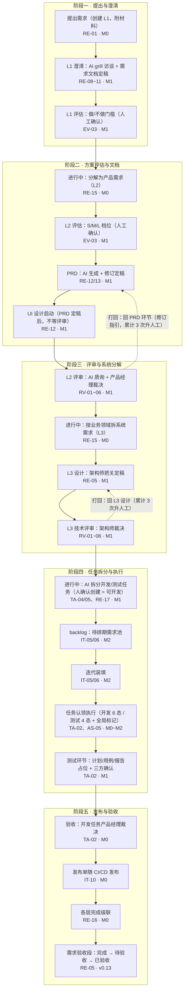
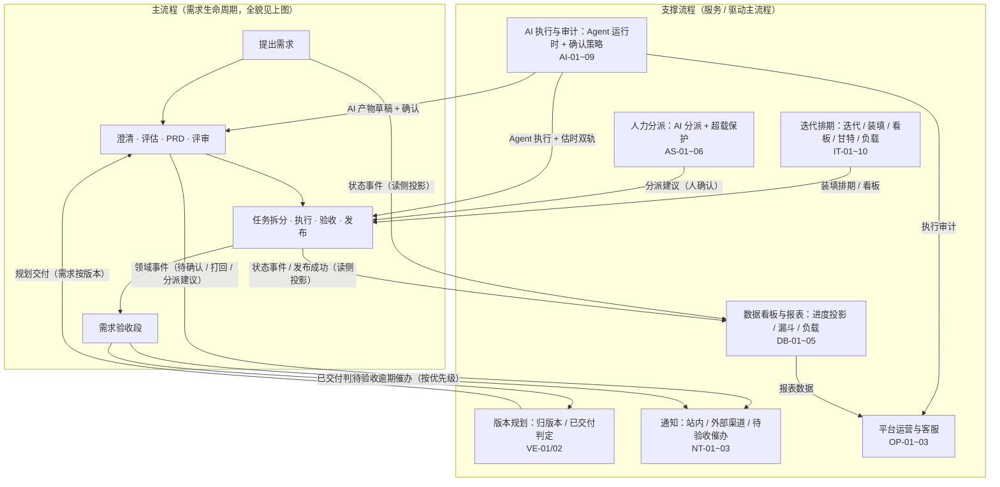
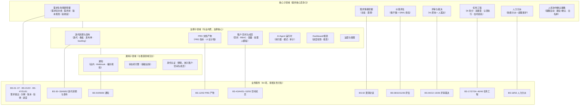
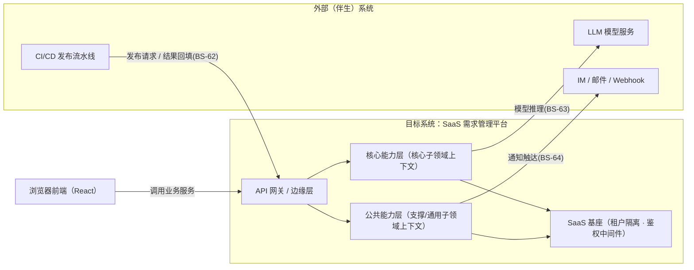
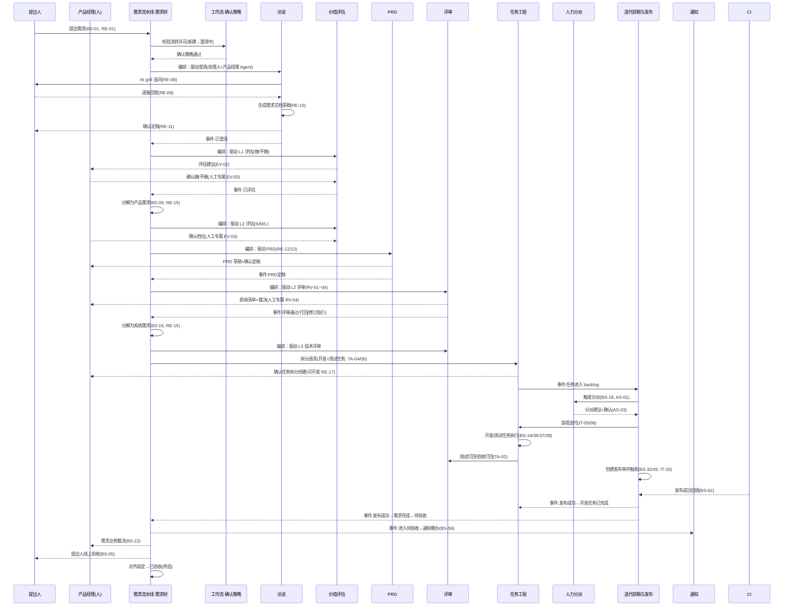
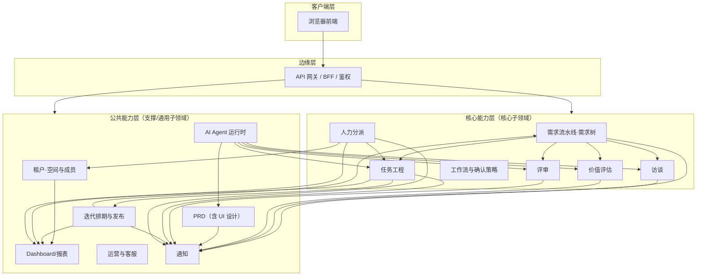
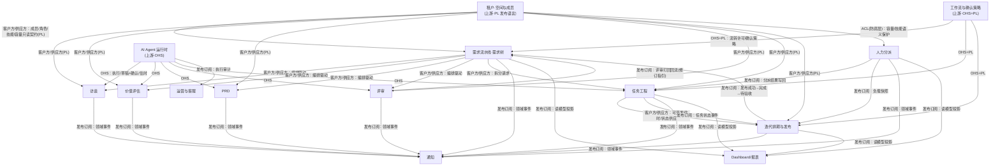

# 08 · DDD 领域划分与限界上下文（业务侧）

> 属于「SaaS 需求管理平台 PRD」的一部分 · v0.13
> **本版按 DDDUP（张逸 · 领域驱动设计统一过程）方法论完整重做**：执行三大阶段 12 步服务风暴中的「全局分析（01 探索业务流程 → 02 识别业务服务 → 03 划分子领域 → 04 定义业务架构）」与「架构映射（05 确定系统上下文 → 06 提炼限界上下文 → 07 绘制服务序列图 → 08 映射应用架构）」；领域建模阶段（09~12）留给架构师技术设计。
> 本文件位置：业务侧 DDD 领域划分与限界上下文方案（需求侧视图，供架构师 PRD 定稿后对齐技术侧 DDD）
> 阅读顺序：前一篇 [07-开放问题](./07-开放问题.md)；架构侧 DDD 模型见 `../architecture/DDD-领域模型.md`（v0.4，PRD 定稿前**冻结、不改动**，本文只读对齐）
> 方法论依据：`D:\knowledge\my-obsidian\wiki\concepts\领域驱动设计统一过程.md`、`业务服务.md`、`限界上下文.md`、`上下文映射.md`、`领域驱动设计反模式.md`、`统一语言.md`、`菱形对称架构.md`、`微服务设计.md` 等

---

## 0. 方法论口径与对旧版的诊断修正

### 0.1 方法论口径

- **问题空间（全局分析）**：系统范围（分析边界一重）→ 子领域（分析边界二重，按价值高低：核心 / 支撑 / 通用）。判据 = **价值高低**，不是界面菜单、角色或动词分类。
- **解空间（架构映射）**：系统上下文（设计边界一重）→ 限界上下文（设计边界二重，**顺变化方向而分 + 以知识语境为界**）→ 逻辑分层（三重）→ 聚合（四重，架构侧）。
- **推导链**：业务服务（02，动词短语命名，数量明显多于限界上下文）→ 子领域（03，语义相关 + 功能相关归类，遵守高内聚松耦合 / 单一抽象层次 / 奥卡姆剃刀 / 最小惊讶 / 清晰边界）→ 限界上下文（06，逐条论证共同变化方向与知识语境）→ 上下文映射（4 通信集成模式 + 4 团队协作模式，只在实际成立的场景使用）+ 服务契约表（query / command / event）。
- **统一语言**：术语严格取自 [02-名词表](./02-名词表.md)（需求 / 产品需求 / 系统需求 / 任务双类型 / 版本 / 迭代 / backlog / 提出人 / 处理人 / 就绪度 / 进度汇总 / 全局标记 / 发布单等），**不发明新业务词**。
- 全部基于 **PRD v0.13 定稿口径**，不引入 PRD 没有的业务语义。

### 0.2 旧版问题 → 本版修正对照（逐条验证）

| # | 旧版问题（诊断） | 本版修正 |
|---|---|---|
| 1 | **跳步**：把 04 的功能清单 1:1 映射成上下文，未走「业务服务 → 子领域 → 限界上下文」推导 | 本版展示完整推导链：§1.2 识别 **64 项业务服务** → §1.3 划分子领域 → §2.2 提炼上下文。上下文边界由推导产出，不是功能清单 1:1 |
| 2 | **核心/支撑/通用判据错**（价值高低未执行）：状态机引擎被并入核心域；任务被判支撑域；租户·空间与成员未拆通用要素 | §1.3 按价值重新归类并**每个子领域给归属理由**：任务工程 = **核心**（「AI agent 当员工」直接载体）；状态机引擎 = **通用子领域**（基础设施）；确认策略 = **核心**；租户·空间与成员 = **支撑**（认证为嵌入的通用要素） |
| 3 | **顺变化方向未执行**：「需求流水线·需求树」14 叶 + 编排大脑 = 大聚合反模式 | §2.2 上下文 2 用「顺变化方向 + 知识语境」逐条论证：需求生命周期相关叶子在 v0.6~v0.13 每次版本同向变化（RE-05/RE-16/VE 联动），属**同一知识语境**（需求 = 分层载体 + 生命周期状态）；聚合本身是小的树节点、编排是领域服务而非聚合，**判定非大聚合**。访谈/评估/PRD/评审按各自产物知识语境与变化方向判定**该拆**（§2.2 上下文 3~6） |
| 4 | **共享内核误用**：任务↔迭代排期标「共享内核」 | §3 修正为 **客户方/供应方**（迭代调用任务供应的可开发/估时契约）+ **发布者/订阅者**（任务状态 / 发布事件）。共享内核仅「跨团队稳定共享领域模型」时成立，同系统同团队不适用 |
| 5 | **粒度失衡**：PRD 仅 2 叶 vs 需求流水线 14 叶 | §2.2 论证：**粒度判据 = 顺变化方向 + 知识语境，不是叶子数量**。PRD 是独立文档产物语境（顺变化方向 = 文档规则）、小而有界；需求流水线 14 叶同属一个生命周期语境、聚合规模小。两处均符合粒度原则 |
| 6 | **落点未论证**：版本 VE / backlog / 验收段 / 发布单 / UI 设计各落哪个上下文未给知识语境理由 | §2.2 各落点给理由：版本 = 需求侧「规划维度」→ 需求流水线；backlog = 排期侧「候选池」→ 迭代排期与发布（与版本**不同**知识语境）；验收段 = 需求状态机的一部分 → 需求流水线；发布单 = 执行侧批量上线 → 迭代排期与发布；UI 设计 = L2 附着的文档产物 → PRD |
| 7 | **缺系统上下文（05）与服务序列图（07）** | 补上：§2.1 系统上下文图（含 CI/CD、LLM 模型服务、IM/Webhook、前端、SaaS 平台），§2.3 服务序列图（核心流程跨上下文协作） |
| 8 | **统一语言**：术语须与 PRD 02 名词表一致 | 全文术语对齐 02 名词表；业务服务命名用动词短语 + PRD 叶子编号回标；上下文命名与 v0.4 保持对应便于架构对齐 |

---

## 1. 全局分析（问题空间）

### 1.1 探索业务流程（01）

**主流程（一条需求从提出到已验收）**——用业务阶段图表达（节点含 PRD 叶子编号与里程碑标注；虚线为打回流）：

> 里程碑标注依 [05-里程碑交付](./05-里程碑交付.md)：M0 领域地基 37 叶 / M1 AI 流水线 29 叶 / M2 AI 管理闭环 14 叶 / M3 打磨 9 叶；v0.13 需求验收段为定稿增量、不单独计里程碑。图中「验收（开发任务裁决）」为任务层验收（M0），「需求验收段」为需求层验收（v0.13），两处均落在主流程上。退化完成规则（父级完成判定排除废弃子级）、废弃级联/恢复等为终止态例外，不在主路径展示，口径见 [03-需求全生命周期流程详解](./03-需求全生命周期流程详解.md)。

**支撑流程**——支撑流程服务/驱动主流程（子图分组 + 边上的箭头注明服务关系）：

> 支撑流程与主流程的关系：**版本规划**在需求侧（归版本、已交付判定，v0.12）；**迭代排期 / 人力分派**在任务执行侧（装填、分派建议 + 人确认，M2）；**通知**为各环节领域事件的外部触达出口（含 v0.13 待验收按优先级催办）；**AI 执行与审计**为主流程各 AI 环节提供执行机制（草稿 + 确认 / 全自动）与审计记录；**数据看板与报表**为读侧投影（进度汇总 / 漏斗 / 负载，CQRS）；**平台运营与客服**在平台侧消费审计与报表（只读，见 [07-开放问题](./07-开放问题.md) 12）。

**线上/线下与系统内外**：主流程与支撑流程均为**线上**业务活动（目标系统内，SaaS 平台）；线下活动（如口头沟通需求背景）不是业务服务，不纳入系统。目标系统内/外边界（CI/CD、LLM 模型服务、IM/Webhook 等伴生系统）见 [§2.1 确定系统上下文](#21-确定系统上下文05)，此处不重复。

> 与 §2.3 服务序列图的分工：本图为**业务流程全貌**（问题空间，业务阶段视角）；§2.3 为**跨限界上下文协作时序**（解空间，按「角色 → 服务契约 → 上下文 → 事件」粒度），两者互补、不重复。

### 1.2 识别业务服务（02）

按参与者逐一识别，排除三类对象（线下活动、前端操作如「打开界面」、业务服务内部步骤）。业务服务是**向目标系统后端发起的一次连续而完整的功能交互**。共 **64 项**，数量显著多于限界上下文（14）。服务规约格式：`作为<参与者> 我想要<服务功能> 以便<服务价值>`。触发 = 按钮 / 策略定时器 / 伴生系统消息。

| 编号 | 业务服务（动词短语） | 参与者 | 服务规约（作为…想要…以便…） | 触发 | 对应 PRD 叶子 |
|---|---|---|---|---|---|
| BS-01 | 提出需求 | 提出人 | 作为提出人，我想要创建初始需求并附上目标描述与材料，以便想法正式纳入管理 | 按钮 | RE-01, RE-14 |
| BS-02 | 参与澄清访谈 | 提出人 | 作为提出人，我想要逐条回答 AI 追问并补充材料，以便需求全貌被挖完整 | 按钮 | RE-08, RE-09 |
| BS-03 | 确认需求文档定稿 | 提出人 / 产品经理 | 作为提出人，我想要确认澄清纪要/需求文档定稿，以便进入评估环节 | 按钮 | RE-11 |
| BS-04 | 回应评审质询 | 提出人 / 开发人员 | 作为参与方，我想要逐条回应评审质询，以便方案边界达成一致 | 按钮 | RV-03 |
| BS-05 | 线上验收所提需求 | 提出人 | 作为提出人，我想要对所提整棵需求做线上验收确认，以便确认需求达成 | 按钮 | RE-05（验收段） |
| BS-06 | 提出验收异议 | 提出人 | 作为提出人，我想要对验收结果提出异议，以便问题被返工处理 | 按钮 | RE-05（验收段） |
| BS-07 | 创建产品需求 | 产品经理 | 作为产品经理，我想要直接创建产品需求（自身规划类），以便快速跳过澄清推进 | 按钮 | RE-01 |
| BS-08 | 确认 L1 做/不做判定 | 产品经理 | 作为产品经理，我想要确认业务目标值不值得做，以便决定是否投入 | 按钮（人工专属） | EV-03（L1 语义） |
| BS-09 | 确认产品需求分解 | 产品经理 | 作为产品经理，我想要确认初始需求分解为产品需求，以便需求树生长 | 按钮 | RE-15 |
| BS-10 | 确认 L2 评估档位 | 产品经理 | 作为产品经理，我想要修正并确认方案价值档位（S/M/L/废弃），以便决定优先级 | 按钮（人工专属） | EV-03 |
| BS-11 | 确认废弃并附原因 | 产品经理 | 作为产品经理，我想要确认需求废弃并附原因，以便终止无价值工作 | 按钮 | EV-04 |
| BS-12 | 修订并定稿 PRD | 产品经理 | 作为产品经理，我想要修订并确认 PRD 定稿（含评审打回后按修订指引修订），以便进入评审 | 按钮 | RE-13 |
| BS-13 | 主持 L2 评审并裁决 | 产品经理 | 作为产品经理，我想要主持需求评审并对质询做通过/打回裁决，以便方案质量把关 | 按钮（人工专属） | RV-04 |
| BS-14 | 撰写打回理由 | 产品经理 / 架构师 | 作为裁决人，我想要撰写打回理由作为修订指引，以便修订方向明确 | 按钮（人工专属） | RV-05 |
| BS-15 | 执行强制升人工 | 产品经理 | 作为产品经理，我想要在第 3 次打回时人工修订或放行，以便打破打回死循环 | 按钮 | RV-05 |
| BS-16 | 确认系统需求分解 | 产品经理 | 作为产品经理，我想要确认产品需求按业务领域分解为系统需求，以便技术实施展开 | 按钮 | RE-15（L2→L3） |
| BS-17 | 调整并确认任务拆分 | 产品经理 / 架构师 | 作为确认人，我想要调整并确认开发任务拆分结果批量创建，以便任务可执行 | 按钮 | TA-05 |
| BS-18 | 确认装填/分派建议 | 产品经理 / 迭代负责人 | 作为负责人，我想要确认 AI 装填与分派建议，以便迭代排期生效 | 按钮 | AS-03, IT-06 |
| BS-19 | 任务验收裁决 | 产品经理 | 作为产品经理，我想要对开发任务做验收通过/打回裁决，以便任务可进入发布 | 按钮（人工专属） | TA-02 |
| BS-20 | 三方确认（测试） | 产品经理 + 架构师 + 测试人员 | 作为三方，我想要对测试结果做三方确认，以便测试任务完成 | 按钮（人工专属） | TA-02 |
| BS-21 | 决定需求归属版本 | 产品经理 | 作为产品经理，我想要把需求归入/移出某版本，以便规划本版交付范围 | 按钮 | VE-02 |
| BS-22 | 需求级验收业务裁决 | 产品经理 | 作为产品经理，我想要对完成需求做业务裁决（功能符合 PRD？），以便验收敲定 | 按钮（人工专属） | RE-05（验收段） |
| BS-23 | 恢复废弃需求/任务 | 产品经理 | 作为产品经理，我想要恢复废弃的需求/任务（级联恢复），以便重新评估 | 按钮 | EV-04, TA-02 |
| BS-24 | 创建系统需求（技术改进） | 架构师 | 作为架构师，我想要直接创建技术改进类系统需求，以便技术债治理纳入管理 | 按钮 | RE-01 |
| BS-25 | 修订并确认设计定稿 | 架构师 | 作为架构师，我想要修订并确认系统设计定稿，以便进入技术评审 | 按钮 | RE-05（L3 设计） |
| BS-26 | 主持 L3 技术评审并裁决 | 架构师 | 作为架构师，我想要主持技术评审并裁决通过/打回，以便实现方案把关 | 按钮（人工专属） | RV-04 |
| BS-27 | 确认测试任务拆分 | 架构师 / 测试人员 | 作为确认人，我想要确认测试任务拆分创建，以便测试可执行 | 按钮 | TA-05（测试部分） |
| BS-28 | 测试打回升架构师裁决 | 架构师 | 作为架构师，我想要在测试打回累计 3 次时介入裁决，以便打破重测循环 | 按钮（人工专属） | TA-02 |
| BS-29 | 反馈设计/任务可行性 | 架构师 / 开发人员 | 作为技术方，我想要反馈需求粒度/设计可行性，以便方案合理 | 按钮 | RE-01, TA-05 |
| BS-30 | 管理迭代 | 迭代负责人 | 作为迭代负责人，我想要创建/编辑/结束迭代，以便管理执行周期 | 按钮 | IT-01, IT-09 |
| BS-31 | 确认迭代装填 | 迭代负责人 | 作为迭代负责人，我想要把任务装填/移出迭代，以便确定本期执行范围 | 按钮 | IT-05 |
| BS-32 | 决定发布任务 | 迭代负责人 | 作为迭代负责人，我想要创建发布单并决定发布哪些任务，以便分批上线 | 按钮 | IT-10 |
| BS-33 | 维护看板 | 迭代负责人 / 开发人员 | 作为使用者，我想要在看板上拖拽流转任务状态，以便执行过程可视化 | 按钮 | IT-03 |
| BS-34 | 认领开发任务 | 开发人员 / 开发 Agent | 作为认领者，我想要认领开发任务并切换估时双轨，以便开始执行 | 按钮 | AS-05, TA-07 |
| BS-35 | 执行开发任务 | 开发人员 / 开发 Agent | 作为执行者，我想要执行开发并推进任务状态（进行中→待测试），以便交付可测成果 | 按钮 | TA-02 |
| BS-36 | 标记/解除阻塞挂起 | 任意成员 | 作为负责人，我想要标记或解除任务挂起/阻塞（全局标记），以便如实反映执行状态 | 按钮 | TA-02, RE-18 |
| BS-37 | 认领测试任务 | 测试人员 / 测试 Agent | 作为认领者，我想要认领测试任务并切换估时双轨，以便开始测试准备 | 按钮 | AS-05, TA-07 |
| BS-38 | 拆分测试任务 | 测试人员 | 作为测试人员，我想要基于 UI 设计 + PRD 操作流程 + 接口拆分测试任务，以便测试覆盖完整 | 按钮 | TA-04（测试部分） |
| BS-39 | 输出测试计划/用例/报告 | 测试人员 / 测试 Agent | 作为测试人员，我想要输出测试计划、编写用例、执行用例、输出报告（占位），以便测试可追踪 | 按钮 | TA-02（测试环节） |
| BS-40 | 测试打回 | 测试人员 | 作为测试人员，我想要对不通过的开发任务打回并附反馈，以便缺陷返工 | 按钮 | TA-02 |
| BS-41 | 三方确认（测试） | 测试人员 | 作为测试人员，我想要参与测试三方确认，以便测试任务完成 | 按钮（人工专属） | TA-02 |
| BS-42 | 产出 UI 设计稿 | UI 设计师 | 作为 UI 设计师，我想要在 PRD 定稿后产出 UI 设计稿/交互原型，以便作为 L3 设计输入 | 按钮 | RE-12（UI 设计随 PRD 启动） |
| BS-43 | 管理空间 | 空间负责人 | 作为空间负责人，我想要创建/编辑/删除空间并设定负责人，以便组织需求集 | 按钮 | TE-12 |
| BS-44 | 维护空间内角色权限 | 空间负责人 | 作为空间负责人，我想要维护空间内角色/权限/账户关系，以便权限合规 | 按钮 | TE-13, TE-04 |
| BS-45 | 触发发布 | 空间负责人 / 发布角色 | 作为发布人，我想要触发发布单随 CI/CD 发布，以便任务上线 | 按钮 | IT-10 |
| BS-46 | 强制升人工裁决 | 空间负责人 | 作为空间负责人，我想要在验收/测试打回累计 3 次时介入裁决，以便打破死循环 | 按钮（人工专属） | TA-02（3 次升人工） |
| BS-47 | 查看需求与进度 | 任意成员 | 作为成员，我想要检索/筛选/查看需求与进度，以便掌握状态 | 按钮 | RE-02, RE-03, DB-01 |
| BS-48 | 查看迭代看板/甘特/负载 | 迭代负责人 / 成员 | 作为使用者，我想要查看看板、甘特与负载，以便执行可视化 | 按钮 | IT-03, IT-07, IT-08 |
| BS-49 | 查看并导出报表 | 产品经理 / 空间负责人 | 作为负责人，我想要查看漏斗/评估分布/负载报表并导出，以便复盘 | 按钮 | DB-02~05 |
| BS-50 | 管理评估框架 | 产品经理 | 作为产品经理，我想要创建/启用自定义评估框架，以便评估适配业务 | 按钮 | EV-05, EV-06 |
| BS-51 | 维护团队处理人模板 | 空间负责人 / 产品经理 | 作为负责人，我想要配置团队级/需求级处理人，以便环节处理人自动解析 | 按钮 | TE-09, TE-10 |
| BS-52 | 维护内置 Agent 目录 | 空间负责人 | 作为空间负责人，我想要按 Agent 目录把 Agent 添加为成员，以便 agent 可参与流程 | 按钮 | TE-08, TE-06 |
| BS-53 | 维护成员角色/技能/容量 | 空间负责人 | 作为空间负责人，我想要维护成员角色/技能/容量，以便分派有据 | 按钮 | TE-07 |
| BS-54 | 配置通知规则/订阅 | 产品经理 / 空间负责人 | 作为负责人，我想要配置通知规则与订阅人（含待验收催办频率映射），以便通知按需触达 | 按钮 | NT-02 |
| BS-55 | 登录与租户切换 | 账号用户 | 作为用户，我想要登录/登出并切换租户/空间上下文，以便进入工作环境 | 按钮 | TE-11 |
| BS-56 | 查看运营数据 | 平台管理员 | 作为平台管理员，我想要查看租户/活跃度/AI 调用量，以便掌握平台运营 | 按钮 | OP-01 |
| BS-57 | 处理客服工单 | 平台管理员 | 作为平台管理员，我想要处理客服工单，以便解决平台用户问题 | 按钮 | OP-02 |
| BS-58 | 管理 AI 用量额度 | 平台管理员 | 作为平台管理员，我想要查看并限额租户 AI 用量，以便控制成本 | 按钮 | OP-03 |
| BS-59 | 待验收逾期催办 | 策略 Timer | 作为策略，我想要按优先级定期催办超期待验收需求（P0=1 天/P1=2 天/P2=3 天/P3=7 天），以便验收及时敲定 | 策略定时器 | NT-02（v0.13） |
| BS-60 | 执行提醒动作 | 策略 Timer | 作为策略，我想要触发迭代临近/任务停滞/待确认积压/下级风险等提醒，以便过程不遗漏 | 策略定时器 | AI-08 |
| BS-61 | 判定版本已交付 | 策略 Timer | 作为策略，我想要在版本下所有需求完成时自动判定版本已交付，以便交付状态真实 | 策略定时器 | VE-01 |
| BS-62 | 接收发布结果（CI/CD） | CI/CD 伴生系统 | 作为 CI/CD，我想要接收发布请求并回填发布成功/失败结果，以便任务状态自动更新 | 伴生系统消息 | IT-10 |
| BS-63 | 响应模型推理（LLM） | LLM 模型服务 | 作为 LLM 服务，我想要响应 Agent 的推理请求，以便 AI 环节产出产物 | 伴生系统消息 | AI-01（底层） |
| BS-64 | 外部触达通知（IM/Webhook） | IM/邮件 伴生系统 | 作为外部工具，我想要接收通知触达，以便用户多渠道获知 | 伴生系统消息 | NT-03 |

> 说明：AI 各环节的「执行」动作（grill 追问、评估算分、生成 PRD、生成质询、AI 拆分、Agent 执行任务）由 Agent 代表其业务角色发起（BS-02/BS-35/BS-37 等已覆盖业务侧），AI 执行的**机制**归入伴生/运行时能力（BS-63 + 上下文 11），不重复列服务。人工专属动作（评审裁决、档位确认、做/不做判定、验收裁决、三方确认、发布）在业务服务上已标注。

### 1.3 划分子领域（03，按价值高低）

归类依据 = 语义相关 + 功能相关；归纳原则 = 高内聚松耦合 / 单一抽象层次 / 奥卡姆剃刀 / 最小惊讶 / 清晰边界。**不受界面菜单、角色、动词分类影响**。

| 子领域 | 价值类别 | 归属理由（价值判据） | 包含业务服务 |
|---|---|---|---|
| **需求生命周期管理**（需求流水线·需求树） | **核心** | 三层需求树 + 每层独立状态机 + 完成口径 + 验收段 + 版本规划 = 全产品「大脑」，贯穿人机可替换；把「需求从想法管到上线」闭环是核心竞争力 | BS-01,03,05,06,07,09,16,21,22,24,47,51,61 |
| **需求情报挖掘**（访谈·澄清） | **核心** | 「AI 挖全貌」grill 式访谈是差异化 AI 能力（价值主张第 1 条），访谈方法论（追问/澄清/需求全貌）是业务知识不是通用聊天 | BS-02 |
| **价值评估** | **核心** | 价值判定规则（L1 做/不做门槛 + L2 S/M/L 档位）+ 完全自定义评估框架 = 核心业务规则，决定「值不值得做/值多少」 | BS-08,10,11,50 |
| **评审与裁决** | **核心** | AI 质询 + 人裁决闭环 + 打回回流修订指引 + 累计 3 次升人工 = 人机协作裁决差异化核心；「人裁决不可代行」是产品信任边界 | BS-04,13,14,15,26 |
| **任务工程**（AI 拆分 + 开发/测试双类型 + 认领执行 + 估时双轨） | **核心** | **「AI agent 当员工」的直接载体**：AI 拆分任务（TA-04/05）、开发/测试双类型状态机、agent 认领执行、估时双轨（人机可替换）——这是本产品相对 Jira/Linear 的关键差异，目标用户（一人公司）付费理由所在。通用任务 CRUD 只是其基座 | BS-17,27,29,34,35,37,38,39,40,46 |
| **人力分派** | **核心** | AI 按角色技能自动分派 + 超载保护 + 建议/白名单 = 「agent 当员工」的排班机制，竞品没有，差异化 | BS-18,53 |
| **人机协作确认策略** | **核心** | 「提醒自动 / 副作用建议+确认 / 白名单」决定了 **AI 能替人做多少、哪些决定必须留给人**——这是「人机可替换」的安全边界，产品承诺本身 | BS-18,45,60（确认关卡） |
| **迭代排期与发布** | **支撑** | 迭代/装填/看板/甘特/负载/发布单 = 通用项目管理执行能力（Jira 已有），规则相对简单；backlog 为其排期候选读模型 | BS-30,31,32,33,48,62 |
| **PRD 文档产物**（含 UI 设计稿） | **支撑** | PRD 生成/修订/版本 + UI 设计稿 = L2 附着的**文档产物**，规则简单，不承载差异决策；差异化在 AI 生成能力（运行时），不在文档容器 | BS-12,42 |
| **租户·空间与成员** | **支撑**（认证为其中通用要素） | 空间/团队/成员/角色权限/技能/容量/处理人模板 = 支撑核心子领域的专业内聚业务（RBAC 是分派强依赖输入，非纯通用）；**账号认证/登录为通用子领域要素，因 PRD 将登录进入默认租户/权限校验统一拦截与 RBAC 强耦合，嵌入本上下文而非单列**（TE-11） | BS-43,44,51,52,53,55 |
| **AI Agent 运行时** | **支撑** | Agent 执行器/执行状态/执行模式/工具调用/审计 = **通用 AI 执行载体**，任何做 AI 流水线的竞品都有；「agent 当员工」的差异化在业务语义（环节处理人配置、确认策略、任务执行），不在执行机制 | BS-63（底层） |
| **Dashboard/报表 + 进度投影** | **支撑** | 读侧投影与报表，规则简单，不参与写不变量 | BS-47,48,49 |
| **运营与客服** | **支撑** | 平台侧运营/客服/用量额度，SaaS 平台通用能力 | BS-56,57,58 |
| **通知** | **通用** | 站内信/邮件/Webhook 触达 + 规则订阅，与垂直领域无关 | BS-54,59,64 |
| **状态机引擎** | **通用**（基础设施，无独立业务叶子） | 通用状态流转能力（平台基座「AI 流程执行框架」），跨对象复用，无业务差异化；**不作为独立业务上下文**，作为基础设施能力供各上下文状态机使用 | — |
| **身份认证** | **通用**（要素） | 登录/会话/多租户切换，跨行业通用；因 PRD 耦合嵌入租户·空间与成员 | BS-55 |

> 关键边界说明（回应旧版判据问题）：① **任务 = 核心**（价值高低判据：它承载「AI agent 当员工」——本产品对一人公司的核心承诺），非支撑；② **状态机引擎 = 通用子领域**（基础设施），确认策略 = 核心子领域（安全边界），两者分离，不再并成一个「引擎通用+策略核心」混算的核心域；③ **租户·空间与成员 = 支撑**，其中认证为嵌入的通用要素；④ **AI Agent 运行时 = 支撑**（通用执行载体），「agent 当员工」的差异化不在运行时而在任务工程/分派/确认策略。

### 1.4 定义业务架构视图（04）

系统范围 = 目标 SaaS 需求管理平台；子领域 = 上表（核心 7 + 支撑 6 + 通用 3）；业务服务 = 64 项按子领域归位。业务架构视图：

---

## 2. 架构映射（解空间）

### 2.1 确定系统上下文（05）

目标系统边界：SaaS 需求管理平台（多租户 SaaS）。外部系统及其关系：

| 外部系统 | 关系 | 方向 |
|---|---|---|
| 浏览器前端（React） | 用户/Agent 的操作入口，经 API 网关调用业务服务 | 外部 → 系统 |
| CI/CD | **伴生系统**：接收发布单发布请求、回填发布成功/失败/回滚结果（BS-62）；M0 人工触发、M2 起自动接入 | 系统 ↔ 外部 |
| LLM 模型服务 | **伴生系统**：Agent 环节的模型推理（BS-63），产出澄清/评估/PRD/质询/拆分等产物 | 系统 → 外部 |
| IM / 邮件 / Webhook | **伴生系统**：通知外部触达渠道（BS-64，Webhook 通用扩展口，后续接飞书等） | 系统 → 外部 |
| SaaS 平台基座 | 租户上下文中间件、鉴权、行隔离（TE-02/TE-11 的机制层） | 系统内 |
| 平台运营/客服后台（OP） | 平台管理员侧，对租户数据**只读**访问（开放问题 12） | 系统内（平台侧） |

### 2.2 提炼限界上下文（06，逐条论证）

判据 = **顺变化方向而分（沿引起变化的原因纵向切分，每片完整）+ 以知识语境为界（同一概念在不同语境含义不同）**。共 **14 个上下文**。命名与架构 v0.4 保持对应便于对齐。

#### 上下文 1 · 租户·空间与成员 —— 支撑域（认证为嵌入的通用要素）

- **职责一句话**：管理多租户、账号认证、空间（租户下目的容器）、团队、空间成员（人与 Agent 统一对象）、RBAC（账号 → 成员 → 空间角色 → 权限）、技能、容量、内置 Agent 目录与团队级处理人模板。
- **顺变化方向论证**：本上下文的变化源 = 组织建模与权限规则（v0.7 空间模型、v0.9 角色=权限包、v0.12 角色体系重构 7 人类角色 + 12 Agent）。这与需求生命周期/任务执行/排期的变化源不同——组织权限改了不应牵动流水线代码。**纵切：完整管理「谁能在哪个空间、以什么角色、有什么权限、能接多少活」**，各下游只消费其契约。
- **知识语境论证**：「成员/角色/容量」在本语境 = 组织身份与资源配额；同一概念在下游（分派 = 负载约束、任务 = 认领人、通知 = 收件人）只是 ID 引用与只读属性。**「认证 = 通用要素」嵌入而非单列**：PRD 将登录进入默认租户、权限校验统一拦截与 RBAC 强耦合（TE-11），且登录方式（SSO 等）变化频率低、影响小，独立成上下文收益不足以抵消跨上下文鉴权边界的成本（奥卡姆剃刀）。
- **覆盖叶子**：TE-01~13（13 项）。
- **与其他上下文关系**：上游，以**发布语言（PL）**公开版本化契约（Member/Space/Role/Skill/Capacity/处理人模板 DTO）；下游按 **客户方/供应方** 消费只读契约；**不做反向依赖**。分派（容量/负载语义）单独加 **防腐层（ACL）** 隔离（见 §3 理由）。

#### 上下文 2 · 需求流水线·需求树 —— 核心域

- **职责一句话**：需求分层分解树（L1 初始 / L2 产品 / L3 系统）建模、分解、每层独立状态机（**含验收段 v0.13**）、完成口径与守卫、就绪度、全局标记、直接创建来源、处理人解析、**版本规划（VE）**、退化完成规则——串联澄清/评估/PRD/评审/拆分/执行的**编排方（客户方）**。
- **顺变化方向论证（关键，回应大聚合诊断）**：本上下文内所有叶子在 v0.6~v0.13 **每次版本同向变化**——验收段（v0.13）同时改 RE-05（状态机）、RE-16（进度规则）、VE 的「已交付 = 全部需求已完成」判定；中间态统一（v0.10）同时改 RE-05/RE-16；版本模型补充（v0.12）同时改 VE 与完成口径。它们共享**同一变化源 = 需求生命周期与交付规划规则**，纵向切开会导致「需求对象在其生命周期语境被拆散」，跨上下文强一致。**非大聚合**：领域聚合本身是小的树节点（Requirement 携带 type + 状态 + 树引用 + 标记），「编排」是**领域服务**（编排方调供应商，客户方/供应方模式），不是聚合内堆积。14 个叶子是 PRD 颗粒度，不是聚合规模。
- **知识语境论证**：「需求」在本语境 = **分层载体 + 生命周期状态 + 归属版本**（完整需求概念）。同一「需求」在下游（访谈 = 访谈对象、评估 = 评分对象、任务 = 归属上级）是不同知识语境下的**局部视角**。**版本（VE-01/02）落本上下文**：版本语义完全建立在需求之上（需求.归属版本单选、父级归版本子级跟随、已交付 = 版本下需求全完成、版本页 = 需求进度聚合视图），无独立于需求的行为，与需求生命周期规则同向变化（v0.12 版本模型与验收段同版改动）。**验收段（v0.13）落本上下文**：验收段是需求状态机（RE-05）的一部分（完成→待验收→已验收、返工回进行中、不改变进度），与完成守卫强耦合，无独立聚合产物。
- **覆盖叶子**：RE-01~07, RE-14~18, VE-01, VE-02（14 项）。
- **与其他上下文关系**：对访谈/评估/PRD/评审为**编排方（客户方）**；评审打回事件**回流**（L2→PRD、L3→设计，修订指引）；向任务发拆分请求；消费迭代排期的发布成功事件驱动完成 → 待验收；验收段触发通知（待验收按优先级提醒）。

#### 上下文 3 · 访谈 —— 核心域（服务 L1 澄清）

- **职责一句话**：AI grill 式多轮追问挖需求全貌，产出澄清纪要 + 需求文档（RE-08~11）。**服务对象 = 初始需求层（L1 澄清）**。
- **顺变化方向论证**：本上下文变化源 = 访谈方法论与 AI 追问质量（grill 轮次、问题维度、纪要结构）。访谈的改进独立于评估/PRD/评审——**访谈精进不该波及评分卡或评审单**，反之亦然。**纵切完整**：一个澄清会话 = 问题 + 回答 + 纪要 + 文档，自洽闭环。
- **知识语境论证**：「需求」在此语境 = **访谈对象（被追问的全貌）**，与评估语境的「评分对象」、评审语境的「评审对象」是不同产物语境。名称相同、含义不同的典型「盲人摸象」场景 → 独立上下文。
- **覆盖叶子**：RE-08, RE-09, RE-10, RE-11（4 项）。
- **与其他上下文关系**：供应商（被需求流水线编排，环节 = L1 澄清）；AI 对话执行由 Agent 运行时提供；产出通过领域事件回传流水线（已澄清）。评审打回**不回填**访谈循环（v0.6 定稿）。

#### 上下文 4 · 价值评估 —— 核心域（服务 L1 做/不做 + L2 S/M/L）

- **职责一句话**：基于需求文档做评分输出档位。**两套语义**：L1 评估「业务目标值不值得做」= 做/不做门槛（人工专属确认）；L2 评估「方案价值」= S/M/L/废弃（优先级）。共用评估机制、不同框架配置（v0.10/v0.11）。评估框架可完全自定义（EV-05/06）。
- **顺变化方向论证**：变化源 = 评估模型与判定规则（框架维度/权重/阈值）。评估规则的调整独立于文档产物与评审——**评估框架升级不波及 PRD/评审**。纵切完整：评估 = 评分卡 + 档位 + 历史，自洽。
- **知识语境论证**：「需求」在此语境 = **评分对象（价值判定的输入）**，与访谈语境的「全貌对象」含义不同。
- **覆盖叶子**：EV-01~07（7 项）。
- **与其他上下文关系**：供应商；默认「草稿 + 确认」——Agent 产评分卡草稿、人确认/改判，档位结果回传流水线；「废弃」档是废弃入口之一（任意阶段废弃的终止态语义归需求流水线）。

#### 上下文 5 · PRD（含 UI 设计稿）—— 支撑域（服务 L2 产物）

- **职责一句话**：基于需求文档 + 评估结论产出结构化 PRD（RE-12/13）；**UI 设计（v0.12）**随 PRD 定稿启动、产出 UI 设计稿/交互原型（挂 L2）、作 L3 设计输入（含测试任务拆分依据）。
- **顺变化方向论证**：变化源 = **文档产物规则**（PRD 章节结构、版本管理、UI 设计稿形态）。文档格式改动是低频、独立的变化方向，不牵动评估/评审逻辑；反之评估/评审规则改动也不波及文档容器。**粒度（回应旧版失衡诊断）**：2 个叶子是**文档语境小而完整**的体现——PRD 上下文 = PRD 文档 + 版本 + UI 设计稿，是完整业务能力（生成与修订、定稿、供下游消费），粒度由顺变化方向判定而非叶子数量。
- **知识语境论证**：「需求」在此语境 = **文档产物的挂载点（PRD 挂在产品需求上、UI 设计稿挂 L2）**；产物语境 ≠ 访谈/评估/评审语境。**UI 设计落本上下文**：UI 设计稿是 L2 附着的文档产物，规则简单，与 PRD 同属「方案文档」语境。
- **覆盖叶子**：RE-12, RE-13（2 项）+ UI 设计产物（v0.12，无独立叶子）。
- **与其他上下文关系**：供应商（被需求流水线编排）；评审打回后回本环节按修订指引修订出版本（打回逻辑在评审）；UI 设计产物被 L3 设计（架构师输入）与测试任务拆分（测试人员输入）消费。

#### 上下文 6 · 评审 —— 核心域（服务 L2 业务评审 + L3 技术评审）

- **职责一句话**：AI 主持质询（生成挑战性问题，可人工增删）、人裁决（通过/打回）、**打回 = 回上一环节**（理由作修订指引）、累计 3 次强制升人工。**服务对象 = L2 业务评审 + L3 技术评审**（技术改进类直建 L3 评审必走、可轻量）。
- **顺变化方向论证**：变化源 = 质询方法论与裁决规则（质询清单生成、打回回流、3 次升人工）。评审规则的调整独立于访谈/评估——**评审质询精进不波及评分卡**。纵切完整：评审单 + 质询 + 回应 + 裁决 + 存档，自洽闭环。
- **知识语境论证**：「需求」在此语境 = **评审对象（被质询的方案/设计）**；L2 与 L3 评审共用同一评审知识语境（质询 + 人裁决 + 打回），故一个上下文承载两层评审。
- **覆盖叶子**：RV-01~06（6 项）。
- **与其他上下文关系**：供应商；ReviewRejected 事件流向需求流水线（发布者/订阅者），由流水线驱动回上一环节；人裁决不可由 Agent 代理（唯一硬性规则）。

#### 上下文 7 · 任务工程 —— 核心域（系统需求层最底层，「AI agent 当员工」载体）

- **职责一句话**：系统需求之下最底层——**开发任务子域**（6 态 + 废弃：待处理→进行中→待测试→待验收→待发布→已完成，验收/测试打回）与**测试任务子域**（4 态：待处理→进行中→待执行→已完成，不发布不验收，测试环节占位 + 三方确认 + 测试打回升架构师）共享 Task 基础对象；AI 拆分（开发/测试双类型，v0.12）、拆分质量信号、估时双轨、依赖关系、全局标记（任务级）。
- **价值判据（回应旧版判支撑）**：本产品对一人公司的核心承诺 = **「AI agent 当员工」**——AI 拆分任务、agent 认领并执行、估时随认领者切换（人机可替换）。这是相对 Jira/Linear 的关键差异，是用户付费理由所在 → **核心子领域**。通用任务 CRUD（TA-01/03）只是其基座，不影响子领域价值归类。
- **顺变化方向论证**：变化源 = 任务执行规则（v0.8 任务 5 态、v0.12 任务双类型、v0.12 测试环节/三方确认、v0.11 验收打回 3 次升人工）。任务规则演进独立于需求生命周期——**任务状态机改型不牵动需求状态机**。任务双类型共享任务对象/看板/迭代/估时/认领分派机制，故**不拆两个上下文**，内部分子域；测试环节（计划/用例/报告）**本期流程占位**（概念存在、不实现存储），并入本上下文不独立（奥卡姆剃刀）。
- **知识语境论证**：「任务」在此语境 = **可独立交付的最小执行单元（开发/测试双类型）**，是需求的执行视角；同「需求」在需求流水线是生命周期视角。任务上下文拥有自己的状态机知识（开发 6 态 / 测试 4 态）。
- **覆盖叶子**：TA-01~08（8 项）。
- **与其他上下文关系**：消费需求流水线的拆分请求（L3 拆开发/测试任务）；为迭代排期提供**上游供应**（可开发 RE-17 / 估时 / 状态）；消费人力分派结果（事件）；状态流转由工作流确认策略提供引擎 + 确认策略；任务状态事件 + 发布成功事件是需求进度汇总投影的叶子数据源；测试任务拆分输入含 PRD 的 UI 设计 + 操作流程 + 接口（v0.12）。

#### 上下文 8 · 迭代排期与发布 —— 支撑域（系统需求层执行侧）

- **职责一句话**：迭代周期配置、任务装填（手动/AI 自动）、迭代内看板（开发 6 态 / 测试 4 态分列 + 全局标记）、甘特/负载视图、**发布单（Release，属于迭代，v0.8/v0.10/v0.12）**；**backlog（待排期需求池，v0.11）作为本上下文的排期候选读模型**。
- **顺变化方向论证**：变化源 = 排期执行规则（迭代装填、发布单前置、挂起/废弃自动移出发布单）。排期规则演进独立于需求生命周期——**装填规则调整不牵动需求状态机**。纵切完整：迭代 + 装填 + 看板 + 发布单，自洽执行闭环。
- **知识语境论证**：**backlog 落本上下文**（回应旧版落点诊断）：backlog = 「已确认未排期的需求（L2/L3）+ 未归版本需求 + 任务」的**排期候选池**，业务上是池子、实现是筛选视图（读模型），供迭代装填（IT-05/06）取用——**排期语境**。**版本（VE）是需求侧「规划维度」**（装需求、读需求状态判已交付），与 backlog 是**不同知识语境**（规划交付 vs 排期候选），故版本在上下文 2、backlog 在上下文 8。**发布单落本上下文**：发布单属于迭代、随 CI/CD 发布、成功后关闭 → 开发任务自动已完成——**执行侧批量上线语境**；发布成功事件流出驱动需求完成（发布动作在此、完成守卫在需求流水线）。
- **覆盖叶子**：IT-01, IT-02, IT-03, IT-05, IT-06, IT-07, IT-08, IT-09, IT-10（9 项，无 IT-04）。
- **与其他上下文关系**：消费任务的**上游供应**（可开发/估时/状态）；消费人力分派负载快照（负载图）；backlog 视图消费需求流水线（版本/状态事件）+ 任务（装填状态事件）；**发布成功事件**（发布者/订阅者）流出到需求流水线（驱动完成 → 待验收）与需求进度投影。

#### 上下文 9 · 人力分派 —— 核心域

- **职责一句话**：按成员角色/技能/容量自动分派任务（开发任务分开发角色、测试任务分测试角色，v0.12）、超载保护、分派建议与确认、容量统计。
- **价值判据**：AI 分派 + 超载保护 + 建议/白名单 = 「agent 当员工」的排班机制，竞品（Jira/Linear）没有 → **核心**。
- **顺变化方向论证**：变化源 = 分派策略（技能匹配规则、超载阈值、白名单）。分派规则调整独立于任务执行/排期——**分派策略改型不牵动任务状态机**。纵切完整：分派（建议/确认/生效/取消）+ 负载快照，自洽。
- **知识语境论证**：「成员容量/技能」在此语境 = **分派约束与负载语义**，与租户·空间与成员中「成员建模」是不同知识语境（后者是身份，前者是负载决策）——这也是对其加 ACL 的理由（见 §3）。
- **覆盖叶子**：AS-01~06（6 项）。
- **与其他上下文关系**：消费租户·空间与成员的成员/技能/容量契约（ACL 隔离）；分派结果事件写回任务；负载快照投影给迭代排期做负载图。

#### 上下文 10 · 工作流与确认策略 —— 核心域（确认策略 = 核心；状态机引擎 = 通用基础设施嵌入）

- **职责一句话**：**确认策略（核心）** = 提醒类动作自动执行（EXECUTE_AUTO）、副作用类动作默认「建议 + 人确认」（SUGGEST_CONFIRM）、白名单放开（WHITELISTED_AUTO）；人工专属动作（评审裁决、档位确认、做/不做判定、验收裁决、三方确认、发布）不在白名单放开范围内。**状态机引擎（通用基础设施）** = 提供通用状态流转能力（平台基座「AI 流程执行框架」），被本上下文与各状态机消费。
- **价值判据（回应旧版引擎混算核心）**：确认策略决定「AI 能替人做多少、哪些决定必须留给人」——**「人机可替换」的安全边界 = 产品承诺本身 → 核心子领域**。**状态机引擎 = 通用子领域**（跨对象复用的通用流转能力、无业务差异化、无独立业务叶子），作为基础设施能力嵌入本上下文，**不单独计为核心**。
- **顺变化方向论证**：引擎变化源 = 通用流转能力需求（低频、通用）；确认策略变化源 = 业务授权规则（高评、随业务决策）。两者变化方向不同，但因引擎无业务叶子、属平台基座，且确认策略语义强依赖引擎执行模型，故**同上下文呈现、内部按「引擎通用 + 策略核心」两层表达**（类比认证嵌入租户上下文，奥卡姆剃刀）。
- **知识语境论证**：各上下文声明自己的合法流转表（需求三层机含验收段 / 任务双类型机 / 迭代看板），确认策略作为统一规则服务跨上下文复用——「谁能批准流转」是统一知识语境。
- **覆盖叶子**：AI-05（副作用确认机制）、AI-06（白名单配置）、AI-08（提醒类动作自动执行）（3 项）；为 RE-05/TA-02/IT-03 的状态流转提供引擎与确认规则。
- **与其他上下文关系**：作为**上游 OHS+PL** 向需求流水线/任务/迭代提供流转与确认服务（多消费者，OHS 成立）；团队可白名单覆盖默认策略。

#### 上下文 11 · AI Agent 运行时 —— 支撑域

- **职责一句话**：平台内置 Agent 的执行环境、编排、执行模式（草稿 + 确认 / 全自动）、工具调用与执行审计（AI-01/02/03/04/07/09）。
- **价值判据（回应旧版「agent 当员工」论证）**：运行时是**通用 AI 执行载体**（执行器/模式/审计），任何 AI 流水线产品都有一套，不决定产品差异。「agent 当员工」的差异化在业务语义层：环节处理人配置（上下文 1）、确认策略（上下文 10）、任务认领执行与估时双轨（上下文 7）——运行时**不承载业务决策**，只是让 AI 产物的机制 → **支撑**。
- **顺变化方向论证**：变化源 = 执行机制（LLM 调用、工具、审计、模式）。机制升级（换模型/加工具）独立于各环节业务规则——**模型升级不牵动访谈/评估逻辑**。
- **知识语境论证**：「Agent」在此语境 = **运行时实例（绑定成员 kind=AGENT）**，与租户·空间与成员中「Agent 目录」的**成员身份**是不同知识语境。
- **覆盖叶子**：AI-01, AI-02, AI-03, AI-04, AI-07, AI-09（6 项）。
- **与其他上下文关系**：作为供应商（OHS）被访谈/评估/PRD/评审/任务消费（执行/草稿 + 确认/估时）；执行审计供运营与客服（用量/审计）与 Dashboard 消费。

#### 上下文 12 · 通知 —— 通用域

- **职责一句话**：把各上下文领域事件转化为面向人/Agent 的通知（站内信/邮件/IM/Agent 回调），含通知规则与订阅、外部渠道（Webhook 扩展口）。**待验收催办频率映射（v0.13）**：P0=1 天/P1=2 天/P2=3 天/P3=7 天，为可配置规则（NT-02），触发时机由需求流水线验收段产生。
- **价值判据**：跨上下文复用、与垂直领域无关 → **通用**。
- **覆盖叶子**：NT-01, NT-02, NT-03（3 项）。
- **与其他上下文关系**：订阅各上下文领域事件（发布者/订阅者）；通过 OHS 提供发送与偏好查询；外部渠道为扩展口。

#### 上下文 13 · Dashboard/报表（含需求进度汇总投影）—— 支撑域

- **职责一句话**：租户 Dashboard（含下级「N 个阻塞/挂起」风险提醒）、需求漏斗/评估分布/团队负载报表、报表导出，以及**需求进度汇总投影**（读模型：系统需求 = 已完成任务/总数；父级 = 子级聚合；废弃子级排除；挂起/阻塞计未完成；验收段不改变进度）。
- **顺变化方向论证**：变化源 = 报表需求与投影物化机制；**纯 CQRS 读侧**，不参与写路径不变量（进度永不写回需求聚合）。
- **知识语境论证**：读模型把「需求/任务/迭代」呈现为**统计视角**，与写侧业务语境分离。
- **覆盖叶子**：DB-01~05（5 项）。
- **与其他上下文关系**：订阅需求流水线/任务/迭代/分派的事件更新投影（发布者/订阅者）；进度投影消费发布成功事件。

#### 上下文 14 · 运营与客服 —— 支撑域

- **职责一句话**：SaaS 平台侧运营后台、客服工单、AI 用量与额度管理（OP-01~03）。注意内置「客服 Agent」是服务租户自身客户的团队成员（上下文 1），与本上下文平台客服后台是不同概念。
- **覆盖叶子**：OP-01, OP-02, OP-03（3 项）。
- **与其他上下文关系**：消费 AI 运行时执行审计（事件）；对业务上下文为平台侧只读/审计（分离方式 + 读模型；开放问题 12）。

### 2.3 服务序列图（07）

核心流程跨上下文协作（角色 → 服务契约 → 上下文 → 事件）：

### 2.4 应用架构映射（08）

按菱形对称架构（内外分离 + 南北对称），每个限界上下文内部结构 = 北向网关（远程服务 Resource/Controller → 本地服务 AppService → 消息契约）→ 领域层（聚合/领域服务）→ 南向网关（端口 Repository/Client/Publisher → 适配器）。系统分层 = 核心能力层（核心子领域上下文）+ 公共能力层（支撑/通用子领域上下文）。

| 系统层 | 限界上下文 |
|---|---|
| 核心能力层 | 需求流水线·需求树、访谈、价值评估、评审、任务工程、人力分派、工作流与确认策略 |
| 公共能力层 | 租户·空间与成员、PRD、迭代排期与发布、AI Agent 运行时、Dashboard/报表、运营与客服、通知 |

协作方式：进程内 = 远程服务 → 本地服务 → 领域；跨上下文 = 服务调用（北向网关 ↔ 北向网关）或事件驱动（南向网关 Publisher → 事件总线 → 北向网关 Subscriber）。CQRS 读模型（Dashboard/报表、backlog 视图）不参与写不变量。跨上下文一致性采用「建议 → 确认 → 执行」两阶段 + 领域事件最终一致（详见架构 v0.4 §9，本处仅对齐）。

---

## 3. 上下文映射（Context Map）+ 服务契约表

### 3.1 上下文映射图（正确模式）

按 DDDUP 4 通信集成模式（ACL / OHS / PL / 共享内核）+ 4 团队协作模式（遵奉者 / 分离方式 / 发布者·订阅者 / 客户方·供应方），**只在实际成立的场景使用**：

- **ACL 只标 1 处**：人力分派 → 租户·空间与成员。理由：分派对「成员容量/技能」做**超载保护决策**，租户·空间与成员 RBAC 模型演进（v0.12 重构）会直接破坏分派的负载语义，需要防腐层隔离翻译。其余下游消费的是稳定版本化的发布语言 DTO，用客户方/供应方即可，**不标 ACL**。
- **OHS + PL 只标真正多消费者的上游**：工作流与确认策略（需求/任务/迭代共用）、AI Agent 运行时（多个环节上下文消费）、租户·空间与成员（多个下游消费稳定基础词表）。这些上游对更多下游做承诺、公开稳定契约，OHS 成立。
- **共享内核：不使用**。任务↔迭代排期同系统同团队，非「跨团队稳定共享模型」，修正旧版误标为 **客户方/供应方 + 发布者/订阅者**。
- **发布者/订阅者**：评审→需求流水线（打回回流）、任务→迭代排期（状态事件）、迭代排期→需求流水线（发布成功）、分派→任务（分派结果）、各上下文→通知（领域事件）、写侧→Dashboard（读模型订阅）、运行时→运营（审计事件）。
- **客户方/供应方**：需求流水线→访谈/评估/PRD/评审（编排方=客户）；任务→迭代排期（上游供应可开发/估时）；迭代排期→任务/需求（装填取数/版本状态消费）；租户→各下游（服务契约消费）。

> 模式使用声明：**ACL 仅 1 处**（分派 → 租户，容量/负载语义保护）；**OHS+PL 仅 3 个真多消费者上游**（工作流、运行时、租户）；**共享内核不使用**；其余为客户方/供应方与发布者/订阅者。修正了旧版「租户对全部下游 OHS+PL+ACL」「任务↔迭代共享内核」的泛化误用。

### 3.2 服务契约表

| 上游 | 下游 | 模式 | 服务契约 | 操作类型 |
|---|---|---|---|---|
| 租户·空间与成员 | 需求流水线/访谈/评估/PRD/评审/任务/迭代/分派 | 客户方/供应方（PL） | 查询成员/角色/技能/容量、查询处理人模板、校验权限 | query |
| 租户·空间与成员 | 人力分派 | ACL | 查询成员容量/技能（翻译为分派侧语义） | query |
| 需求流水线·需求树 | 访谈 | 客户方/供应方 | 发起澄清会话（给定需求+处理人） | command |
| 需求流水线·需求树 | 价值评估 | 客户方/供应方 | 发起评估（给定需求+框架） | command |
| 需求流水线·需求树 | PRD | 客户方/供应方 | 生成/修订 PRD | command |
| 需求流水线·需求树 | 评审 | 客户方/供应方 | 创建评审单、发起质询 | command |
| 评审 | 需求流水线·需求树 | 发布者/订阅者 | 评审通过 / 评审打回（修订指引） | event |
| 需求流水线·需求树 | 任务工程 | 客户方/供应方 | 拆分请求（L3 拆开发/测试任务） | command |
| 任务工程 | 迭代排期与发布 | 客户方/供应方 | 查询可开发任务（RE-17）/估时/状态 | query |
| 任务工程 | 迭代排期与发布 | 发布者/订阅者 | 任务状态变更 / 全局标记变更 | event |
| 人力分派 | 任务工程 | 发布者/订阅者 | 分派确认 / 分派取消 | event |
| 迭代排期与发布 | 需求流水线·需求树 | 发布者/订阅者 | 发布成功（清单+需求引用）→ 驱动完成→待验收 | event |
| 迭代排期与发布 | 需求流水线·需求树 | 客户方/供应方 | 查询需求版本/状态（backlog 筛选） | query |
| 工作流与确认策略 | 需求流水线/任务/迭代 | 客户方/供应方（OHS+PL） | 校验流转许可、查询/应用确认策略 | command/query |
| AI Agent 运行时 | 访谈/评估/PRD/评审/任务 | 客户方/供应方（OHS） | 执行环节（产物生成）、草稿+确认 | command |
| 各业务上下文 | 通知 | 发布者/订阅者 | 领域事件（待确认/打回/分派建议/待验收催办/下级风险） | event |
| 写侧上下文 | Dashboard/报表 | 发布者/订阅者 | 状态/发布/分派/挂起阻塞事件 → 投影 | event |
| AI Agent 运行时 | 运营与客服 | 发布者/订阅者 | 执行审计事件（用量/日志） | event |

---

## 4. 与 PRD 对齐映射表（新上下文 ↔ 业务域 A~K ↔ 叶子 ↔ v0.4）

| 新上下文（本文 v0.13） | PM 业务域（域 A~K） | 叶子 | 数量 | v0.4 有界上下文（对齐） | 对齐说明 |
|---|---|---|---|---|---|
| 租户·空间与成员 | 域A 租户与团队 | TE-01~13 | 13 | 租户·空间与成员 | 1:1；认证=嵌入通用要素；v0.12 角色体系重构内部调整 |
| 需求流水线·需求树 | 域B 需求（对象/状态流转/树/进度/标记）+ 版本规划 | RE-01~07, RE-14~18, VE-01, VE-02 | 14 | 需求流水线·需求树 | 扩展验收段（v0.13）、版本规划（VE）、退化完成（v0.11）、L3 按业务领域拆（v0.10） |
| 访谈 | 域B 需求（澄清环节） | RE-08~11 | 4 | 访谈 | 1:1；服务 L1 澄清 |
| 价值评估 | 域C 价值评估 | EV-01~07 | 7 | 价值评估 | 1:1；L1 做/不做复用 EV 机制 |
| PRD | 域B 需求（PRD 环节） | RE-12, RE-13 | 2 | PRD | 1:1；UI 设计稿挂 L2（v0.12） |
| 评审 | 域D 评审 | RV-01~06 | 6 | 评审 | 1:1；L2/L3 评审主持归属、评审必走（v0.11/v0.12） |
| 任务工程 | 域E 任务 | TA-01~08 | 8 | 任务 | **支撑 → 核心（价值重判）**；任务双类型子域 + 测试环节并入 |
| 迭代排期与发布 | 域F 迭代排期 | IT-01,02,03,05,06,07,08,09,10 | 9 | 迭代排期与发布 | 1:1；发布单前置（v0.12）、backlog 排期候选读模型（v0.11） |
| 人力分派 | 域G 人力分派 | AS-01~06 | 6 | 人力分派 | 1:1；测试任务分派测试角色 |
| 工作流与确认策略 | 域H AI 执行（确认策略） | AI-05, AI-06, AI-08 | 3 | 工作流状态机 | 确认策略=核心、引擎=通用基础设施；为 RE-05/TA-02/IT-03 提供引擎 |
| AI Agent 运行时 | 域H AI 执行（Agent 执行与模式） | AI-01~04, AI-07, AI-09 | 6 | AI Agent 运行时 | 1:1；测试 Agent 归目录（v0.12），机制不变 |
| 通知 | 域I 通知 | NT-01~03 | 3 | 通知 | 1:1；待验收催办频率映射（v0.13） |
| Dashboard/报表 | 域J 数据看板与报表 | DB-01~05 | 5 | Dashboard与报表（含进度投影） | 1:1；进度口径随 v0.10/v0.12/v0.13 更新 |
| 运营与客服 | 域K 平台运营与客服 | OP-01~03 | 3 | 运营与客服 | 1:1 |
| **合计** | | | **89** | | |

---

## 5. 相对 v0.4 的差异说明

> v0.4 对齐 PRD v0.7，本文对齐 PRD v0.13 并按 DDDUP 重做。上下文**命名与数量（14 个）与 v0.4 保持对应**，但**划分过程（业务服务→子领域→上下文）、价值归类与上下文映射模式已重构**。逐条列出（★ = 任务提示重点关注项）：

| # | v0.4 口径 | v0.13（DDDUP 重做）调整 | 落点上下文 | 理由 |
|---|---|---|---|---|
| 1 | ★ 划分过程：功能清单 1:1 | **完整推导**：64 项业务服务 → 14 个子领域（价值高低）→ 14 个限界上下文（顺变化方向+知识语境） | 全局 | DDDUP 02/03/06 步骤落地，消除跳步 |
| 2 | ★ 任务 = 支撑域 | **任务工程 = 核心域** | 任务工程 | 价值判据：任务（AI 拆分 + 开发/测试双类型 + agent 认领执行 + 估时双轨）是「AI agent 当员工」的直接载体，一人公司产品关键承载 |
| 3 | ★ 工作流状态机 = 引擎通用 + 策略核心（按核心计） | **确认策略 = 核心；状态机引擎 = 通用子领域（基础设施，不单计核心）** | 工作流与确认策略 | 价值判据：引擎是通用流转能力（平台基座），确认策略才是「人机可替换」安全边界 |
| 4 | ★ 任务↔迭代 = 共享内核 | **客户方/供应方 + 发布者/订阅者** | 上下文映射 | 共享内核仅「跨团队稳定共享模型」成立；同系统同团队不适用 |
| 5 | ★ 租户对全部下游 = OHS+PL + ACL | **PL 发布语言 + 客户方/供应方为默认；ACL 仅分派 1 处** | 上下文映射 | ACL 只在实际保护场景成立（分派容量/负载语义），禁止泛化标注 |
| 6 | ★ 粒度：需求流水线 14 叶 vs PRD 2 叶 | **论证粒度 = 顺变化方向 + 知识语境，非叶子数** | 上下文 2/5 | 需求生命周期叶子同向变化、同知识语境、聚合小，非大聚合；PRD 是独立文档语境 |
| 7 | ★ 版本落点未论证 | **版本 = 需求侧规划维度 → 需求流水线**（与 backlog 排期语境区分） | 需求流水线·需求树 | 版本语义完全建立在需求之上，与生命周期同向变化 |
| 8 | ★ backlog 落点未论证 | **backlog = 排期候选池（读模型）→ 迭代排期与发布** | 迭代排期与发布 | 排期语境，供装填取用 |
| 9 | 无需求级验收段 | **验收段（v0.13）**：完成→待验收→已验收、返工重走、提出人线上验收 | 需求流水线·需求树 | 验收段 = 需求状态机（RE-05）一部分，与完成守卫耦合 |
| 10 | 需求状态机含需求层「待发布」 | **需求层去「待发布」、中间态统一「进行中」（v0.10）**；任务层保留 | 需求流水线 + 任务 | v0.10 定稿 |
| 11 | 无版本概念（v0.4 对齐 v0.7） | **版本 = 规划维度（v0.9/v0.12）**：已交付判定/废弃移出/挂起留版本/父级跟随 | 需求流水线·需求树 | v0.9/v0.12 定稿 |
| 12 | 完成口径 = 已发布上线 | **完成口径更新（v0.8/v0.12/v0.13）**：开发任务=发布成功、测试任务=三方确认；需求完成=开发活动彻底结束→待验收 | 需求流水线（守卫）+ 任务 + Dashboard（投影） | 随任务双类型与验收段演进 |
| 13 | 无测试环节 | **测试环节（v0.12）**：计划/用例/报告占位 + 三方确认 + 测试打回升架构师 | 任务工程（测试任务子域） | 本期流程占位，并入任务上下文 |
| 14 | 评审主持人/验收负责人角色 | **角色体系重构（v0.12）**：人类 7 类 + Agent 12 类、评审/验收裁决归位 | 租户·空间与成员 | 角色 = 权限包 |
| 15 | 无 backlog | **backlog 定名（v0.11）** | 迭代排期与发布 | 待排期需求池 = 筛选视图（读模型） |
| 16 | 发布单（Release 清单含任务/需求） | **发布单前置（v0.10/v0.12）**：只装「测试通过+验收通过」开发任务、挂起/废弃自动移出 | 迭代排期与发布 | Release 聚合不变量扩展 |
| 17 | 无 UI 设计 | **UI 设计提前启动（v0.12）**：PRD 定稿后启动、挂 L2、作 L3 设计输入 | PRD | UI 设计稿是 L2 文档产物 |
| 18 | 缺系统上下文/服务序列图 | **补 05 系统上下文 + 07 服务序列图** | §2.1/§2.3 | DDDUP 架构映射完整性 |

---

## 附录 A：89 个叶子功能全覆盖核对

| 上下文 | 叶子 | 小计 |
|---|---|---|
| 租户·空间与成员 | TE-01~13 | 13 |
| 需求流水线·需求树 | RE-01~07, RE-14~18, VE-01, VE-02 | 14 |
| 访谈 | RE-08~11 | 4 |
| 价值评估 | EV-01~07 | 7 |
| PRD | RE-12, RE-13 | 2 |
| 评审 | RV-01~06 | 6 |
| 任务工程 | TA-01~08 | 8 |
| 迭代排期与发布 | IT-01, IT-02, IT-03, IT-05, IT-06, IT-07, IT-08, IT-09, IT-10 | 9 |
| 人力分派 | AS-01~06 | 6 |
| 工作流与确认策略 | AI-05, AI-06, AI-08 | 3 |
| AI Agent 运行时 | AI-01, AI-02, AI-03, AI-04, AI-07, AI-09 | 6 |
| 通知 | NT-01~03 | 3 |
| Dashboard/报表 | DB-01~05 | 5 |
| 运营与客服 | OP-01~03 | 3 |
| **合计** | | **89** |

> 说明：IT 系列无 IT-04（编号跳号，原「迭代对象」分支仅 9 个叶子）；RE-05/TA-02/IT-03 的状态流转由工作流与确认策略提供引擎与确认规则、在各上下文声明合法流转表（两处归属不冲突）；UI 设计（v0.12）无独立叶子，随 PRD 上下文（RE-12/13 语境）承载、UI 设计师角色归租户·空间与成员（TE-04/07）。

---

## 附录 B：遗留待架构侧确认项（不修改 v0.4）

与架构 v0.4 §10 开放问题一致，需技术设计阶段确认：分派超载保护强一致 vs 最终一致、进度投影时延/幂等、分解并发一致性、规模自适应边界、运营平台侧只读例外、发布建模口径与 CI/CD 集成边界。另本文新增一条业务侧提示：**任务工程判核心后，技术侧需为其配置独立资源库与聚合边界（Task 聚合），避免与需求树聚合跨上下文强耦合**（沿用 v0.4 事件驱动最终一致策略）。

*文档结束。本文为业务侧 DDDUP 推导结果，供架构师在 PRD 定稿后同步技术侧 DDD 模型（v0.4 → 新版本）时对齐。*
