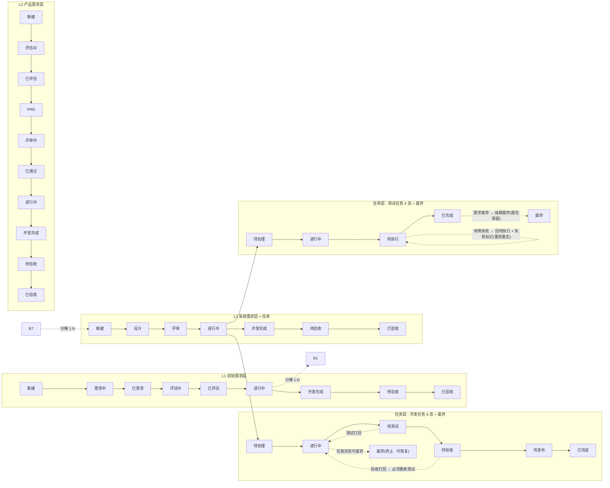
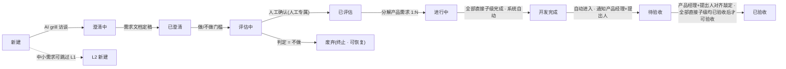
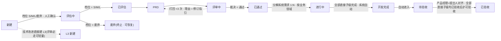
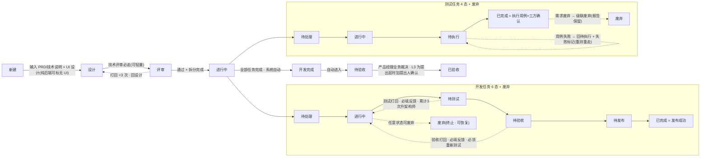
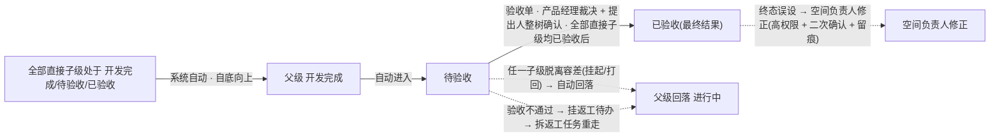

# 09 · 三层需求业务流程全景

> 属于「SaaS 需求管理平台 PRD」的一部分 · v0.13
> 本文件定位：三层需求业务流程的**图形化讲解**（一图看懂：三层树 + 任务层 + 横切规则 + 版本迭代），不含技术实现细节
> 阅读顺序：作为 [03-需求全生命周期流程详解](./03-需求全生命周期流程详解.md) 的图形化速览，术语口径见 [02-名词表](./02-名词表.md)
> 版本：2026-08-13

一句话定位：本文档以 5 张图 + 流程文字，一次性讲清三层需求树（L1 初始需求 / L2 产品需求 / L3 系统需求）+ 任务层（开发任务 6 态 / 测试任务 4 态）的完整业务流程、横切规则与「版本 × 迭代」双维度。

---

## 1. 全景总览

**总览**：平台以「三层需求树 + 任务层」承载一条需求从想法到上线的全过程，回答三个递进问题——**L1 初始需求**回答「这个业务目标值不值得做」（提出人提出，AI grill 澄清 + 做/不做门槛评估）；**L2 产品需求**回答「用什么方案解决」（产品经理评估价值、写 PRD、评审，按业务领域拆解）；**L3 系统需求**回答「如何实现」（架构师设计、技术评审、拆分任务）；**任务层**为最小交付单元，分**开发任务**（6 态 + 废弃）与**测试任务**（4 态），支撑 L3 完成判定。

- **分解关系（1:N，自顶向下）**：初始需求 1:N 产品需求，产品需求 1:N 系统需求，系统需求 1:N 任务；分解动作创建直接子级。
- **主路径**：提出 → 澄清（AI grill 访谈）→ 评估（做/不做门槛）→ PRD → 评审 → 设计 → 技术评审 → 任务执行（开发/测试）→ 发布上线 → 自底向上判「各层开发完成」→ 待验收 → 已验收。
- **完成判定自底向上**：父级「开发完成」= 全部直接子级已完成（需求子级处于「开发完成/待验收/已验收」即计入；任务子级 = 开发任务发布成功 + 测试任务三方确认）；进度由系统自动汇总，**状态与进度永远一致**。
- **任务类型 × 岗位**：任务状态机只按**类型**分流（开发任务 6 态 / 测试任务 4 态），**与岗位无关**——前端/后端/终端等任何开发岗位的开发任务均走同一 6 态状态机（流程语义一致：开发→提交测试→测试→验收→发布→完成）；岗位差异体现在负责人/认领人、估时双轨与 Agent 12 类目录，不体现为独立状态机。
- **版本 × 迭代横切**：版本是规划维度（需求归版本，产品经理决定），迭代是执行维度（装任务）；需求按版本、任务按迭代，两者无直接绑定，数据上可由「版本 → 需求 → 任务 → 迭代」推导。

---

## 2. L1 初始需求流程

**流程描述**：L1 承载提出人的粗需求，回答「这个业务目标值不值得做」。创建后进入**澄清中**：产品经理 Agent 发起 AI grill 多轮追问，产出澄清纪要 + 需求文档，由提出人/产品经理「草稿 + 确认」定稿（→ **已澄清**）。随后进入**评估中**：产品经理 Agent 按 L1 口径评估业务目标值不值得做（投入产出/战略契合/风险），给出做/不做建议，判定由产品经理**人工确认**（人工专属，AI 只建议不代行）；判定 = 不做 → **废弃**（终止态，可恢复），判定 = 做 → **已评估** → **进行中**：产品经理确认将初始需求分解为产品需求（1:N，副作用动作默认人确认）。全部直接产品需求处于「开发完成 / 待验收 / 已验收」时，系统**自动**置「开发完成」（= 开发活动彻底结束，进度 100%），随即自动进入**待验收**（通知产品经理 + 提出人并行验收），双方在验收单内对齐敲定 → **已验收**（前置 = 全部直接子级均已已验收；验收一旦敲定即为最终结果，不可再回退）；验收不通过回「进行中」返工重走。终止态：已验收 / 废弃 / 删除。**跳过规则**：中小需求可跳过 L1 直接创建产品需求（跳过澄清与 L1 评估，L2 评估 + 评审仍走）。

---

## 3. L2 产品需求流程

**流程描述**：L2 承接产品方案，回答「方案价值多少」。创建（L1 分解 / PM 直建）后进入**评估中**：产品经理 Agent 按评估框架计算分值并建议 S/M/L/废弃 档位，档位由产品经理**人工确认**（人工专属）；档位 = 废弃 → **废弃态**（终止，可恢复），档位 = S/M/L → **已评估** → **PRD**：产品经理 Agent 生成 PRD 草稿，产品经理修订并确认定稿；**PRD 定稿后即启动 UI 设计**（不等评审通过，UI 设计挂 L2，作为 L3 设计与测试拆分的输入）。PRD 定稿进入**评审中**：架构师 Agent 生成质询清单（可人工增删），产品经理主持评审、逐条回应、裁决通过/打回（**人工专属**）；打回（累计 < 3 次）回 **PRD**，打回理由作为修订指引；**累计第 3 次打回转人工处理**（不再反复打回，由产品经理人工介入，处理通过后恢复）。裁决通过 → **已通过** → **进行中**：按业务领域分解系统需求（1:N，一个 L3 = 一个业务领域）；全部直接系统需求处于「开发完成 / 待验收 / 已验收」时系统**自动**置「开发完成」→ **待验收** → **已验收**（验收段口径同 L1）。终止态：已验收 / 废弃 / 删除。

---

## 4. L3 系统需求流程 + 任务层

**流程描述**：L3 回答「如何实现」，按业务领域承载技术实现（一个 L3 = 一个业务领域）。创建（L2 分解，或技术改进类直建，评审必走可轻量）后进入**设计**：架构师 Agent 产出系统设计（技术方案/接口/数据结构），架构师确认定稿（输入 = PRD/技术说明 + UI 设计；**纯后端 L3 可标注「无 UI」免 UI 设计输入**）。设计定稿进入**评审**（技术评审**必走**，技术改进类可轻量不跳过）：架构师主持、裁决通过/打回（**人工专属**），打回回设计（理由 = 修订指引），累计 3 次转人工处理。通过后进入**进行中**，同步拆分两类任务：**开发任务**由开发人员/架构师基于系统设计拆；**测试任务**由测试人员基于 UI 设计 + PRD 用户操作流程 + 前后端接口拆；全部计划任务（开发 + 测试）确认创建 = 已拆分可开发。任务执行——**开发任务 6 态**：待处理 → 进行中 → 待测试 → 待验收 → 待发布 → 已完成（= 发布成功）；待测试被测试打回、待验收被验收打回均回「进行中」且必填反馈，**返工必须重新测试**；测试打回累计 3 次升架构师裁决、验收打回累计 3 次转人工处理；待发布任务经发布单（只装「测试通过 + 验收通过」的开发任务，测试任务不进单）发布上线，发布单关闭 → 自动「已完成」；**发布失败/回滚 → 开发任务回「待发布」可重试**。**测试任务 4 态**：待处理 → 进行中 → 待执行 → 已完成（执行用例 + 三方确认：产品经理 + 架构师 + 测试人员，不发布不验收）；**测试任务执行用例失败 → 回「待执行」+ 失败标记（重测重走），三方确认前可改判**；需求废弃 → 未完成测试任务级联废弃（已完成报告保留）。全部开发任务已完成（发布成功）**且**测试任务已完成（三方确认）→ 系统自动置 L3「开发完成」→ 待验收 → 已验收（产品经理业务裁决；**L3 为提出层时加提出人线上确认**）。

---

## 5. 横切规则

> 以下规则**不改变状态机定义**，作为「任意层、任意状态」的横切约束。

### 5.1 父级完成判定（自底向上）

「开发完成」= 开发活动彻底结束（进度 100%），判定**自底向上**：父级完成 = 全部直接子级已完成——直接子级为**需求**时，处于「开发完成 / 待验收 / 已验收」即计入（验收段容差）；直接子级为**任务**时，开发任务「已完成」= 发布成功、测试任务「已完成」= 执行用例 + 三方确认。任一直接子级挂起 / 阻塞 / 进行中 → 父级不判完成，保持「进行中」。状态与进度为**持续重算约束**：父级「开发完成」（或「待验收」）后，任一直接子级脱离上述状态（如验收打回归「进行中」返工）→ 父级**自动回落「进行中」**、退出待验收、**待验收提醒同步停止**；子级重新满足条件后再次自动判「开发完成」并重新进入待验收、重新触发提醒。已验收父级在子级被「空间负责人修正」回退时不自动回落，由空间负责人一并处理。废弃子级永远不计入完成判定；全部直接子级均废弃时父级无法自动完成，由人工处理（父级也废弃 / 补充子级）。

### 5.2 验收段（开发完成 → 待验收 → 已验收）

需求「开发完成」后由系统自动进入「待验收」，通知**产品经理 + 提出人**并行验收（功能已上线，双方可见）。验收交互以**需求验收单**承载（挂需求详情、不新增页面）：功能清单 + 验收项 + 上线链接 + 通过 / 异议动作（附原因）+ 单内对话；异议 → 产品经理回应（接受返工 / 说明理由请撤回），留痕 = 对齐记录；一人多角验收只执行一次。验收由**产品经理业务裁决**（各层子级验收均由产品经理裁决）+ **提出人线上确认**（仅提出层；提出人整树线上验收只在其提出层执行一次）。「已验收」前置 = 全部直接子级均已「已验收」，验收敲定后为最终结果、不可再回退。验收不通过 → 回「进行中」返工：系统挂「返工」待办 → 人工确认拆返工任务（开发/测试）→ 重走开发-测试-验收-发布 → 重新判「开发完成」→ 再入「待验收」。**催办规则**：进入待验收第 0 天即通知，满 N 天未敲定每 N 天催办一次（按需求优先级 P0=1天 / P1=2天 / P2=3天 / P3=7天，可配置），无动作满 3 轮升级空间负责人介入；验收仍人工专属、系统不自动裁决；父级回落「进行中」时提醒同步停止。验收段不改变进度（进入待验收即 100%）。

### 5.3 转人工处理（打回循环上限）

评审 / 验收打回累计 3 次 → 需求**转人工处理**：不再反复打回，该环节 AI 不代行、路由人工，由产品经理 / 空间负责人介入（修订后重走评审 / 验收，或直接审核放行），处理通过后恢复，并记录「流程例外」。**测试打回**（同一开发任务测试不通过 → 返工 → 重测循环）累计 3 轮未过 → 上升架构师介入裁决（继续返工 / 拆分多个小任务 / 废弃）。

### 5.4 废弃 / 恢复

任意阶段可直接废弃（评估判档 = 废弃，或开发到一半砍掉），带原因、可留痕；**需求废弃 → 其下未完成任务（开发 / 测试）级联废弃**，已完成测试任务报告保留；父级完成判定排除废弃子级；已装入发布单的任务被挂起 / 废弃 → 自动移出发布单。**废弃恢复 = 恢复至废弃前的状态**（已废弃子级保持废弃、可单独恢复；已完成任务保持已完成；留痕可追溯）；恢复废弃需求不自动回版本。不做但需留档 → 用挂起。

### 5.5 挂起 / 阻塞（全局标记）

**全局标记**：任意需求 / 任务、任意状态可打（测试任务本身也可打），带原因，解除回原状态。**挂起** = 自选搁置：任务挂起移出迭代池回待排期需求池，不计负载不计进度，已装入发布单自动移出；**阻塞** = 被外部依赖卡住：计负载占用、不计进度产出，不自动改派（AI 仅提示）。标记**不沿需求树自动传递**，父级详情与 Dashboard 显示「下级存在 N 个挂起 / 阻塞」风险提醒，解除后消失；需求挂起 / 阻塞 → 测试任务状态不动。

### 5.6 纠错回退

产品经理 / 空间负责人可将任意需求 / 任务**强制回退到指定合法前置态**（纠错动作，如误操作改错状态时纠正）：**必填原因留痕**；**回退 ≠ 打回**——不计打回计数、不转人工处理；不改变状态机定义。**常规纠错回退仅作用于非最终结果**：需求「已验收」、任务「已完成」不可用常规回退；终态误设由空间负责人走独立「修正」流程（高权限 + 二次确认 + 留痕，独立于常规回退）。

---

## 6. 版本 × 迭代横切

**版本是规划维度**：回答「这一版交付哪些需求」。需求**归入版本（单选，由产品经理决定）**，带规划交付日期（参考、不强制）；需求可不归版本（未归 = 在待排期需求池）；父级归版本 → 子级跟随，移出 → 整棵子树移出；需求废弃 → 自动移出版本，恢复废弃不回版本；需求挂起 → 留在版本（算未完成，阻塞交付判定）。**版本「已交付」= 版本下所有需求均已「已验收」**（系统自动判定；挂起 / 阻塞 / 进行中 / 开发完成 / 待验收一律计未交付，验收段为交付判定必经环节）；**已交付版本在任一需求被「修正」回退后，版本随之后移「进行中」**。

**迭代是执行维度**：回答「这段时间开发什么」，装任务（开发 / 测试任务均随需求进迭代，测试任务不独立排期），自带看板 + 甘特图 + 负载图；**发布单属于迭代**（迭代内可多次发布，每单装一批「待发布」开发任务，随做随发；发布单只装「测试通过 + 验收通过」的开发任务，测试任务不进单）。

**两者无直接绑定**——迭代不挂版本，需求也不装进迭代；需求通过「其任务进了哪个迭代」可追溯到迭代，进而推导版本执行情况（版本 → 需求 → 任务 → 迭代）。即：**需求按版本、任务按迭代**。
